```{r setup, include=FALSE}
knitr::opts_chunk$set(warning = FALSE, message = FALSE, 
                      fig.retina = 3, fig.align = "center")
```

```{r packages-data, include=FALSE}
library(countdown)
set.seed(1234)
```

```{r xaringanExtra, echo=FALSE}
xaringanExtra::use_xaringan_extra(c("tile_view"))
```

class: center middle main-title section-title-7

# Defining and describing<br>the nonprofit sector

.class-info[

**August 25, 2022**

.light[PMAP 3210: Introduction to Nonprofits<br>
Andrew Young School of Policy Studies
]

]

---

name: outline
class: title title-inv-5

# Plan for today

--

.box-1.sp-after-half[What are nonprofits?]

--

.box-5.sp-after-half[Why do we have a class<br>just for nonprofits?]

--

.box-3.sp-after-half[What are we doing this semester?]

--

.box-2.sp-after-half[The universe of nonprofits]

--

.box-6.sp-after-half[Problems with nonprofits]

---

layout: false
name: what-are-nonprofits
class: center middle section-title section-title-1 animated fadeIn

# What are<br>nonprofits?

---

layout: true
class: title title-1

---

# What are nonprofits?

.center[Typically, they are:]

--

.box-inv-1.medium[**Corporations**]

--

.box-inv-1.medium[with **Special Tax Status**]

--

.box-inv-1.medium[providing a **Public Good**]

???

We will discuss these three things

---

# They are ***not***…

--

.box-inv-1.medium[Prohibited from making a profit]

--

.box-inv-1.medium[Free from paying all taxes]

--

.box-inv-1[.medium[Legally accountable to donors]<br>.smaller[(except for breaking promises)]]

???

1. Nonprofits can operate at a profit, but they are not allowed to distribute the profit to shareholders.

2. Major misconception. Every nonprofit has to pay some sort of tax every year.

3. Other than for claims of fraud or, in few cases, contract, donors cannot sue nonprofits for mishandling, misusing, or wasting donated funds. Only the state attorney general can do that.

---

layout: false

.pull-left-3[
.box-1.SMALL[Corporation]

.box-inv-1.small[Legal entity]

.box-inv-1.small[Board managed]

.box-inv-1.small[No owners]

.box-inv-1.small[Organized<br>under state law]
]

--

.pull-middle-3[
.box-1.SMALL[Special tax status]

.box-inv-1.small[30+ categories of IRS tax exemption]

.box-inv-1.small[Different taxes apply differently (income, sales, property, employment, etc.)]
]

--

.pull-right-3[
.box-1.SMALL[Public good]

.box-inv-1.small[Health]

.box-inv-1.small[Arts]

.box-inv-1.small[Education]

.box-inv-1.small[Social service]

.box-inv-1.small[Civic]

.box-inv-1.small[Research]

.box-inv-1.small[Religious]
]

---

class: title title-1

# Find a nonprofit

Make a list of a few organizations you think are nonprofits

Look up a few to see if they are. What do they do? What public goods do they provide?

Hints: Look for things like "501(c)(3)", "tax exempt", or links to give donations

```{r echo=FALSE}
countdown(minutes = 4, play_sound = FALSE, font_size = "1.5em")
```

---

class: title title-1

# Find a nonprofit

Make a list of a few organizations you think are nonprofits

Look up a few to see if they are. What do they do? What public goods do they provide?

Hints: Look for things like "501(c)(3)", "tax exempt", or links to give donations

.color-2[**Share what you found with your neighbors**]

```{r echo=FALSE}
countdown(minutes = 4)
```

---

layout: true
class: middle center

---

<figure>
  
</figure>

---

<figure>
  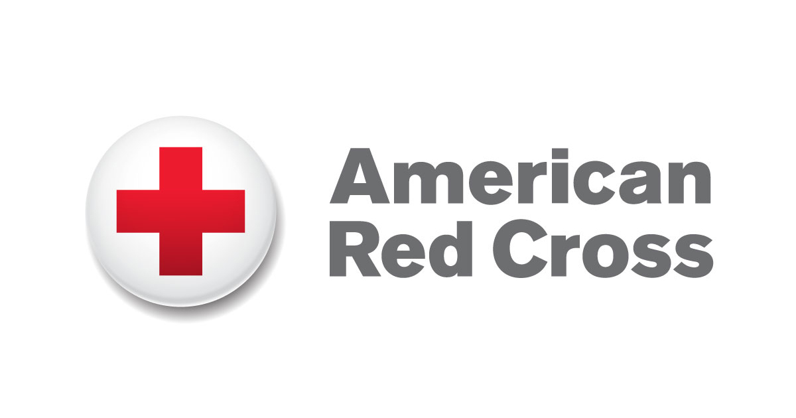
</figure>

---

<figure>
  
</figure>

---

<figure>
  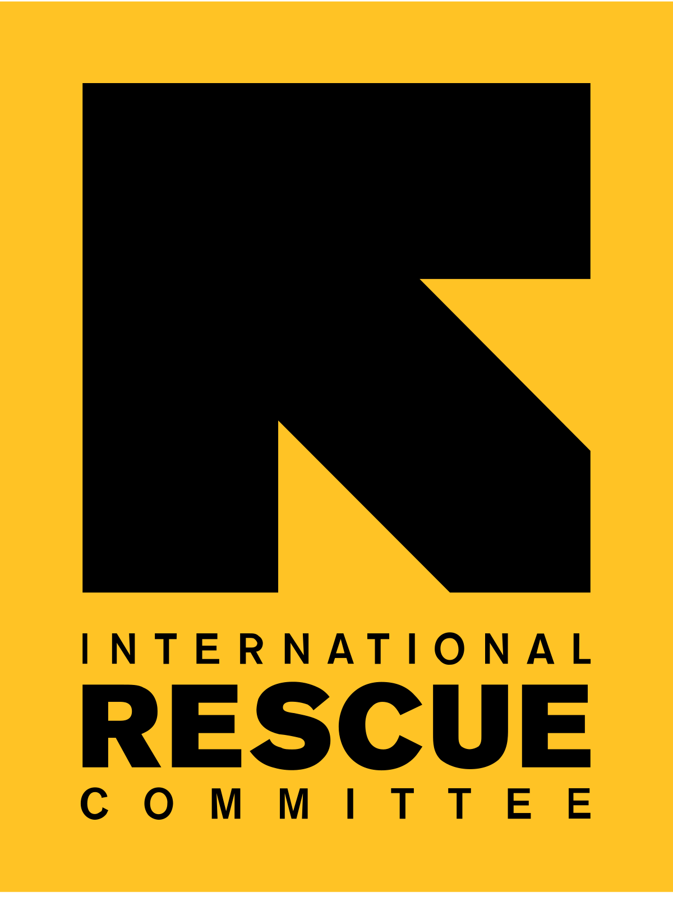
</figure>

---

<figure>
  
</figure>

---

<figure>
  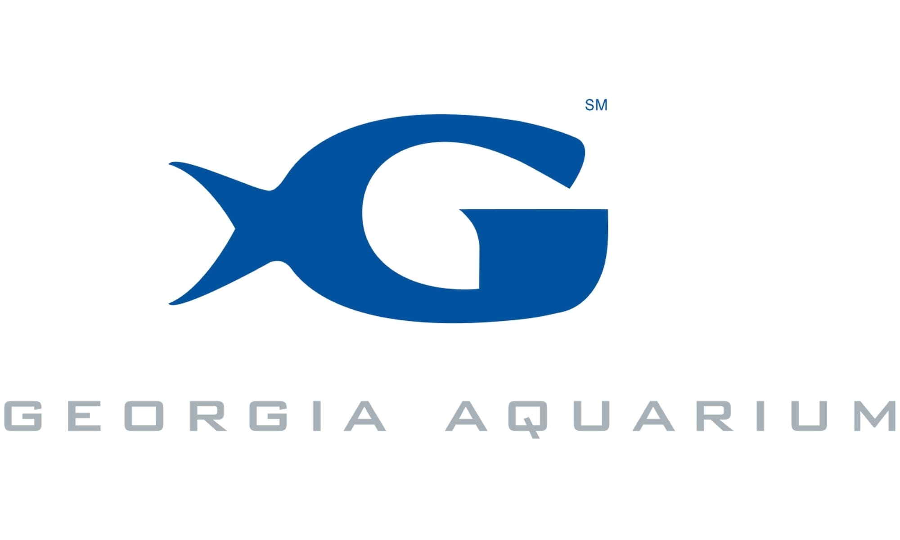
</figure>

---

layout: false
class: middle section-title-inv-1 animated fadeIn

.box-1.huge[Pop quiz!]

???

Source: NCCS, October 2015.

Also via the inimitable Aaron Miller.

---

layout: true
class: section-title-inv-1

---

.medium.center[

In 2016, how many nonprofit organizations<br>were registered with the IRS?

- 65,252
- 589,587
- 1,571,056

]

---

.medium.center[

In 2016, how many nonprofit organizations<br>were registered with the IRS?

- 65,252
- 589,587
- .color-7[**1,571,056**]

]

--

.box-1.small[That's one nonprofit for every 214 Americans!]

---

.medium.center[

How many of these filed a<br>990 tax return with the IRS?

- 65,252
- 589,587
- 1,571,056

]

---

.medium.center[

How many of these filed a<br>990 tax return with the IRS?

- 65,252
- .color-7[**589,587**]
- 1,571,056

]

--

.box-1.small[Not all nonprofits need to do this!]

---

.medium.center[

What percent of the US gross domestic<br>product is attributed to nonprofits?

- 2.7%
- 5.3%
- 16.1%

]

---

.medium.center[

What percent of the US gross domestic<br>product is attributed to nonprofits?

- 2.7%
- .color-7[**5.3%**]
- 16.1%

]

???

About $905 billion.

Public Charities (1.1 million) collectively managed over $3 trillion in assets.

---

.medium.center[

Which of these is the largest<br>source of revenue for nonprofits?

- Private contributions and donations
- Earned income
- Government grants

]

---

.medium.center[

Which of these is the largest<br>source of revenue for nonprofits?

- Private contributions and donations
- .color-7[**Earned income**]
- Government grants

]

--

.box-1.small[72% from earned income!]

???

Fees from government sources (primarily Medicare and Medicaid) alone account for 24.5% of nonprofit revenue.

Private giving only accounts for 13% of nonprofit revenue.

---

layout: false
name: why-focus
class: center middle section-title section-title-5 animated fadeIn

# Why do we have a<br>class just for nonprofits?

---

class: middle

.box-5.medium.sp-after[Why not just learn about<br>businesses or governments?]

.box-5.medium[What makes nonprofits unique?]

---

class: middle

.box-5.medium.sp-after[Why not just learn about<br>business management?]

.box-5.medium[What makes nonprofit<br>management unique?]

???

mission v. profit, public trust, varied funding, fundraising, measuring performance, legal context, volunteers, governance, multiple programs & constituencies

---

layout: false
name: class-overview
class: center middle section-title section-title-3 animated fadeIn

# What are we doing<br>this semester?

---

layout: true
class: title title-3

---

# Who am I?

<figure>
  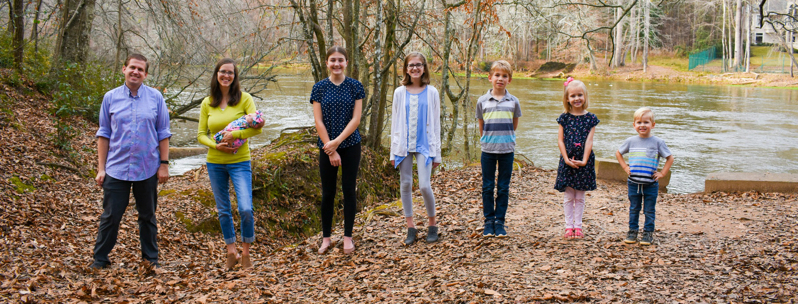
</figure>

---

# Who am I?

--

.pull-left-3[
<figure>
  
</figure>
]

--

.pull-middle-3[
<figure>
  
</figure>
]

--

.pull-right-3[
<figure>
  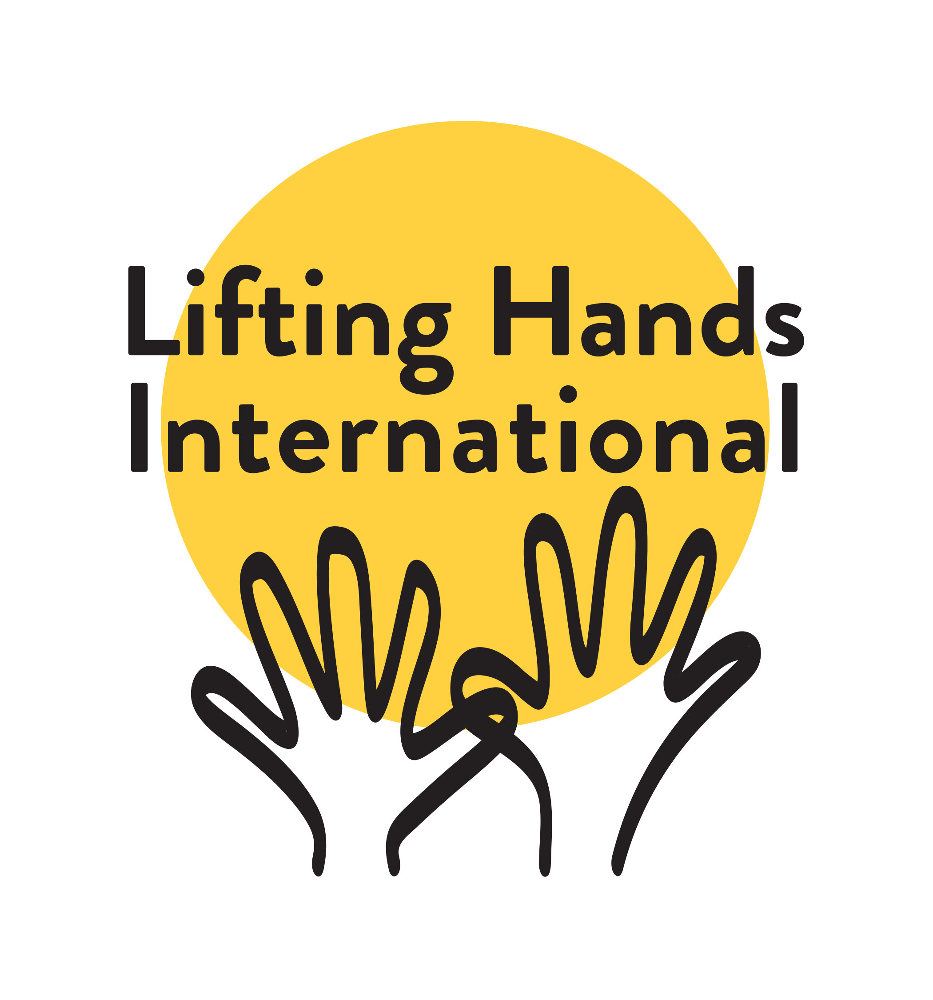
</figure>
]

---

# Superheroes

.center[
<figure>
  
</figure>
]

---

# Class goals

--

.box-inv-3.less-medium[Discover a deeper appreciation<br>for the nonprofit sector]

--

.box-inv-3.less-medium[Identify the core purposes of a nonprofit]

--

.box-inv-3.less-medium[Understand what makes nonprofits unique]

--

.box-inv-3.less-medium[Create a hypothetical nonprofit!]

---

# Class readings

.pull-left.center[

<figure>
  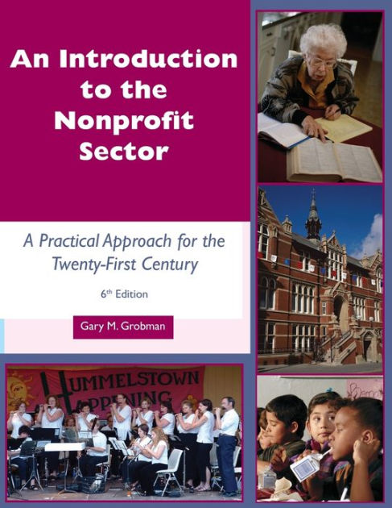
</figure>

]

.pull-right.small[
Gary M. Grobman, *An Introduction to the Nonprofit Sector: A Practical Approach for the Twenty-First Century*, .color-1[6th edition]

Other readings and videos
]

---

# Class website

.box-inv-3[↓ Schedule & assignments & most other content lives here ↓]

.box-inv-3[.color-5[**nonprofit**] .color-7[**f**] .color-6[**22**] .classes.andrewheiss.com]

.box-inv-3.smaller[https://nonprofitf22.classes.andrewheiss.com/]

.box-inv-3.small.sp-after[You'll have access to this site forever after the class is over]

--

.box-3.less-medium.sp-before[Turn stuff in at iCollege]

---

# Assignments

--

.box-inv-3.medium[Pre-class check-ins]

--

.box-inv-3.medium[Why nonprofits?]

--

.box-inv-3.medium[Team project]

--

.box-3.medium[No tests!]

---

layout: false
class: middle

.box-3.huge[Why teams?!<br>Teams are the worst.]

---

layout: true
class: title title-3

---

# Why teams?

--

.box-inv-3.less-medium[I'm not trying to be mean!]

--

.box-inv-3.less-medium[Nonprofit work is all about collaboration]

--

.box-inv-3.less-medium.sp-after[You cannot start or work in a<br>successful nonprofit without teamwork]

--

.box-3.less-medium[I'll give you tools to make teamwork suck less!]

---

# Pre-class check-ins

--

.box-inv-3[.medium[On iCollege under "Quizzes"]<br>.small[(but it's not really a quiz!)]]

--

.box-inv-3.medium[Tell me if you're in class +<br>tell me how prepared you are]

--

.box-inv-3.medium[Turn in a written response]

---

# Pandemic stuff

--

.box-inv-3.medium[Please, please, please wear a mask]

--

.box-inv-3[.medium[If you're sick, don't come to class!]<br>.small[(We'll figure out a way to get you caught up!)]]

--

.box-inv-3[.medium[Show grace and patience with each other] .small[(and with me!)]]

---

# I'm here to help!

.box-inv-3.medium[Student hours]

.box-inv-3.SMALL[E-mail, Calendly, Webex]

---

layout: false
name: universe-nonprofits
class: center middle section-title section-title-2 animated fadeIn

# The universe<br>of nonprofits

---

layout: true
class: title title-2

---

# What are nonprofits?

.center[Typically, they are:]

.box-inv-2.medium[**Corporations**]

.box-inv-2.medium[with **Special Tax Status**]

.box-inv-2.medium[providing a **Public Good**]

---

# Confusing names!

--

.box-inv-2.medium[These are all basically the same thing!]

--

.center[
.float-left[.box-2.small[Nonprofit organization (NPO)]]

.float-left[.box-2.small[Non-profit organization]&ensp;.box-2.small[Not-for-profit organization]]

.box-2.small[Nongovernmental organization (NGO)]

.float-left[.box-2.small[501(c)(3)]&ensp;.box-2.small[501(c)]]

.box-2.small[Third sector]
]

---

# Six characteristics of nonprofits

--

.box-inv-2[Formal organization]

--

.box-inv-2[Non-profit-seeking or distributing]

--

.box-inv-2[Private]

--

.box-inv-2[Self-governing]

--

.box-inv-2[Voluntary]

--

.box-inv-2[Operating for public or mutual benefit]

---

# Public or mutual benefit

.box-inv-2[Nonprofits don't always have to serve the public]

--

.pull-left[
.box-2[Public-serving]

.float-left.center[.box-inv-2.small[Charities]&emsp;.box-inv-2.small[Foundations]]

.box-inv-2.small[Advocacy organizations]

.float-left.center[.box-inv-2.small[Education]&emsp;.box-inv-2.small[Hospitals]]


.box-2.SMALL[Focused on the broader public]
]

--

.pull-right[
.box-2[Member-serving]

.box-inv-2.small[Fraternities and sororities]

.box-inv-2.small[Professional associations]

.float-left.center[.box-inv-2.small[Sports clubs]&emsp;.box-inv-2.small[HOAs]]

.box-2.SMALL[Focused on their members]
]

---

# Nonprofits and taxes

.box-inv-2.large[Organizations that focus<br>on the public get<br>special tax privileges]

---

# §501(c)

.center[
<figure>
  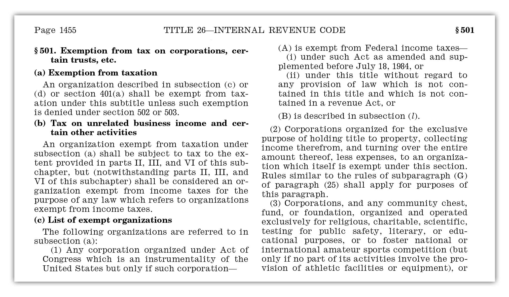
</figure>
]

???

- https://www.law.cornell.edu/uscode/text/26/501
- https://www.govinfo.gov/content/pkg/USCODE-2011-title26/pdf/USCODE-2011-title26-subtitleA-chap1-subchapF-partI-sec501.pdf

---

# §501(c)

.center[
<figure>
  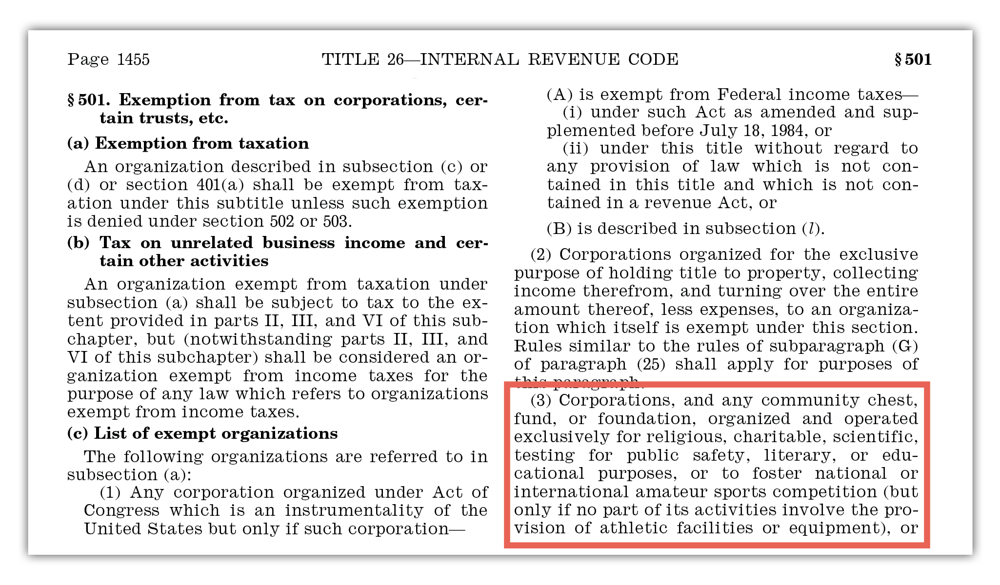
</figure>
]

---

# 501(c) categories you should know

.box-2[There are 29 different types in §501(c),<br>plus a bunch in §527!]

.box-2.smaller[Pages 69–70 in [IRS Publication 557](https://www.irs.gov/pub/irs-pdf/p557.pdf)]

&nbsp;

.float-left.center[
.box-inv-2.less-medium[501(c)(3)]&ensp;.box-inv-2.less-medium[501(c)(4)]&ensp;.box-inv-2.less-medium[501(c)(6)]&ensp;.box-inv-2.less-medium[527]
]

???

There are 29 different types!

See also https://www.charitynavigator.org/index.cfm?bay=content.view&cpid=1559

---

# 501(c)(3)

.box-inv-2[Nine official subsectors: [NTEE-CC](https://nccs.urban.org/project/national-taxonomy-exempt-entities-ntee-codes)]

.pull-left[
- Arts, Culture, and Humanities
- Education
- Environment and Animals
- Health
- Human Services
]

.pull-right[
- International, Foreign Affairs
- Public, Societal Benefit
- Religion Related
- Mutual/Membership Benefit
]

???

NTEE-CC codes: https://nccs.urban.org/project/national-taxonomy-exempt-entities-ntee-codes

---

# 501(c)(3)

--

.box-2[.medium[Charitable organizations]<br>.small[Most nonprofits you can think of]]

--

.box-inv-2[Organization is tax exempt]

--

.box-inv-2[Contributions are tax deductible<br>.small[Only category that allows this!]]

---

layout: true
class: middle section-title-inv-2

---

.box-2.huge[Why care about<br>tax deductions?]

---

.box-2.medium[**Jody earns $80,000/year**]

--

.pull-left[
```{r echo=FALSE}

# Substitute Geordi Drake Meme
# Geordi, with his finger pointed approvingly 
tibble::tribble(
  ~`Annual income`, ~`Marginal tax rate`,
  "$0–$10,000", "0%",
  "$10,001–$50,000", "10%", 
  "$50,001–$100,000", "20%", 
  "$100,001–$300,000", "30%",
  "$300,000+", "50%", 
) |>
  kableExtra::kbl() |>
  kableExtra::kable_styling(font_size = 35)


```
]

--

.pull-right[
.box-2.smaller[She pays 0% on first $10,000<br>.small[($0)]]

.box-2.smaller[She pays 10% on the next $40,000<br>.small[($4,000)]]

.box-2.smaller[She pays 20% on the last $30,000<br>.small[($6,000)]]

.box-2[Total = $10,000]
]

---

layout: true
class: title title-2

---

# 501(c)(3)

.box-2[.medium[Charitable organizations]<br>.small[Most nonprofits you can think of]]

.box-inv-2[Organization is tax exempt]

.box-inv-2[Contributions are tax deductible<br>.small[Only category that allows this!]]

--

.box-inv-2[Insubstantial lobbying allowed<br>.small[But no participation in political campaigns]]

???

- LDS church during Prop 8 - counted as insubstantial lobbying
- Lobbying only for ideas, policies; political campaigns are for people
- BYU accidentally promoted Romney during his 2012 campaign—quickly redacted - you can't say anything about specific candidates
- Free speech not an issue - you don't have to be tax exempt - you give up some free speech in exchange for tax exemption

---

# 501(c)(4)

--

.box-2[.medium[Social welfare organizations]<br>.small[ACLU, NAACP, NRA, some political PACs]]

--

.box-inv-2[Organization is tax exempt]

--

.box-inv-2[Contributions are ***not*** deductible]

--

.box-inv-2[Political lobbying allowed<br>.small[(2010 Citizens United decision)]]

---

# 501(c)(6)

--

.box-2[.medium[Business leagues and trade associations]<br>.small[RIAA, chambers of commerce, the NFL]]

--

.box-inv-2[Organization is tax exempt]

--

.box-inv-2[Contributions are ***not*** deductible]

--

.box-inv-2[Political lobbying allowed]

---

# §527

--

.box-2[.medium[Political parties, campaigns, PACs]<br>.small[ActBlue, EMILY's List, Republican Governors Association, AFL-CIO]]

--

.box-inv-2[Organization is tax exempt ***only*** for "exempt activity"<br>.small[(Money spent on political activities and lobbying)]]

--

.box-inv-2[Contributions are ***not*** deductible]

--

.box-inv-2[Political lobbying is their whole purpose]

---

# Getting tax exemptions

--

.box-inv-2[Establishing a nonprofit corporation<br>does not automatically give you tax exemption!]

--

.box-2[Incorporate at the *state* level<br>through the state's Department of State]

--

.box-2[Apply to the IRS at the *federal* level to get tax-exempt status<br>using one of the 501(c) categories (most often 501(c)(3))]

---

# Nonprofits vs. foundations

.pull-left.center[
<figure>
  
</figure>
]

.pull-right.center[
<figure>
  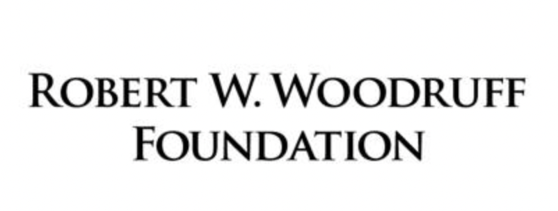
</figure>
]

--

.box-inv-2[Both are 501(c)(3)s!]

.box-2[How are they different?]

---

# Nonprofits vs. foundations

--

.pull-left[
.box-inv-2.less-medium[Public charities]

.box-2.small[Income from lots of sources]

.box-2.small[Charities must demonstrate<br>"public support" to the IRS<br>.small[(10–33.33%)]]
]

--

.pull-right[
.box-inv-2.less-medium[Private foundations]

.box-2.small[Income from one .smaller[(or a few)] sources]

.box-2.small[Foundations must pay taxes on<br>investment income]

.box-2.small[Foundations must give away at<br>least 5% of their assets each year]
]

???

By default all nonprofits are private foundations until they prove to the IRS that they count as public charities

---

layout: false
name: problems-nonprofits
class: center middle section-title section-title-6 animated fadeIn

# Problems<br>with nonprofits

---

layout: true
class: title title-6

---

# Issues in the nonprofit sector

--

.box-inv-6.medium.sp-after-half[Undercompensation, tame programs,<br>and fear of overhead]

--

.box-inv-6.medium.sp-after-half[Elite control and reputation laundering]

--

.box-inv-6.medium[Subversion of the public sector]

---

# Structural issues with the sector

.center[
<figure>
  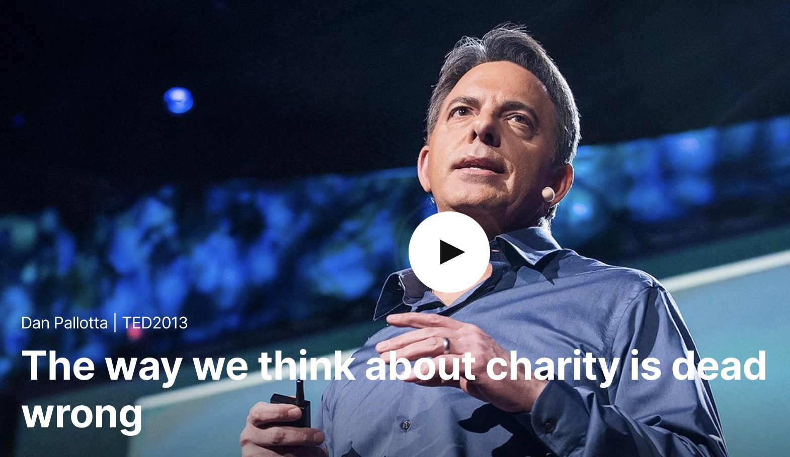
</figure>
]

---

# Structural issues with the sector

--

.box-inv-6[Low compensation + burnout]

???

1. Compensation - underpaid employees in the sector - easy to take advantage of people - lowest paid sector in business schools

---

# Abysmal compensation

.center[
<figure>
  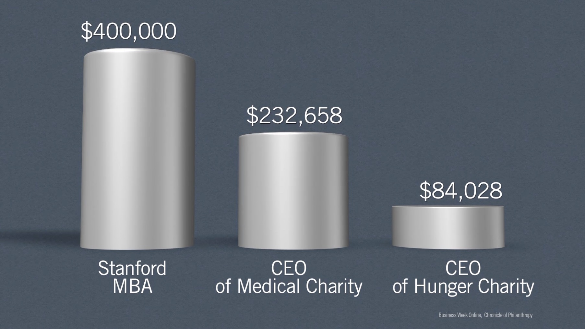
</figure>
]

---

# Structural issues with the sector

.box-inv-6[Low compensation + burnout]

--

.box-inv-6[Fear of marketing and overhead]

--

.box-inv-6[Reluctance to take risks]

???

1. Compensation - underpaid employees in the sector - easy to take advantage of people - lowest paid sector in business schools
2. Advertising and marketing - we don't like seeing charities advertise (or spending on overhead in general)
3. Taking risk on new revenue ideas - nonprofits reluctant to do that because of reputational issues

---

# Taming programs to get funding

.pull-left.center[
<figure>
  
</figure>
]

.pull-right[
.box-inv-6[Funders demand<br>measurable results]

.box-inv-6[NGOs do easier, more<br>measurable programs]

.box-6.medium[Mission drift]
]

???

cause switching (that's sometimes okay! March of Dimes)

---

# Structural issues with the sector

.box-inv-6[Low compensation + burnout]

.box-inv-6[Fear of marketing and overhead]

.box-inv-6[Reluctance to take risks]

--

.box-inv-6[Constrained time horizons]

--

.box-inv-6[Since there are no profits, it's hard to attract capital]

???

1. Compensation - underpaid employees in the sector - easy to take advantage of people - lowest paid sector in business schools
2. Advertising and marketing - we don't like seeing charities advertise (or spending on overhead in general)
3. Taking risk on new revenue ideas - nonprofits reluctant to do that because of reputational issues
4. Time - Amazon, Uber, Twitter all took years to produce profits - nonprofits can't do that
5. Profit to attract risk capital - venture capitalists won't touch it because they can't get a 10x return

---

# Embedded values

.box-inv-6.huge[Don't confuse<br>morality<br>with frugality]

???

Why are these issues? What kind of values are embedded in our perceptions of the nonprofit sector?

---

# Elite philanthropy

.pull-left.center[
<figure>
  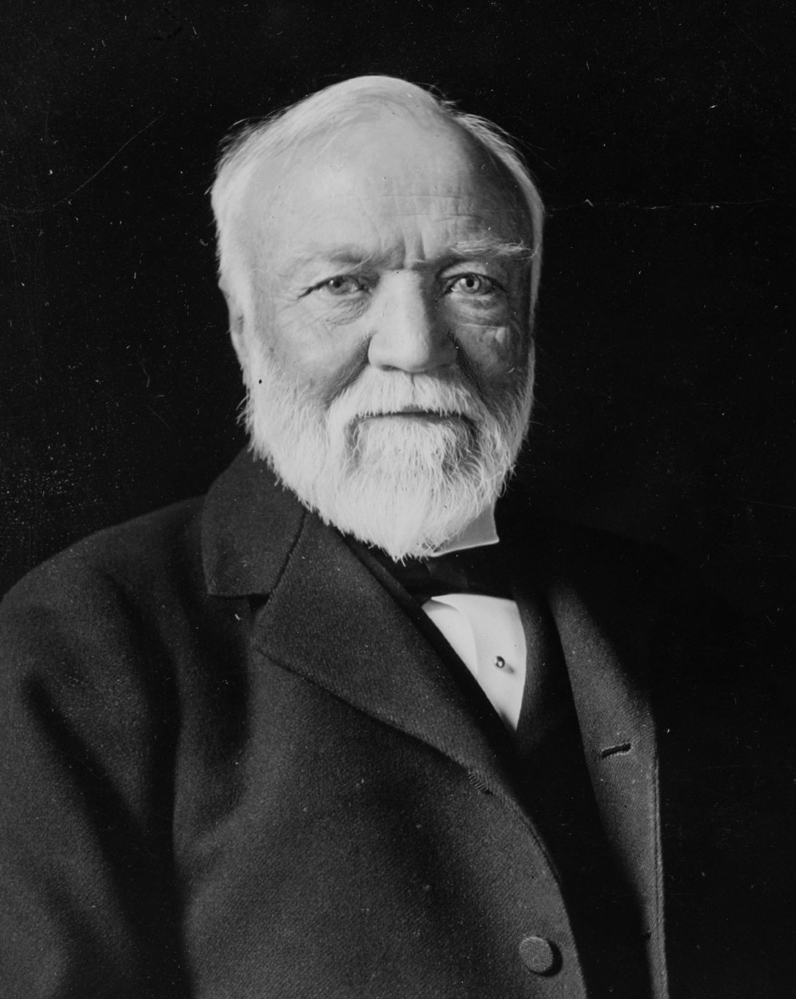
</figure>
]

.pull-right[
.box-inv-6[Public library system]

.box-inv-6[Carnegie Hall]

.box-inv-6[Carnegie Institute]

.box-inv-6[Carnegie Mellon University]

.box-inv-6[Carnegie Endowment<br>for International Peace]

]

---

layout: false
class: middle

.box-6.huge[Why?]

.box-inv-6.large[Why donate all this money?<br>instead of keeping it?]

---

class: middle

.box-6.huge[Modern parallels?]

---

layout: true
class: title title-6

---

# Elite philanthropy gone wrong

.pull-left.center[
<figure>
  
</figure>
]

.pull-right[
.box-inv-6.SMALL[Billionaires can avoid<br>taxes and set their own<br>policy agendas]

.box-inv-6.SMALL[Subversion of<br>the public sector]

.box-inv-6.SMALL[Billionaires can<br>use nonprofit work<br>to build reputation]
]

???

Anand Giridharadas: AN-and GEER-da-das

---

# Reputation laundering

.center[
<figure>
  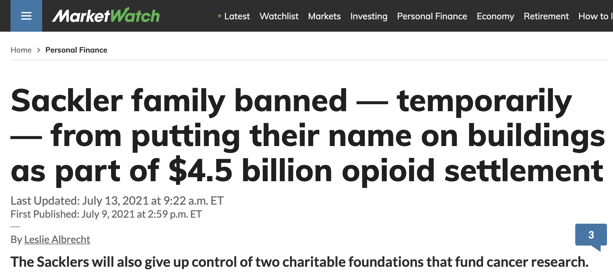
</figure>
]

???

https://www.marketwatch.com/story/sackler-family-banned-temporarily-from-putting-their-name-on-buildings-as-part-of-4-5-billion-opioid-settlement-11625857196

---

# Reputation (and money?) laundering

.center[
<figure>
  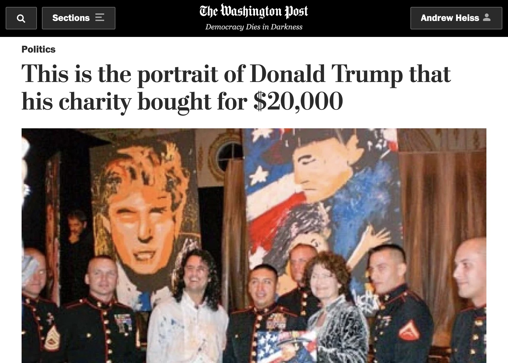
</figure>
]

???

https://www.washingtonpost.com/news/post-politics/wp/2016/11/01/this-is-the-portrait-of-himself-that-donald-trump-bought-with-20000-from-his-charity/

---

# Reptuation laundering

.pull-left[
.box-inv-6[Greenwashing]

.center[
<figure>
  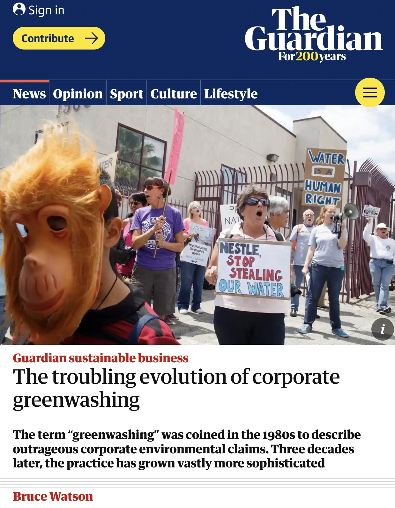
</figure>
]
]

--

.pull-right[
.box-inv-6[Pinkwashing]

.center[
<figure>
  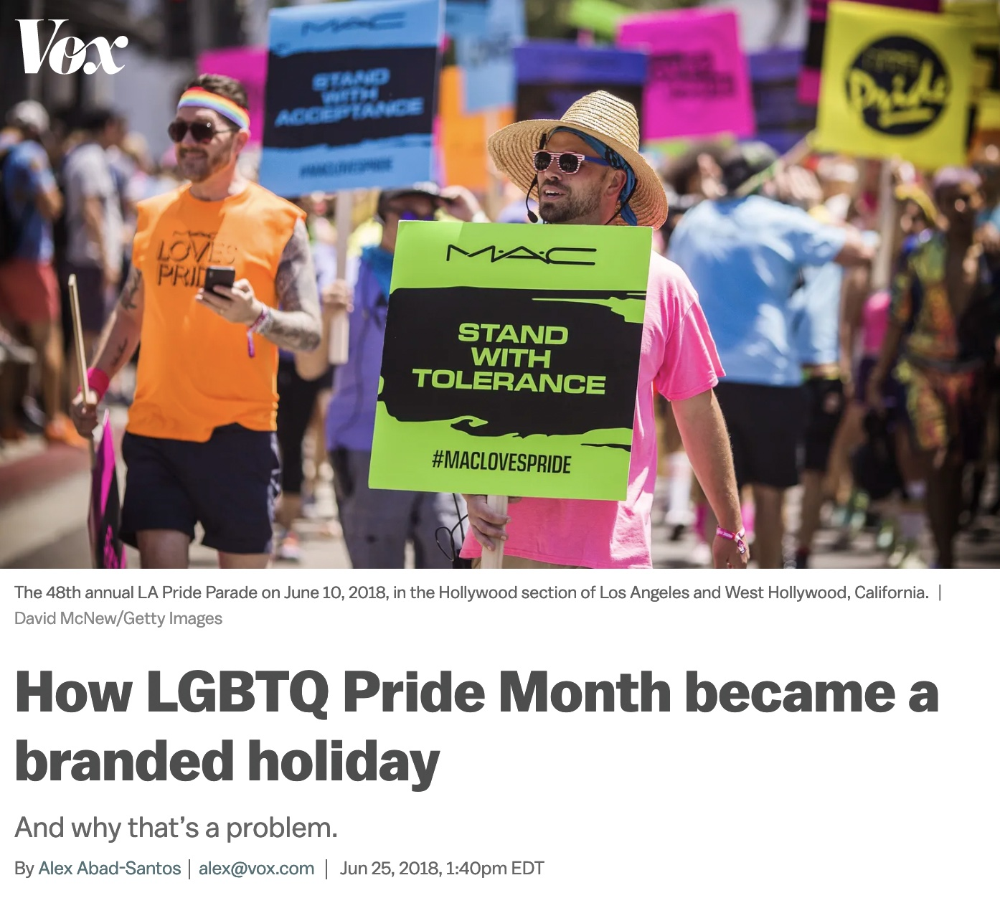
</figure>
]
]

???

https://www.vox.com/2018/6/25/17476850/pride-month-lgbtq-corporate-explained

https://www.theguardian.com/sustainable-business/2016/aug/20/greenwashing-environmentalism-lies-companies

---

# Misuse in other countries

.box-inv-6.sp-after[.medium[GONGOs]<br>.small[Government-operated NGOs]]

.box-inv-6.medium[First Lady NGOs]

