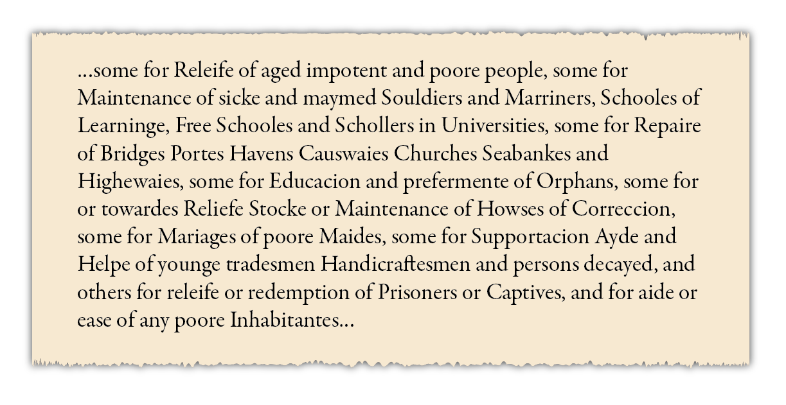
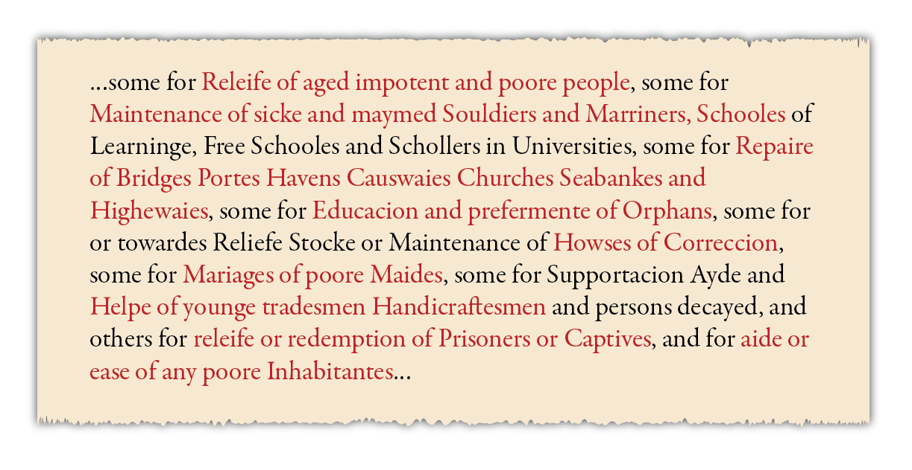
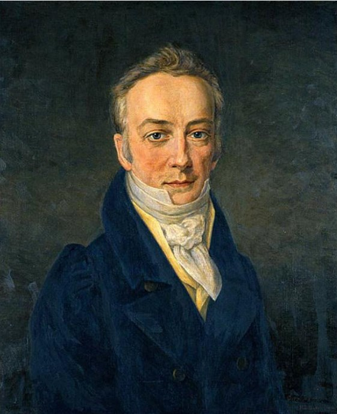
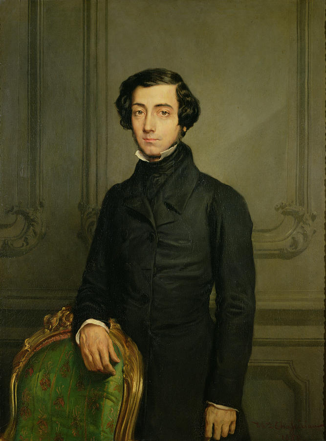
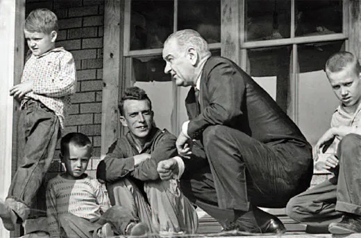
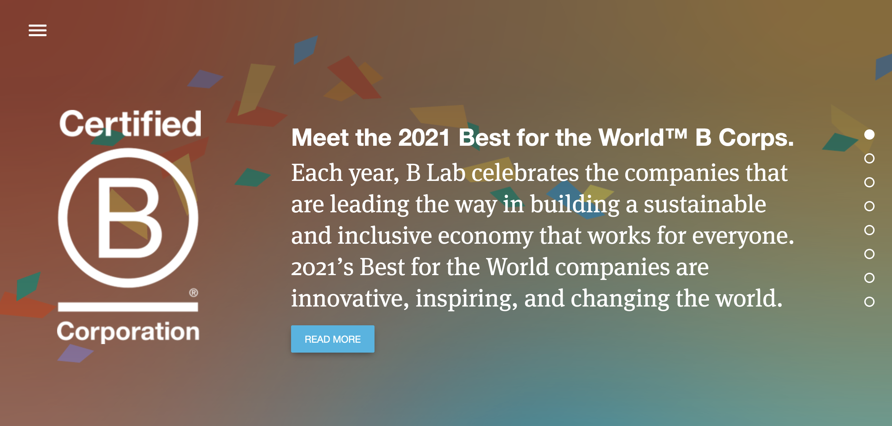

```{r setup, include=FALSE}
knitr::opts_chunk$set(warning = FALSE, message = FALSE, 
                      fig.retina = 3, fig.align = "center")
```

```{r packages-data, include=FALSE}
library(countdown)
```

```{r xaringanExtra, echo=FALSE}
xaringanExtra::use_xaringan_extra(c("tile_view"))
```

class: center middle main-title section-title-7

# History and theory<br>of the nonprofit sector

.class-info[

**September 1, 2022**

.light[PMAP 3210: Introduction to Nonprofits<br>
Andrew Young School of Policy Studies
]

]

---

name: outline
class: title title-inv-5

# Plan for today

--

.box-8.sp-after-half[.less-medium[Why do nonprofits even exist?] .small[(Theory part)]]

--

.box-3.sp-after-half[.less-medium[Why do nonprofits even exist?] .small[(History part)]]

--

.box-1.less-medium[How to make teamwork not suck]

--

.box-6.less-medium[Forming and norming]

--

.box-2.less-medium[Issue and cause selection]

---

layout: false
name: theory
class: center middle section-title section-title-8 animated fadeIn

# Why do<br>nonprofits even exist?<br>.smaller[(Theory part)]

---

layout: true
class: title title-8

---

# Public goods

--

.box-inv-8.medium[Non-excludable]

.box-8.small.sp-after[Not possible to stop others<br>from using the good or service]

--

.box-inv-8.medium[Non-rivalrous]

.box-8.small[One person using the good or service<br>doesn't prevent anyone else from using it]

---

# Types of goods

&nbsp;

.center[
<table>
  <tr>
    <th></th>
    <th>Excludable</th>
    <th>&ensp;Not excludable&ensp;</th>
  </tr>
  <tr>
    <td><b>Rival</b></td>
    <td>&nbsp;<br>&nbsp;</td>
    <td>&nbsp;<br>&nbsp;</td>
  </tr>
  <tr>
    <td><b>Not rival</b></td>
    <td>&nbsp;<br>&nbsp;</td>
    <td>&nbsp;<br>&nbsp;</td>
  </tr>
</table>
]

---

# Types of goods

&nbsp;

.center[
<table>
  <tr>
    <th></th>
    <th>Excludable</th>
    <th>&ensp;Not excludable&ensp;</th>
  </tr>
  <tr>
    <td><b>Rival</b></td>
    <td>Private<br>goods</td>
    <td>&nbsp;<br>&nbsp;</td>
  </tr>
  <tr>
    <td><b>Not rival</b></td>
    <td>&nbsp;<br>&nbsp;</td>
    <td>&nbsp;<br>&nbsp;</td>
  </tr>
</table>
]

---

# Types of goods

&nbsp;

.center[
<table>
  <tr>
    <th></th>
    <th>Excludable</th>
    <th>&ensp;Not excludable&ensp;</th>
  </tr>
  <tr>
    <td><b>Rival</b></td>
    <td>Private<br>goods</td>
    <td>&nbsp;<br>&nbsp;</td>
  </tr>
  <tr>
    <td><b>Not rival</b></td>
    <td>Club<br>goods</td>
    <td>&nbsp;<br>&nbsp;</td>
  </tr>
</table>
]

---

# Types of goods

&nbsp;

.center[
<table>
  <tr>
    <th></th>
    <th>Excludable</th>
    <th>&ensp;Not excludable&ensp;</th>
  </tr>
  <tr>
    <td><b>Rival</b></td>
    <td>Private<br>goods</td>
    <td>Common pool<br>resources</td>
  </tr>
  <tr>
    <td><b>Not rival</b></td>
    <td>Club<br>goods</td>
    <td>&nbsp;<br>&nbsp;</td>
  </tr>
</table>
]

---

# Types of goods

&nbsp;

.center[
<table>
  <tr>
    <th></th>
    <th>Excludable</th>
    <th>&ensp;Not excludable&ensp;</th>
  </tr>
  <tr>
    <td><b>Rival</b></td>
    <td>Private<br>goods</td>
    <td>Common pool<br>resources</td>
  </tr>
  <tr>
    <td><b>Not rival</b></td>
    <td>Club<br>goods</td>
    <td>Public<br>goods</td>
  </tr>
</table>
]

---

layout: false
class: section-title-inv-8

# Rivalry and excludability

.box-8[A free public lecture at a university]

.box-8[Noise produced by aircraft around an airport]

.box-8[A forest used by the community to collect firewood]

.float-left.center[.box-8[*Hamilton* tickets]&ensp;.box-8[A public park]]

.box-8[Bird/Lime/Uber scooters]

---

layout: true
class: title title-8

---

# Government failure

--

.box-inv-8.less-medium[The government doesn't provide<br>public goods or services like it should]

--

.box-8.medium.sp-after[Nonprofits can fill those gaps]

--

.box-8.small[How to recognize if a nonprofit is fixing this:<br>ask "could the government do that instead?"]

.box-8.small[Examples?]

---

# Market failure

--

.box-inv-8.less-medium[The private sector doesn't provide<br>goods or services because there's no incentive]

--

.box-8.medium.sp-after[Nonprofits can fill those gaps]

--

.box-8.small[How to recognize if a nonprofit is fixing this:<br>ask "Could/should the private sector do that instead? Why aren't they?"]

.box-8.small[Examples?]

---

# Transaction costs

--

.box-inv-8.less-medium[Fixing public goods issues is expensive!]

.box-inv-8.small[Time, effort, money, resources]

.smaller[&nbsp;]

--

.box-8[Nonprofits can work more quickly and have<br>more connections to communities, making it<br>easier and cheaper to provide services]

???

A nonprofit providing a forum for communicating in that game - private sector won't do it

---

# Externalities

--

.box-inv-8.less-medium[A cost or benefit to someone who<br>did not choose that cost or benefit]

--

.float-left.center[.box-inv-8.small[Pollution]&ensp;.box-inv-8.small[Vaccinations]&ensp;.box-inv-8.small[Cell phones and driving]]

--

.float-left.center[.box-inv-8.small[Internet bandwidth]&ensp;.box-inv-8.small[Research]&ensp;.box-inv-8.small[Education]]

--

.box-8.sp-before[Nonprofits can help mitigate negative ones<br>and promote positive ones]

---

# Contract failure

--

.box-inv-8[Principal-agent theory + information asymmetry]

--

.box-inv-8.small[Good or service too complex for consumer to understand]

--

.box-inv-8.small[Consumer not competent to understand]

--

.box-inv-8.small.sp-after[Purchaser not ultimate consumer]

--

.box-8[Nonprofits have inherent trust, or "halo" effect;<br>no assumption that organization<br>is trying to exploit the consumer]

???

- Too complex: Healthcare, higher education
- Not competent: Dementia patients
- Purchaser not ultimate consumer: Assisted living center

---

# Pluralistic theory

--

.box-inv-8.sp-after[Even if government is competent and can<br>provide public goods, nonprofits are seen as<br>less bureaucratic and more responsive]

--

.box-8[Nonprofits…]

--

.box-8.small[…encourage individual action for the public good]

--

.box-8.small[…create stronger societies]

--

.box-8.small[…respond better to the needs of diverse societies]

---

layout: false
class: middle section-title-inv-8

.box-8.medium[In small groups, think of<br>two different nonprofits]

---

class: section-title-inv-8

.box-8.small[Why do these organizations exist?]

.box-8.small[What are the differences and similarities of these organizations?]

.box-8.small[What need do these organizations fill?<br>Government failure? Market failure? Something else?]

.box-8.small[Would the work be more efficient if done by the government or<br>private companies? Or are nonprofits the best route?]

.box-8.small[Do people trust these nonprofits? Can they reach out to diverse groups<br>better or worse than the government or private companies?]

.box-8.small[What would happen if the nonprofit failed?]

---

layout: false
name: history
class: center middle section-title section-title-3 animated fadeIn

# Why do<br>nonprofits even exist?<br>.smaller[(History part)]

---

layout: true
class: title title-3

---

# Six characteristics of nonprofits

.box-inv-3[Formal organization]

.box-inv-3[Non-profit-distributing]

.box-inv-3[Private]

.box-inv-3[Self-governing]

.box-inv-3[Voluntary]

.box-inv-3[Operating for public benefit]

---

# British Colonies

.box-inv-3[1601 Elizabethan Statute of Charitable Uses]

.center[
<figure>
  
</figure>
]

???

<https://www.cambridge.org/core/books/abs/history-of-the-law-of-charity-15321827/charitable-uses-act-1601-43-elizabeth-i-c-4/666B786DC8A8242B0BCBACF708EE7C18>

---

# British Colonies

.box-inv-3[1601 Elizabethan Statute of Charitable Uses]

.center[
<figure>
  
</figure>
]

---

# British Colonies

.center[
<table class="cell-left">
  <tr>
    <td>Formal organization&emsp;</td>
    <td><b>Mostly in churches</b></td>
  </tr>
  <tr>
    <td>Private</td>
    <td><b>Government control</b></td>
  </tr>
  <tr>
    <td>Income sources</td>
    <td><b>Mostly tax supported</b></td>
  </tr>
  <tr>
    <td>Self-governing</td>
    <td><b>Government control</b></td>
  </tr>
  <tr>
    <td>Voluntary</td>
    <td><b>Yes</b></td>
  </tr>
  <tr>
    <td>Public benefit</td>
    <td><b>Poverty and education</b></td>
  </tr>
</table>
]

---

# New Republic (1787+)

.box-inv-3.sp-after[Two big changes]

--

.box-3[Separation of church and state]

--

.box-3.sp-after[First amendment right of association]

--

.box-inv-3[Dartmouth v. Woodward (1819)]

???

Supreme Court's first great civil liberties case - issue of government control of nonpublic sector - Dartmouth chartered by NH state government - board expanded, NH wanted to appoint the trustees - but, this conflicted with some donor stipulation that said the board would stay the same size - Daniel Webster argued for Dartmouth (brought the audience to tears) - SC told state government to step out of the way—it didn't have ownership or control over nonprofits like Dartmouth

---

# New Republic (1787+)

.center[
<table class="cell-left">
  <tr>
    <td>Formal organization&emsp;</td>
    <td><b>Corporations</b></td>
  </tr>
  <tr>
    <td>Private</td>
    <td><b>Arbitrary state charter</b></td>
  </tr>
  <tr>
    <td>Income sources</td>
    <td><b>Private sponsorship</b></td>
  </tr>
  <tr>
    <td>Self-governing</td>
    <td><b>Boards</b></td>
  </tr>
  <tr>
    <td>Voluntary</td>
    <td>Yes</td>
  </tr>
  <tr>
    <td>Public benefit</td>
    <td><b>Poverty and education</b></td>
  </tr>
</table>
]

---

# 19th Century

.pull-left.center[
<figure>
  
  <figcaption>James Smithson</figcaption>
</figure>
]

.pull-right[
.box-inv-3["Charitable purposes"<br>expanded to include<br>arts and museum]
]

???

On his death, Smithson's will left his fortune to his nephew, son of his half-brother, but stipulated that if that nephew died without children (legitimate or illegitimate), the money should go "to the United States of America” to found at Washington, an establishment for the increase and diffusion of knowledge among men"

<https://www.si.edu/about/history>

---

# 19th Century

.pull-left.center[
<figure>
  
  <figcaption>Alexis de Tocqueville</figcaption>
</figure>
]

.pull-right[
.box-inv-3.float-left.SMALL["I have seen Americans make great and real sacrifices to the public welfare and have noticed a hundred instances in which they hardly ever failed to lend faithful support to one another."]
]

???

<https://en.wikipedia.org/wiki/Alexis_de_Tocqueville#/media/File:Alexis_de_Tocqueville_(Th%C3%A9odore_Chass%C3%A9riau_-_Versailles).jpg>

---

# 19th Century

.center[
<table class="cell-left">
  <tr>
    <td>Formal organization&emsp;</td>
    <td><b>Religious resurgence</b></td>
  </tr>
  <tr>
    <td>Private</td>
    <td>Arbitrary state charter</td>
  </tr>
  <tr>
    <td>Income sources</td>
    <td><b>Donations and earned income</b></td>
  </tr>
  <tr>
    <td>Self-governing</td>
    <td>Boards</td>
  </tr>
  <tr>
    <td>Voluntary</td>
    <td>Yes</td>
  </tr>
  <tr>
    <td>Public benefit</td>
    <td><b>Add arts and museums</b></td>
  </tr>
</table>
]

---

# 1900–1960

.box-inv-3.sp-after[Two big changes]

--

.box-3[16th amendment (ratified 1913) creates a federal income tax]

--

.float-left.center[.box-inv-3.small[Tax exemption for nonprofits (1913)]&ensp;.box-inv-3.small.sp-after[Tax deduction for donations (1917)]]

.small[&nbsp;]

--

.box-3[Definition expanded to include science and research]

---

# 1900–1960

.center[
<table class="cell-left">
  <tr>
    <td>Formal organization&emsp;</td>
    <td><b>Corporations and trusts</b></td>
  </tr>
  <tr>
    <td>Private</td>
    <td><b>Broad state charter</b></td>
  </tr>
  <tr>
    <td>Income sources</td>
    <td>Donations and earned income</td>
  </tr>
  <tr>
    <td>Self-governing</td>
    <td>Boards</td>
  </tr>
  <tr>
    <td>Voluntary</td>
    <td>Yes</td>
  </tr>
  <tr>
    <td>Public benefit</td>
    <td><b>Add scientific research</b></td>
  </tr>
</table>
]

---

# 1960–2000

--

.pull-left-3[
.box-inv-3[War on<br>Poverty]

<figure>
  
</figure>

.box-3.small[Increased<br>federal funding]
]

--

.pull-middle-3[
.box-inv-3[Neoliberal<br>privatization]

<figure>
  
</figure>

.box-3.small[Explosive growth &<br>professionalization]
]

--

.pull-right-3[
.box-inv-3[Rise in<br>secularization]

<figure>
  
</figure>

.box-3.small[Increase in non-religious nonprofits]
]

???

<https://www.washingtonpost.com/news/wonk/wp/2014/01/08/everything-you-need-to-know-about-the-war-on-poverty/>

<https://en.wikipedia.org/wiki/File:President_Ronald_Reagan_addresses_the_nation_from_the_Oval_Office_on_tax_reduction_legislation.jpg>

---

# 1960–2000

.center[
<table class="cell-left">
  <tr>
    <td>Formal organization&emsp;</td>
    <td><b>Corporations</b></td>
  </tr>
  <tr>
    <td>Private</td>
    <td><b>Simple charter</b></td>
  </tr>
  <tr>
    <td>Income sources</td>
    <td><b>Mostly earned income</b></td>
  </tr>
  <tr>
    <td>Self-governing</td>
    <td>Boards</td>
  </tr>
  <tr>
    <td>Voluntary</td>
    <td>Yes</td>
  </tr>
  <tr>
    <td>Public benefit</td>
    <td><b>IRS categories</b></td>
  </tr>
</table>
]

---

# 2000–today

.box-inv-3.less-medium[Social entrepreneurship and sector blending]

.center[
<figure>
  
</figure>
]

???

<https://usca.bcorporation.net/>

---

# 2000–today

.center[
<table class="cell-left">
  <tr>
    <td>Formal organization&emsp;</td>
    <td><b>Sector blending</b></td>
  </tr>
  <tr>
    <td>Private</td>
    <td>Simple charter</td>
  </tr>
  <tr>
    <td>Income sources</td>
    <td>Mostly earned income</td>
  </tr>
  <tr>
    <td>Self-governing</td>
    <td>Boards</td>
  </tr>
  <tr>
    <td>Voluntary</td>
    <td>Yes</td>
  </tr>
  <tr>
    <td>Public benefit</td>
    <td>IRS categories</td>
  </tr>
</table>
]

---

layout: false
class: section-title-inv-3

# Questions

.box-3.SMALL[Are the roles of nonprofits and government properly balanced?]

.box-3.SMALL[What does the religious history of nonprofits mean to us today?]

.box-3.SMALL[Why is the corporation so important to nonprofit history?]

.box-3.SMALL[Should "charitable purpose" be broader or narrower?]

.box-3.SMALL[Why do we feel a need to treat nonprofit money differently?]

---

layout: false
name: teams-not-suck
class: center middle section-title section-title-1 animated fadeIn

# How to make<br>teamwork not suck

---

layout: true
class: title title-1

---

# Teams are everywhere!

--

.box-inv-1[There's a whole world of scholars<br>who study what makes teams effective]


.box-1.small.sp-after[(Organizational behavior)]

--

.box-inv-1[Teams generally increase<br>productivity, quality, and morale]

.box-inv-1[They're a good thing!]

???

Teams are everywhere!

517 - Teams generally increase productivity, quality, and morale, but often managers see this success and order immediate adoption of work teams without any preparation—leads to failure, creates inefficient teams

---

# Few do them right

.box-inv-1.SMALL[Often, managers (and professors) see the success of teams<br>and make their employees (or students) adopt them<br>***without any preparation***]

--

.box-1.medium[This is bad!]

--

.box-inv-1[Trying to work in a team without any preparation<br>leads to failure and inefficiencies]

--

.box-inv-1[Teams can create public good deficiencies!]

---

layout: false
class: middle

.box-1.large[We're going to <br>do teams right]

---

layout: true
class: title title-1

---

# Stages of the team lifecycle

--

.box-inv-1.medium[Forming]

--

.box-inv-1.medium[Norming]

--

.box-inv-1.medium[Storming]

--

.box-inv-1.medium[Performing]

---

# Forming

--

.pull-left[
.box-inv-1.SMALL[Members aren't a team;<br>just individuals]

.box-inv-1.SMALL[Lots of uncertainty<br>about everything]

.box-inv-1.SMALL[Silence, self-consciousness, dependence, and superficiality reign supreme]
]

--

.pull-right[
.box-1.SMALL[Figure out the details<br>of the task or project]

.box-1.SMALL[Get questions answered]

.box-1.SMALL[Establish trust and<br>build relationships]

.box-1.SMALL[Establish clarity of purpose,<br>procedures, and expectations]
]

???

*Developing Management Skills: Chapter 9, Teams (part 1)* (from BYU MPA OB class)

At first team members aren't a team, but an aggregation of individuals sharing a common setting - there's uncertainty as to what is going to happen, what is expected, who everyone is, who will lead. No shared history, no unity

Silence, self consciousness, dependence, and superficiality reign supreme

In this stage, in order to overcome all that, a team must:

* Orient members and get questions answered
* Establish trust
* Establish relationships with the leaders
* Establish clarity of purpose, norms, procedures, and expectations

Not a time to rely on free and open discussion and consensus decision making - direction, clarity, and structure are needed

---

# Norming

--

.box-1.medium[Start building a team culture]

--

.box-inv-1.SMALL[Codify norms and expectations in a written charter]

--

.box-inv-1.SMALL[Start conforming to standards and expectations]

--

.box-inv-1.SMALL[Maintain unity and cohesion]

--

.box-inv-1.SMALL[Facilitate participation and empowerment]

--

.box-inv-1.SMALL[Show support to team members]

???

Create team culture, a sense of team - members start to work together, conforming to expectations of other team members, creating team character

522 - Team members work to fit in, support each other, get along

Members begin to value team opinion and goals over personal feelings of cooperativeness

Conformity to standards and expectations, ignoring disagreements

A team must:

* Maintain unity and cohesion
* Facilitate participation and empowerment
* Show support to team members
* Provide feedback on team and member performance

**But**, you **must** move on from this stage, otherwise groupthink sets in and drives out good decision making - no challenge to decisions - too much emphasis on preserving the team rather than making accurate, high quality decisions

---

# Storming

--

.pull-left[
.box-inv-1.SMALL[Harmony and success<br>can lead to dissension]

.box-inv-1.SMALL["All sunshine makes a desert"]

.box-inv-1.SMALL[Coalitions and cliques]

.box-inv-1.SMALL[**Free-riding**]
]

--

.pull-right[
.box-1.SMALL[Hold members to<br>expectations in the charter]

.box-1.SMALL[Manage conflict]

.box-1.SMALL[Legitimize productive<br>expressions of individuality]

.box-1.SMALL[Turn counterdependence<br>into interdependence]
]

???

Harmony and success can lead to dissension - "All sunshine makes a desert"

Coalitions and cliques form—there's competition between team members, disagreement with the leader—challenges to others' points of view

Main tasks:

* Manage conflict
* Legitimize productive expressions of individuality
* Turn counterdependence into interdependence
* Foster consensus building process

---

# Performing

--

.box-inv-1.sp-after[After forming, norming, and occasional storming,<br>the team can work at a high level of performance!]

--

.box-1.medium[Members show shared responsibility<br>and concern for one another]

???

Team has worked through each of the previous stages - is able to work at a high level of performance

Keep going at that level—how can we help members thrive? Foster continuous improvement and creativity? Build on core competence? Maintain high level of energy/

Members show shared responsibility and concern for one another, coach and assist one another

---

# Today's plan

--

.pull-left[
.box-1.less-medium[Forming]

.box-inv-1[Create a team name]

.box-inv-1[Get to know each other]

.box-inv-1[Get questions answered]
]

--

.pull-right[
.box-1.less-medium[Norming]

.box-inv-1[Establish roles<br>and expectations]

.box-inv-1[Write a charter]
]

---

# Today's goals

.box-inv-1.medium[Create a name]

.box-inv-1.medium[Create a charter]

.box-inv-1.medium[Settle on a community and issue and<br>preliminary nonprofit for final project]

???

Forming + norming

*Highly* recommend trying to do something together as a team that is wholly unrelated to the class and where you don't talk about the class whatsoever - bowling

Team name

---

layout: false
name: charter
class: center middle section-title section-title-6 animated fadeIn

# Forming<br>and norming

---

layout: false
name: issue-cause
class: center middle section-title section-title-2 animated fadeIn

# Issue and<br>cause selection
