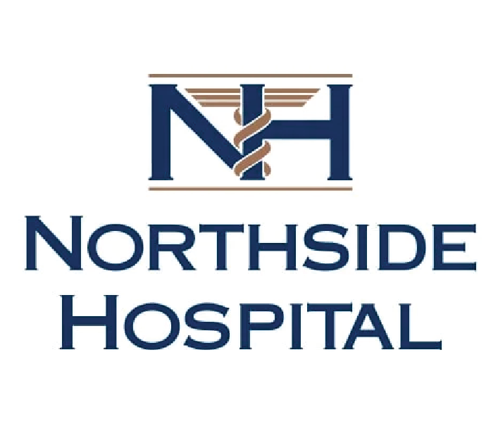

```{r setup, include=FALSE}
knitr::opts_chunk$set(warning = FALSE, message = FALSE, 
                      fig.retina = 3, fig.align = "center")
```

```{r packages-data, include=FALSE}
library(countdown)
```

```{r xaringanExtra, echo=FALSE}
xaringanExtra::use_xaringan_extra(c("tile_view"))
```

class: center middle main-title section-title-2

# Mission and<br>vision statements

.class-info[

**September 8, 2022**

.light[PMAP 3210: Introduction to Nonprofits<br>
Andrew Young School of Policy Studies
]

]

---

name: outline
class: title title-inv-5

# Plan for today

--

.box-7.less-medium[What are mission and<br>vision statements?]

--

.box-3.less-medium[How do we make good<br>mission and vision statements?]

--

.box-1.less-medium[Your nonprofit's<br>mission and vision statements]

---

layout: false
name: what-are
class: center middle section-title section-title-7 animated fadeIn

# What are mission<br>and vision statements?

---

.center[
<figure>
  
</figure>
]

---

layout: true
class: title title-7

---

# What is a mission statement?

--

.box-inv-7.medium[Succinct description of the<br>basic purpose of the organization]

--

.box-7[The reason the organization exists]

--

.box-7[The work to be carried out]

--

.box-7[The beneficiaries it is designed to serve]

---

# What *isn't* a mission statement?

--

.box-inv-7.less-medium[A detailed list of everything the organization does]

--

.box-inv-7.less-medium[Something you create once<br>and never look at again]

--

.box-inv-7.less-medium[Something that changes every month]

---

# Why even have one?

--

.box-inv-7.less-medium[Organizational stability and constraint]

.box-7.small[Keeps programming decisions<br>consistent with organization's purpose]

--

.pull-left[
.box-inv-7.less-medium[Organizational unity]

.box-7.small[Guides day-to-day work]
]

--

.pull-right[
.box-inv-7.less-medium[Public relations]

.box-7.small[Lets outside stakeholders know what the organization does]
]

---

# Why should nonprofits have them?

--

.box-inv-7.medium[Most for-profit private businesses<br>have mission statements]

--

.box-inv-7.medium[Nonprofits absolutely need them]

--

.box-7.large[Why?]


---

# What happens without one?

--

.box-inv-7.medium[Bad things!]

--

.box-7[Mission drift and "barking up the wrong tree"]

--

.box-7[Possibilities limited if statement is unclear or too narrow]

--

.box-7[Organization may not realize when it is time<br>to change mission (or go out of business!)]

---

# What is a vision statement?

--

.box-inv-7[A description that conjures a picture of<br>the overall destination of the organization]

--

.box-inv-7[Answers these kinds of questions:]

--

.box-7.small[What will "success" look like?]

--

.box-7.small[What will the reputation of the nonprofit look like in the community?]

--

.box-7.small[How will your community (or the world) be different?]

--

.box-7.small[What role will the nonprofit play in the community?]

---

layout: false
name: how-make
class: center middle section-title section-title-3 animated fadeIn

# How do we make<br>good mission and<br>vision statements?

---

layout: true
class: title title-3

---

# Components of mission statements

--

.box-inv-3.medium[Purpose statement]

.box-3.small.sp-after[What the organization seeks to accomplish]

--

.box-inv-3.medium[Business statement]

.box-3.small[The main method or activity for fulfilling the purpose]

---

# Purpose statement

--

.center.small[Usually two parts]

--

.pull-left[
.box-1[Phrase that indicates<br>a change in status]

.box-inv-1.smaller[Aspirational verbs like<br>"to increase", "to decrease", "to prevent",<br>"to eliminate", "to promote", etc.]
]

--

.pull-right.sp-after[
.box-8[Problem or condition<br>to be changed]

.box-inv-8.smaller["drunk driving", "illiteracy",<br>"inequality", "homelessness",<br>"effectiveness of {x}", etc.]
]

--

.center.medium[".color-1[To eliminate] .color-8[homelessness]"]

---

# Business statement

--

.box-4.less-medium[Answers the question "What are we going to<br>do to accomplish our purpose?"]

.box-inv-4.smaller.sp-after[Link to the purpose statement with "by" or "through" some verb]

--

.center.medium[".color-1[To eliminate] .color-8[homelessness] .color-4[by providing<br>job training] to homeless individuals"]

---

layout: false

<figure class="sp-after">
  
</figure>

.center[The Woodruff Arts Center’s mission is to inspire, create, support, and celebrate renowned arts and education for diverse audiences through a unique model of partnerships and collaborations, and in an institutionally sustainable manner.]

???

<https://www.woodruffcenter.org/about-the-woodruff-arts-center/>

---

<figure class="sp-after">
  
</figure>

.center[The Woodruff Arts Center’s mission is .color-1[to inspire, create, support, and celebrate] .color-8[renowned arts and education for diverse audiences] .color-4[through a unique model of partnerships and collaborations], and in an institutionally sustainable manner.]

---

layout: true
class: title title-3

---

# Make it part of the culture!

--

.box-inv-3.medium[Mission statements should be<br>memorable and recitable]

.box-3[They also have to allow for a strategy—can't be too vague]

---

layout: false

.center[
<figure>
  
</figure>
]

---

.pull-left[
.center[
<figure>
  
</figure>
]

"Making kids better today and healthier tomorrow"
]

--

.pull-right[
.center[
<figure>
  
</figure>
]

.small[.smaller[
"Northside Hospital is committed to the health and wellness of our community. As such, we dedicate ourselves to being a center of excellence in providing high-quality health care. We pledge compassionate support, personal guidance and uncompromising standards to our patients in their journeys toward health of body and mind. To ensure innovative and unsurpassed care for our patients, we are dedicated to maintaining our position as regional leaders in select medical specialties. And to enhance the wellness of our community, we commit ourselves to providing a diverse array of educational and outreach programs."
]]
]

???

<https://www.choa.org/give>

<https://www.northside.com/about>

---

layout: true
class: title title-3

---

# Components of vision statements

--

.center.small[Usually two parts]

--

.pull-left[
.box-2[Core ideology]

.box-inv-2.smaller[Organization's reason for being;<br>the soul of the nonprofit.<br>**Not** its goal or business strategy]

.box-inv-2.smaller[Ask "why" a bunch of times]
]

--

.pull-right[
.box-6[Envisioned future]

.box-inv-6.smaller[Big hairy audacious goal (BHAG) + vivid description of the future]
]

???

Gravel and asphalt company:

- We make gravel and asphalt products
- Because quality of infrastructure plays a vital role in people's safety and experience
- Because potholes are annoying and dangerous
- Because planes can't land on bad runways
- Because we're making people's lives better by improving the quality of man-made structures

---

# BHAGs

--

.pull-left[

.box-inv-3[Target]

.box-3.small[Ford:<br>"Democratize the automobile"]

.box-inv-3[Common enemy]

.box-3.small[Nike:<br>"Crush Adidas"]
]

--

.pull-right[
.box-inv-3[Role model]

.box-3.small[Stanford:<br>"Become the Harvard of the West"]

.box-inv-3[Internal transformation]

.box-3.small[GE:<br>"Be #1 or #2 in every market"]
]

---

layout: false

<figure class="sp-after">
  
</figure>

.center.medium.color-2[To be a uniquely exciting and innovative destination and a beacon for excellence in arts and education]

---

layout: false
class: middle

<figure>
  
  <figcaption class="center"><a href="https://www.liftinghandsinternational.org/">Lifting Hands International</a></figcaption>
</figure>

---

class: middle

.box-3.huge[Your turn!]

.box-inv-3[Find and evaluate 5 different nonprofits'<br>mission and vision statements]

---

layout: false
name: your-nonprofit
class: center middle section-title section-title-1 animated fadeIn

# Your nonprofit's<br>mission and vision statements
