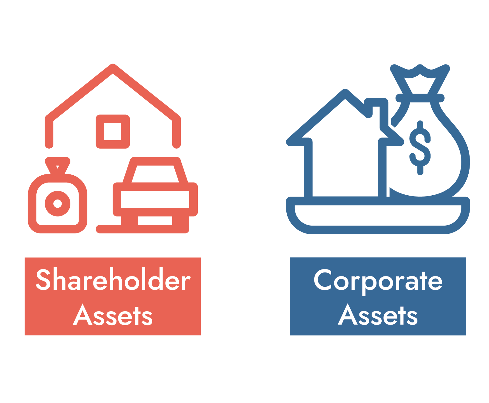
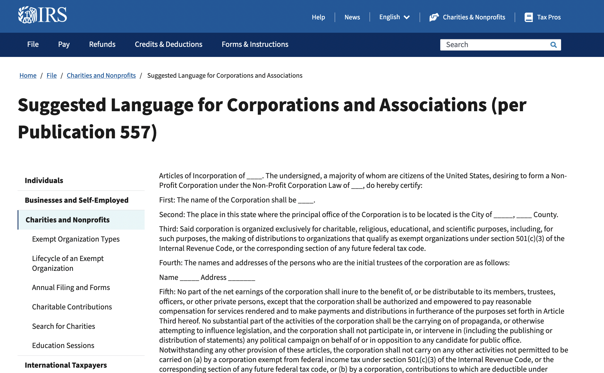
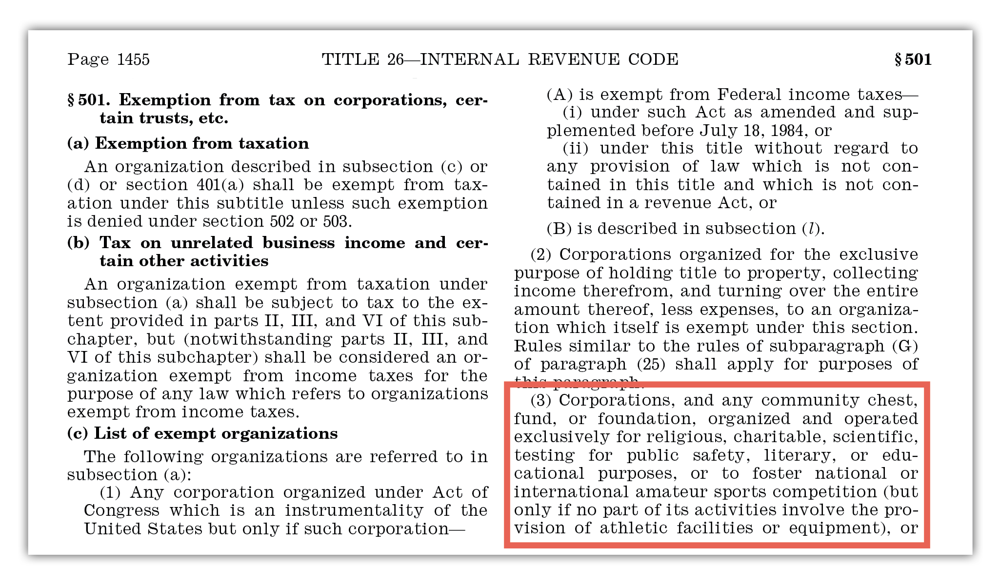

```{r setup, include=FALSE}
knitr::opts_chunk$set(warning = FALSE, message = FALSE, 
                      fig.retina = 3, fig.align = "center")
```

```{r packages-data, include=FALSE}
library(countdown)
```

```{r xaringanExtra, echo=FALSE}
xaringanExtra::use_xaringan_extra(c("tile_view"))
```

class: center middle main-title section-title-2

# Regulatory<br>issues

.class-info[

**September 15, 2022**

.light[PMAP 3210: Introduction to Nonprofits<br>
Andrew Young School of Policy Studies
]

]

---

name: outline
class: title title-inv-5

# Plan for today

--

.box-1.medium.sp-after[Incorporation issues]

--

.box-3.medium[Money issues]

---

layout: false
name: incorporation
class: center middle section-title section-title-1 animated fadeIn

# Incorporation issues

---

layout: true
class: title title-1

---

# Typical corporate structure

.center[
<figure>
  
</figure>
]

---

class: middle

# Typical nonprofit structure

.center[
<figure>
  
</figure>
]

---

layout: true
class: title title-1

---

# Corporate veil

.center[
<figure>
  
</figure>
]

???

Icons from The Noun Project used under a Creative Commons license via [Symbolon](https://thenounproject.com/icon/assets-2724299/) and [Bekeen.co](https://thenounproject.com/icon/assets-4216282/)

---

# Corporate veil

.center[
<figure>
  
</figure>
]

---

# Advantages of incorporation?

--

.pull-left[
.box-inv-1[Limited liability]

.box-1.small.sp-after[Corporate shield]

.box-inv-1[Tax advantages]

.box-1.small[Corporate tax rate lower<br>than personal tax rate]

.box-1.small[Nonprofit exemptions]
]

--

.pull-right[
.box-inv-1[Structure]

.box-1.small[Accountability]

.box-1.small.sp-after[Legal recognition creates trust]

.box-inv-1[Perpetuity]

.box-1.small[Organization can endure over time]
]

---

# Advantages of incorporation?

--

.box-inv-1[Other stuff]

--

.box-1.small[Cheaper postage]

--

.box-1.small[Free public service announcements]

--

.box-1.small[Volunteers]

--

.box-1.small[Halo effect]

--

.box-1.small[Free stuff]

--

.box-1.small[Group decision-making]

---

# Disadvantages of incorporation?

--

.pull-left[
.box-inv-1[Loss of control]

.box-1.small.sp-after[Board oversees all decisions]

.box-inv-1[Compliance expenses]

.box-1.small[It takes money and time<br>to keep up with everything]
]

--

.pull-right[
.box-inv-1[Paperwork]

.box-1.small.sp-after[Lots of forms!]

.box-inv-1[Federal, state,<br>and local tax filings]

.box-1.small[Different deadlines!]
]

---

# Corporate governance

--

.pull-left[
.box-inv-1[Articles of incorporation]

.box-1.smaller[**Filed with the state**]

.box-1.smaller[Purpose statement]

.box-1.smaller[Membership governance]

.box-1.smaller[Name, address, etc.]

.box-1.smaller[Limitations on director liability]

.box-1.smaller[Special tax statement]

.box-1.smaller[What happens at dissolution]
]

???

Assets go to another (c)(3) entity or to the government at dissolution

---

layout: false
class: middle center

<figure>
  
</figure>

???

https://www.irs.gov/charities-non-profits/suggested-language-for-corporations-and-associations

---

layout: true
class: title title-1

---

# Corporate governance

.pull-left[
.box-inv-1[Articles of incorporation]

.box-1.smaller[**Filed with the state**]

.box-1.smaller[Purpose statement]

.box-1.smaller[Membership governance]

.box-1.smaller[Name, address, etc.]

.box-1.smaller[Limitations on director liability]

.box-1.smaller[Special tax statement]

.box-1.smaller[What happens at dissolution]
]

--

.pull-right[
.box-inv-1[Bylaws]

.box-1.smaller[**Not filed with the state**]

.box-1.smaller[Internal document]

.box-1.smaller[Board operations]

.box-1.smaller[Executive operations]

.box-1.smaller[Other operations]
]

---

# Purpose statement

--

.box-inv-1[Make it as broad as possible to maximize flexibility]

--

.box-inv-1[*Not* the same as the mission statement!]

--

.small[

> "Said corporation is organized exclusively for charitable, religious, educational, and scientific purposes, including, for such purposes, the making of distributions to organizations that qualify as exempt organizations under section 501(c)(3) of the Internal Revenue Code, or the corresponding section of any future federal tax code."

]

???

https://www.irs.gov/charities-non-profits/suggested-language-for-corporations-and-associations

https://learning.candid.org/resources/knowledge-base/articles-of-incorporation/

---

# Nonprofit corporation members

--

.box-inv-1.less-medium[Members ≈ Shareholders]

--

.box-1.small.sp-after[Members ≠ anyone who donates]

--

.box-inv-1.less-medium[Members make organizational decisions] 

--

.box-inv-1.less-medium.sp-after[Members choose the board]

--

.center[
.float-left[.box-1[Churches]&ensp;.box-1[Social clubs]&ensp;.box-1[Fraternities and sororities]]
]

???

https://www.upcounsel.com/nonprofit-corporation-members

---

# Should you have members?

--

.pull-left[
.box-inv-1[Advantages of members]

.box-1.small[All participants have equal voice]

.box-1.small[More democratic and egalitarian]
]

--

.pull-right[
.box-inv-1[Disadvantages of members]

.box-1.small[Hard to undo]

.box-1.small[Decision making is more complex]

.box-1.small[Less stable]
]

???

Boards are self-perpetuating

Sierra Club was almost taken over by an anti-immigrant faction since you could become a voting member with a $25 donation

---

# Bylaws

--

.box-inv-1[Governing document for the organization]

--

.box-1.small[Size of board and how it works]

--

.box-1.small[Roles of executive directors and officers]

--

.box-1.small[Rules for meetings, elections, hiring]

--

.box-1.small[Conflict of interest policies]

--

.box-1.small[Compensation and indemnification of directors]

--

.box-1.small[Process of amending bylaws]

???

https://www.harborcompliance.com/information/nonprofit-bylaws

https://learning.candid.org/resources/knowledge-base/nonprofit-bylaws/

---

# Finding public information

.box-inv-1[Articles of incorporation are public information]

.box-inv-1[You can find them online!]

.box-1.small[Some nonprofits put them on their websites]

.center.smaller.sp-after[[Georgia Gwinnett College Foundation](https://www.ggcfoundation.org/)]

.box-1.small[State Departments of State maintain databases of all incorporations]

.center.smaller[[Georgia Secretary of State's Business Search](https://ecorp.sos.ga.gov/BusinessSearch)]

---

layout: false
name: money
class: center middle section-title section-title-3 animated fadeIn

# Money issues

---

layout: true
class: title title-3

---

# §501(c)(3)

.center[
<figure>
  
</figure>
]

---

# §501(c)(3)

--

.box-inv-3[Creating a nonprofit does not<br>automatically grant you 501(c)(3) status!]

--

.pull-left[
.box-3.small[Nonprofits are<br>state-based corporations]
]

.pull-right[
.box-3.small.sp-after[501(c)(3) is a<br>federal IRS regulation]
]

--

.box-inv-3[Getting federal 501(c)(3) status is a separate process]

---

# Why get 501(c)(3) status?

--

.box-inv-3[Exemption from many federal taxes]

--

.box-inv-3[Tax deduction for your donors]

--

.box-inv-3[Major donors won't contribute unless you have it]

--

.box-inv-3[IRS seal of approval (though the bar is low)]

---

# Costs of being a 501(c)(3)

--

.box-inv-3.medium.sp-after-half[Political activity]

--

.box-inv-3.medium.sp-after-half[Unrelated business income<br><small>(UBI)</small>]

--

.box-inv-3.medium[Time!]

???

Business activities - unrelated business income (UBI), if too significant = loss of tax exemption - UBI is always taxable - DI is not generating UBI (that's the point of their organization). If a church newsletter starts selling advertising space, that's UBI. NPR underwriting is special case—sponsors can get exemption. BYU gets tax exemption from selling textbooks, since that fulfills charitable purpose; BYU fudge is UBI.

---

# Paperwork, cost, and time

.pull-left[

.box-inv-3.SMALL[Paperwork]

.smaller[.small[

- GA Articles of Incorporation
- GA Data Transmittal Form 227
- GA Notice of Incorporation
- GA Initial “Annual” Registration
- Bylaws
- IRS Form SS-4: Obtain an EIN
- IRS Form 1023: 501(c) Tax Exempt Application
- IRS Determination Letter
- Form 3605: Application Recognition of Exemption (optional)
- URS Charitable Registration, if applicable
- Form C-100: Charitable Organization Registration

]]
]

.pull-right[

.box-inv-3.SMALL[Cost]

.smaller[.small[

- GA Articles of Incorporation: $100
- GA Notice of Incorporation: $40
- GA initial "Annual" Registration: $50
- Georgia charitable registration: $35
- IRS 501(c): $275 or $600 IRS fee

]]

.box-inv-3.SMALL[Time]

.smaller[.small[

- GA incorporation: ≈5–12 business days
- IRS 501(c) tax exemption: 2 weeks to 3 months

]]
]

---

# Automatic tax exemption

.box-inv-3.less-medium.sp-after[Some organizations get automatic tax exemption]

--

.box-3[Organizations that receive less than $5,000 annually]

--

.box-3[Bona fide religious organizations]

--

.box-3[Fiscal sponsorship]

.box-3.smaller[(a small nonprofit that temporarily falls<br>under the exemption of a larger nonprofit)]

---

# Fundraising and jurisdictions

--

.box-inv-3.less-medium[The IRS grants tax exemption for donations, but…]

--

.box-inv-3.less-medium.sp-after[…39 states regulate donations]

--

.box-3.small[If you are a Georgia-based nonprofit, you can't ask for<br>donations in other states unless you register there too!]

.box-3.smaller[.small[Except for DE, ID, IN, IA, MT, NE, NV, SD, TX, VT, WY]]

--

.box-inv-3.medium[This includes the internet!]

---

# Charleston Principles

.center.smaller[<https://www.charitycompliancesolutions.com/charleston-principles>]

--

.box-inv-3.small[1: Using the internet for fundraising is legitimate]

--

.box-inv-3.small[2: States should enforce fundraising laws and prosecute<br>bad actors, regardless of where the nonprofit is based]

--

.box-inv-3.small[3: Guidelines for getting donations from<br>home states and from other states]

--

.box-inv-3.small[4: A call to reduce the administrative<br>burden of multi-state filing]

---

# Unified Registration Statement

.pull-left[
.center[
<figure>
  
</figure>
]
]

.pull-right[
.center[<http://multistatefiling.org/>]

.box-inv-3.small[Accepted in Georgia<br>with a supplement form]

.box-inv-3.small[CO, FL, and OK<br>do not accept the URS `r emoji::emoji("shrug")`]

.box-inv-3.small[Only good for initial filing,<br>not annual reports `r emoji::emoji("shrug")`]
]

---

# How to set up a nonprofit

&nbsp;

.box-inv-3.large[Lots of guides online]

.box-inv-3[[This one is good](https://www.harborcompliance.com/information/how-to-start-a-non-profit-organization-in-georgia)]
