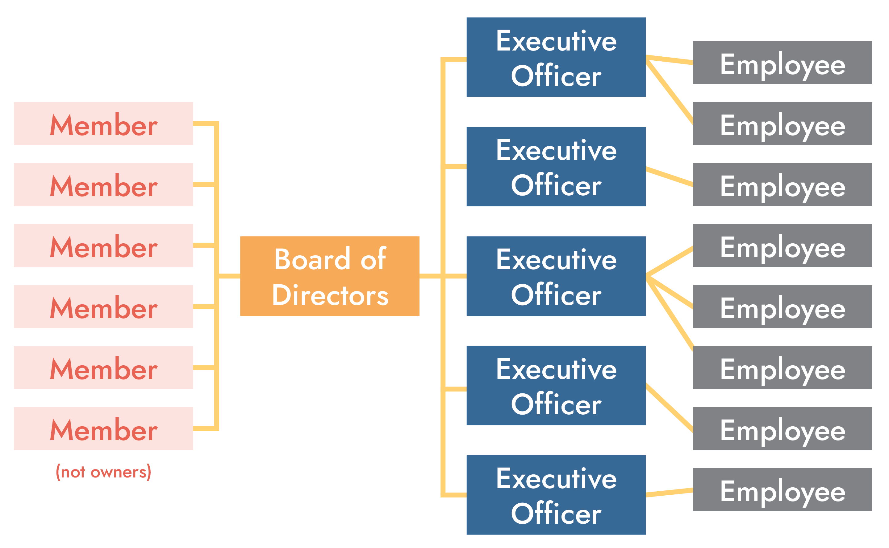
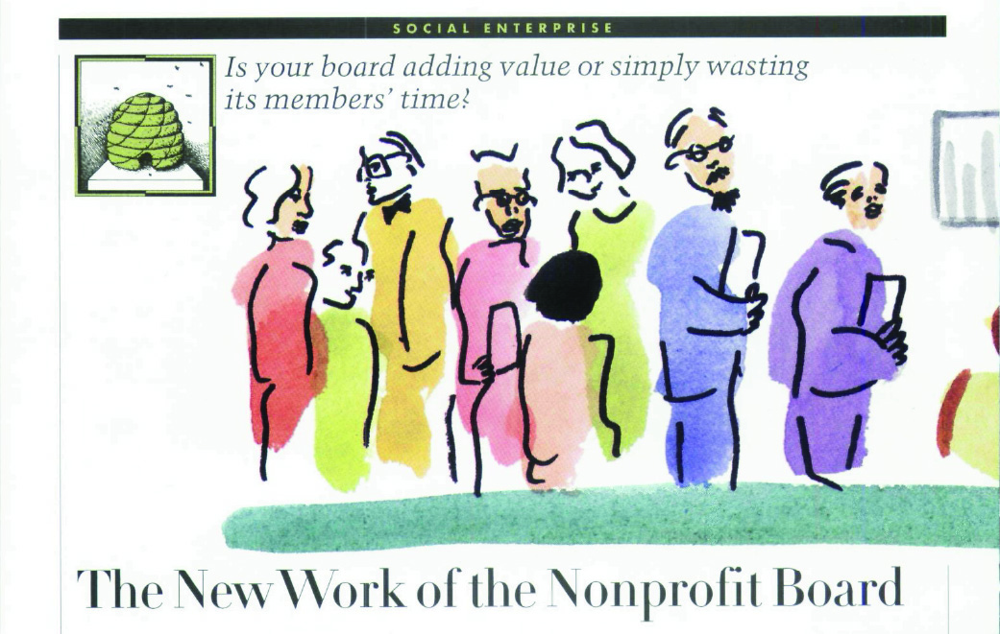
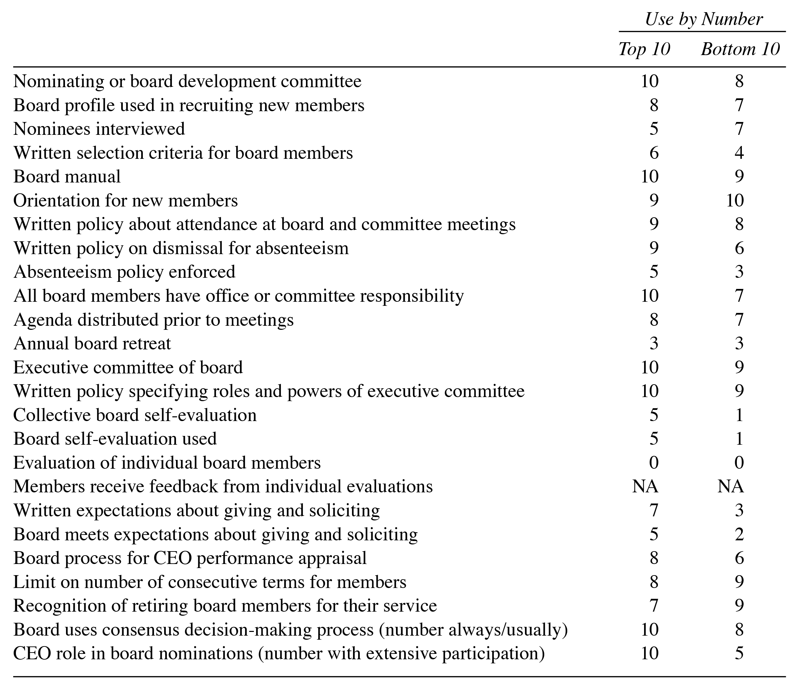

```{r setup, include=FALSE}
knitr::opts_chunk$set(warning = FALSE, message = FALSE, 
                      fig.retina = 3, fig.align = "center")
```

```{r packages-data, include=FALSE}
library(countdown)
```

```{r xaringanExtra, echo=FALSE}
xaringanExtra::use_xaringan_extra(c("tile_view"))
```

class: center middle main-title section-title-2

# Board<br>governance

.class-info[

**September 22, 2022**

.light[PMAP 3210: Introduction to Nonprofits<br>
Andrew Young School of Policy Studies
]

]

---

name: outline
class: title title-inv-5

# Plan for today

--

.box-4.medium.sp-after[What do boards do?]

--

.box-7.medium[What makes a good board?]

---

layout: false
name: boards-do
class: center middle section-title section-title-4 animated fadeIn

# What do<br>boards do?

---

layout: true
class: title title-4

---

class: middle

# Typical nonprofit structure

.center[
<figure>
  
</figure>
]

---

layout: true
class: title title-4

---

# What is a board?

--

.box-inv-4.medium.sp-after[A group of volunteers<br>who help direct the nonprofit]

--

.box-inv-4.medium[The board sets the strategic<br>vision for the nonprofit]

---

# Requirements

.box-inv-4.medium[Legal requirements for being<br>a nonprofit board member:]

--

.box-4.large[Be 18+ years old]

--

.box-4[That's it.]

---

# Board member legal duties

--

.box-inv-4[Duty of Care]

.float-left.center[.box-4.small[Due diligence]&emsp;.box-4.small[Monitor finances]&emsp;.box-4.small[Supervise management]]

--

.box-inv-4[Duty of Loyalty]

.float-left.center[.box-4.small[Put nonprofit's interests above own]&emsp;.box-4.small[Avoid conflicts of interest]]

--

.box-inv-4[Duty of Obedience]

.float-left.center[.box-4.small[Keep nonprofit in line with law and mission]&emsp;.box-4.small[Avoid mission drift]]

---

# Board responsibilities

--

.box-inv-4[Personnel]

.box-4.small[Select new board members]

.box-4.small[Appoint, advise, evaluate, dismiss the CEO/executive director]

--

.box-inv-4[Planning]

.float-left.center[.box-4.small[Approve policies and programs]&emsp;.box-4.small[Maintain clear mission and purpose]]

.box-4.small[Establish standards for performance and hold the organization accountable]

---

# Board responsibilities

--

.box-inv-4[Finance]

.float-left.center[.box-4.small[Ensure sound financial management and transparency]&emsp;.box-4.small[Approve budget]]

--

.box-inv-4[Fundraising]

.float-left.center[.box-4.small[Approve plans for fundraising events]&emsp;.box-4.small[Contribute and participate]]

--

.box-inv-4[Public Relations]

.box-4.small[Encourage outside participation in the organization.]


---

# Where does management fit?

.center[
<figure>
  
</figure>
]

--

.box-inv-4[Management = executive team]

.box-4.smaller[Executive director/CEO and staff]

--

.box-inv-4[Usually paid; direct day-to-day activities of the nonprofit]


---

# Where do boards come from?

.box-inv-4.medium[Elected]

.box-inv-4.medium[Self-perpetuating]

.box-inv-4.medium[Hybrid]

---

# Elected boards

--

.box-inv-4[Membership elects the board]

--

.pull-left[
.box-4.small[Pros]

.box-inv-4.small[Nonprofit more responsive to<br>members' needs and priorities]
]

--

.pull-right[
.box-4.small[Cons]

.box-inv-4.small[Membership divisions<br>reflected in board]

.box-inv-4.small[High turnover makes it hard to<br>sustain long-term strategies]

.box-inv-4.small[Board skills may be uneven<br>because of popularity contest]
]

---

# Self-perpetuating boards

--

.box-inv-4[New board members selected by existing board]

--

.pull-left[
.box-4.small[Pros]

.box-inv-4.small[Continuity of culture,<br>goals, and priorities]

.box-inv-4.small[Can target members<br>with specific skills]
]

--

.pull-right[
.box-4.small[Cons]

.box-inv-4.small[May become unrepresentative<br>of the community]

.box-inv-4.small[Too stable to respond to changes]

.box-inv-4.small[Often give too much<br>authority to the CEO/ED]
]

---

# Hybrid boards

--

.box-inv-4[Some positions are elected;<br>some are appointed or ex officio]

--

.pull-left[
.box-4.small[Pros]

.box-inv-4.small[Combines the<br>advantages of elected and<br>self-perpetuating boards]
]

--

.pull-right[
.box-4.small[Cons]

.box-inv-4.small[Different interests and<br>loyalties may lead to a stalemate]
]

---

# Executive committee

--

.box-inv-4[Boards often have internal committees]

.box-inv-4[Most common (and important) is the<br>**executive committee** of board officers]

.float-left.center[.box-4.small[Chair]&emsp;.box-4.small[Vice chair]&emsp;.box-4.small[Secretary]&emsp;.box-4.small[Treasurer]]

--

.box-inv-4.small[Executive board can have the power of the full board for lots of decisions]

--

.box-inv-4.small[Other committees are useful too, depending on size and needs]

.float-left.center[.box-4.smaller[Finance committee]&emsp;.box-4.smaller[Marketing committee]&emsp;.box-4.smaller[Strategy committee]]

???

Can have the power of the full board to make decisions with the exceptions that it cannot:

- Fill vacancies on the board
- Adopt, amend, or repeal bylaws
- Have powers inconsistent with those established when it was created by the board.

---

# Special kinds of boards

--

.box-inv-4.less-medium[Advisory boards]

.box-4.small[Famous, rich, well-connected, or expert people<br>who want to be affiliated with the nonprofit<br>but don't have time for actual governance]

--

.box-inv-4.less-medium[Client boards]

.box-4.small[Members of the community the nonprofit serves<br>who consult with the governing board and executive team]

---

# Decisions to be made

--

.box-inv-4[Board elected, self-perpetuating, or hybrid?]

--

.box-inv-4[Board size?]

--

.box-inv-4[Quorum size?]

--

.box-inv-4[Should *ex officio* members (like the CEO/ED)<br>have a vote on the board?]

--

.box-inv-4[How should the executive committee be formed?<br>Nominated or open?]

---

layout: false
class: middle

.box-4.medium[Find the board for a nonprofit<br>you're interested in. Who's on it? <br>What expertise do they bring?]

.box-4.medium[Find a nonprofit with an advisory board.<br>Who's on it? Why do you think<br>the nonprofit sought them out?]

---

layout: false
name: good-boards
class: center middle section-title section-title-7 animated fadeIn

# What makes<br>a good board?

---

class: middle

.box-7.large["Effective governance by the board of a nonprofit organization is a rare and unnatural act."]

.box-inv-7.medium["Nonprofit boards are often little more than a collection of high-powered people engaged in low-level activities."]

???

<https://hbr.org/1996/09/the-new-work-of-the-nonprofit-board>

---

class: middle

.center[
<figure>
  
</figure>
]

---

layout: true
class: title title-7

---

# What should board members bring?

<br>

--

.box-inv-7.large[Wealth, wisdom, work?]

???

This can omit critical voices though

---

# Board recruitment and diversity

--

.box-inv-7.sp-after[Why care about board diversity?]

--

.box-inv-7[Recruit board members with different:]

--

.box-7.small[Expertise (legal, fundraising, fiscal, personnel management)]

--

.float-left.center[.box-7.small[Ages]&emsp;.box-7.small[Races and Religions]]

--

.box-7.small[Backgrounds (government, business, nonprofit)]

--

.box-7.small[Experiences (clients of the nonprofit, advocacy work, volunteering)]

---

# Best practices

.center[
<figure>
  
</figure>
]

---

# Best practices

.pull-left[

.box-inv-7[Top 10 organizations<br>used 86% of the<br>correct procedures]

.box-inv-7[Bottom 10 organizations<br>used 70% of the<br>correct procedures]

]

.pull-right[
```{r board-practices-diffs, echo=FALSE, fig.width=6, fig.height=5.5}
library(dplyr)
library(forcats)
library(ggplot2)

df <- tribble(
  ~type, ~pct,
  "Top 10 organizations", 0.86,
  "Bottom 10 organizations", 0.7
) %>% 
  mutate(type = fct_inorder(type))

ggplot(df, aes(x = type, y = pct, fill = type)) +
  geom_col() +
  scale_y_continuous(labels = scales::percent_format()) +
  scale_fill_manual(values = c("#ffd06f", "#e76254")) +
  annotate(geom = "linerange", x = 1.5, xmin = 1, xmax = 2, y = 0.9,
           size = 2, color = "grey50") +
  annotate(geom = "text", x = 1.5, y = 0.95, label = "t = 3.7***",
           size = 5, family = "Jost") +
  labs(x = NULL, y = NULL) +
  guides(fill = "none") +
  coord_cartesian(ylim = c(0, 1)) +
  theme_bw(base_size = 20, base_family = "Jost") +
  theme(panel.grid.major.x = element_blank(),
        panel.grid.major.y = element_blank(),
        panel.grid.minor = element_blank())
```
]

???

> The top 10 organizations reported using 86% of the correct procedures, whereas the bottom 10 use 70% (a difference significant at the .001 level, with a t value of 3.7). The correlation between reported use of prescribed board practices and correct procedures is r = .32 in the restricted sample; the same correlation in the full sample is r = .24. The relation is stronger in the sample of the most and least effective organizations, although the increase is not as great as expected. (p. 157)

---

layout: false
class: middle

.box-7.large[Your most important things]
