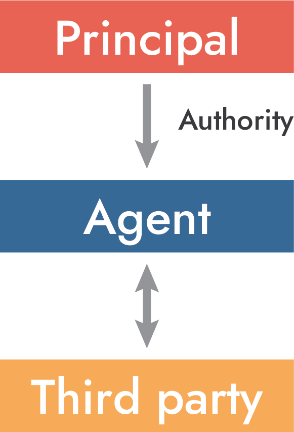
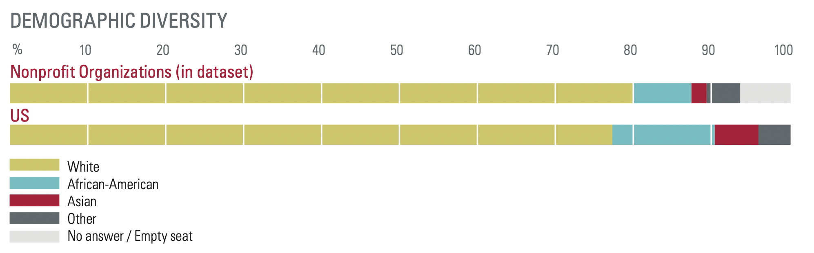
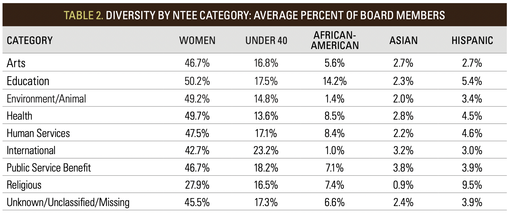
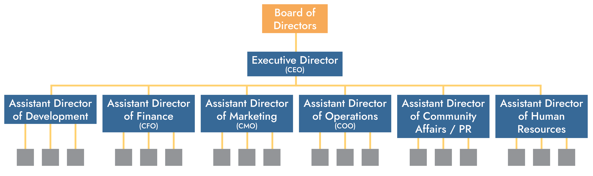
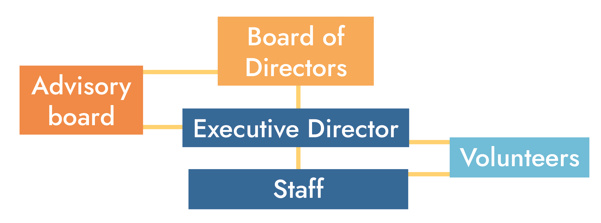
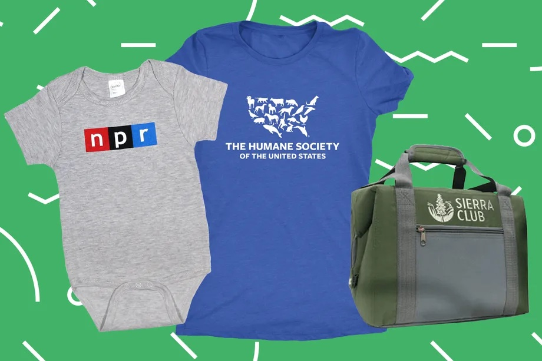

```{r setup, include=FALSE}
knitr::opts_chunk$set(warning = FALSE, message = FALSE, 
                      fig.retina = 3, fig.align = "center")
```

```{r packages-data, include=FALSE}
library(countdown)
```

```{r xaringanExtra, echo=FALSE}
xaringanExtra::use_xaringan_extra(c("tile_view"))
```

class: center middle main-title section-title-2

# Personnel

.class-info[

**September 29, 2022**

.light[PMAP 3210: Introduction to Nonprofits<br>
Andrew Young School of Policy Studies
]

]

---

name: outline
class: title title-inv-5

# Plan for today

--

.box-3.medium.sp-after[Principals and agents]

--

.box-8.medium.sp-after[Officers and employees]

--

.box-1.medium[Volunteers]

---

layout: false
name: principals-agents
class: center middle section-title section-title-3 animated fadeIn

# Principals<br>and agents

---

layout: true
class: title title-3

---

# Principal-agent relationships

.pull-left.center[
<figure>
  
</figure>
]

.pull-right[
.color-1[**Principal**] gives .color-7[**agent**]…

1. authority
2. autonomy
3. discretion

…to do something for them.
]

---

# Nonprofit principals and agents

--

.box-inv-3[Board and executives]

--

.box-inv-3[Executives and employees]

--

.box-inv-3[Employees and volunteers]

--

.box-inv-3[Donors and nonprofit]

--

.box-inv-3[Government and nonprofit]

---

# Different types of agency

--

.pull-left-3[
.box-inv-3.less-medium[Express]

.box-3.small[Exact identification<br>of responsibility]

.box-3.smaller["Only get<br>these things on<br>the grocery list"]
]

--

.pull-middle-3[
.box-inv-3.less-medium[Implied]

.box-3.small[Partial identification<br>of responsibility]

.box-3.smaller["Go to the fridge,<br>see what's missing, and<br>get that stuff at the store"]
]

--

.pull-right-3[
.box-inv-3.less-medium[Apparent]

.box-3.small[Third party assumes agent has agency]

.box-3.smaller[A principal fires an agent, agent continues doing agent-y things; third party not liable for any bad stuff]

.center.smaller[.smaller[.small[Agency law protects the most innocent party first]]]
]

---

# Conflict

--

.box-inv-3.medium[There's inherent conflict!]

--

.pull-left[
.box-3[Principal can't<br>observe the agent]
]

--

.pull-right[
.box-3[Agent's preferences don't<br>always align with<br>the principal's]
]

---

layout: false
class: middle

.box-inv-3.medium[How does the principal make sure<br>the agent does what they want?]

---

layout: true
class: title title-3

---

# Contracts

--

.box-inv-3.medium[A legal document or understanding<br>that specifies a set of actions that<br>parties to the contract must undertake]

--

.box-3[These are inherently incomplete though]

---

layout: false
name: officers-employees
class: center middle section-title section-title-8 animated fadeIn

# Officers and<br>employees

---

layout: false
class: middle section-title-inv-8 animated fadeIn

.box-8.huge[Pop quiz!]

---

layout: true
class: section-title-inv-8

---

.medium.center[

Which group employs the most people?

- The federal government
- All 50 state governments
- Nonprofits

]

???

Source: O'Neil, *Nonprofit Nation*

---

.medium.center[

Which group employs the most people?

- The federal government
- All 50 state governments
- .color-2[**Nonprofits**]

.small[(More than the other two combined!)]

]

???

More than both combined!

---

.medium.center[

Which of the following industries employ more people than the nonprofit industry?

.pull-left.small[
- Agriculture
- Transportation, communication, and other public utilities
]

.pull-right.small[
- Mining
- Construction
- Finance, insurance, and real estate
]

]

???

Source: O'Neil, *Nonprofit Nation*

---

.medium.center[

Which of the following industries employ more people than the nonprofit industry?

.pull-left.small[
- Agriculture
- Transportation, communication, and other public utilities
]

.pull-right.small[
- Mining
- Construction
- Finance, insurance, and real estate
]

.box-2.smaller[None of them!]

]

---

.medium.center[

What percentage of nonprofit<br>program officers are women?

- 28%
- 42%
- 68%

]

???

Source: O'Neil, *Nonprofit Nation*

---

.medium.center[

What percentage of nonprofit<br>program officers are women?

- 28%
- 42%
- .color-2[**68%**]

]

???

Majority of boards are men though

---

class: middle

.center[
Board diversity in the US

<figure>
  
</figure>
]

???

https://scholarworks.iupui.edu/bitstream/handle/1805/15239/board-diversity180220.pdf

---

class: middle

.center[
Board diversity in the US

<figure>
  
</figure>
]

???

https://scholarworks.iupui.edu/bitstream/handle/1805/15239/board-diversity180220.pdf

---

.medium.center[

Considering skill, experience, and work duties, what percentage of nonprofit employees are underpaid?

- 20–30%
- 50–60%
- 80–90%

]

???

Source: O'Neil, *Nonprofit Nation*

---

.medium.center[

Considering skill, experience, and work duties, what percentage of nonprofit employees are underpaid?

- .color-2[**20–30%**]
- 50–60%
- 80–90%

]

???

Once you go beyond entry level positions, you get paid normal amounts

---

class: middle

.box-8.medium[Why are there so many misconceptions<br>about nonprofit employment?]

---

layout: true
class: title title-8

---

# Typical nonprofit structure

.center[
<figure>
  
</figure>
]

---

# Typical nonprofit jobs?

--

.pull-left[
.box-inv-8[Management]

.small[
- Executive director
- Assistant directors
  - Development
  - Finance
  - Operations
  - Planning/marketing
  - Public relations
  - Human resources
]
]

--

.pull-right[
.box-inv-8[Staff]

.small[
- Program officers
- Accountants
- Legal staff
- HR specialists
- Graphic and web designers
- Administrative assistants
]
]

---

# Typical large nonprofit structure

.center[
<figure>
  
</figure>
]

---

# Typical small nonprofit jobs?

--

.pull-left[
.box-inv-8[Management]

.small[
- Executive director
]
]

--

.pull-right[
.box-inv-8[Staff]

.small[
- Director of development
- Business manager
- Administrative assistant
]
]

---

# Simplified nonprofit structure

.center[
<figure>
  
</figure>
]

---

# Types of positions

--

.box-inv-8[Full-time]

--

.box-inv-8[Part-time]

--

.box-inv-8[Contractor]

--

.box-inv-8[Temporary]

--

.box-inv-8[Outsourced]

--

.box-inv-8[Volunteer]

---

# HR compliance

.box-inv-8[Hiring people is ***complicated***!]

--

.pull-left-3.small[
- Hiring policies
- Firing policies
- Overtime policies
- Leave .small[(sick/maternity/bereavement/medical/family/military)]
- Vacation
]

--

.pull-middle-3.small[
- Personal days
- Holidays
- Jury duty
- Health insurance .small[(and ACA regulations)]
- Life insurance
- Retirement plans
]

--

.pull-right-3.small[
- Payroll
- Employee evaluation
- Raises
- Benefits
- Training
- Legal compliance
- **AND MORE**
]

--

.box-8.smaller[This is why there are whole HR departments!]

---

# Discrimination

--

.box-inv-8[Employers cannot discriminate on the basis of:]

--

.float-left.center[.box-8.small[Race]&ensp;.box-8.small[Color]&ensp;.box-8.small[Sex]&ensp;.box-8.small[Religion]&ensp;.box-8.small[Age]]

--

.float-left.center.sp-after[.box-8.small[National origin]&ensp;.box-8.small[Disability]&ensp;.box-8.small[Pregnancy]&ensp;.box-8.small[Familial status]]

--

.box-inv-8[Still being contested in federal and state courts:]

--

.float-left.center.sp-after[.box-8.small[Sexual orientation]&ensp;.box-8.small[Gender identity]]

--

.box-inv-8[Protected classes]

???

- https://www.aclu.org/know-your-rights/lgbtq-rights/
- https://freedomforallamericans.org/states/

---

# Illegal interview questions

--

.box-inv-8[Questions relating to protected class stuff<br>.small[(race, sex, religion, disability, etc.)]]

--

.box-inv-8[Questions that can hint at protected class stuff<br>.small[(# of children, childcare arrangements, if pregnant, height/weight, etc.)]]

--

.box-inv-8[If applicant has been arrested or convicted of a crime<br>.small[(without proof of business necessity for asking)]]

---

layout: false
name: volunteers
class: center middle section-title section-title-1 animated fadeIn

# Volunteers

---

layout: true
class: title title-1

---

# Americans love volunteering

--

.box-inv-1[30.3% of adults volunteered in 2018]

.box-inv-1[77.4 million people]

--

.box-inv-1[6.9 billion hours]

--

.box-inv-1[Value of donated time: $167 billion]

???

VolunteeringInAmerica.gov, 2018

---

# Formal vs. informal

.pull-left[
.box-inv-1.less-medium[Formal volunteering]

.box-1.small.sp-after[Organized by a nonprofit<br>with a specific goal]

.box-1.small[Sorting items at a food bank]
]

--

.pull-left[
.box-inv-1.less-medium[Informal volunteering]

.box-1.small.sp-after[Focused on individuals<br>you're connected to]

.box-1.small[Feeding your neighbor's cat]
]

---

layout: false
class: middle

.box-1.large[Why do you volunteer?]

---

layout: true
class: title title-1

---

# Why do people volunteer?

--

.box-inv-1.medium[Altruism]

--

.box-inv-1.medium[Ego]

--

.box-inv-1.medium[Coercion]

---

# Free labor?

--

.box-inv-1[Volunteers are **not free**.<br>They can be expensive to manage and train.]

--

.box-inv-1.small.sp-after[(Hire a volunteer coordinator if you have lots of volunteers)]

--

.box-inv-1[Volunteers are still agents,<br>even without a formal employment contract]

--

.box-inv-1[Should volunteers be held to a<br>lower standard than paid employees?]

---

# General guidelines

--

.pull-left-3[
.box-inv-1[Clear<br>expectations]

.box-1.smaller[Volunteers sense your<br>mission, but not<br>necessarily your vision]

.box-1.smaller[Make sure they're<br>properly trained]
]

--

.pull-middle-3[
.box-inv-1[Input<br>solicitation]

.box-1.smaller[Volunteers see and hear<br>things that you'll miss]

.box-1.smaller[Create a structured<br>feedback system to<br>hear from them]
]

--

.pull-right-3[
.box-inv-1[Warm<br>appreciation]

.box-1.smaller[Recognition and appreciation<br>are inexpensive forms<br>of compensation]

.box-1.smaller[Returning volunteers<br>save on training costs]
]

---

layout: false
class: middle

.box-1.large[Should you pay volunteers?]

---

layout: true
class: title title-1

---

# Crowding out

--

.float-left.center.sp-after[.box-inv-1.less-medium[Extrinsic motivations]&ensp;.box-inv-1.less-medium[Intrinsic motivations]]

--

.box-1.small[Blood donations]

--

.box-1.small[Taxes]

--

.box-1.small[Favors]

--

.box-1.small[Thanksgiving]

--

.box-1.small[Playgroups and daycares]

---

# Crowding out

--

.box-inv-1[Extrinsic rewards can crowd out intrinsic motivations]

--

.box-inv-1.sp-after[Don't violate important social relationships<br>by reducing services to a market transaction]

--

.box-1.large[Pay enough or don't pay at all]

---

# Volunteer compensation

.box-inv-1.small.sp-after[If you pay volunteers with money,<br>you need to pay them like employees,<br>which then makes them more like employees or contractors]

.pull-left[
.center[
<figure>
  
</figure>
]
]

.pull-right[
.box-inv-1["Paying" with recognition,<br>appreciation, food, swag,<br>stuff, etc. feels different]

.box-inv-1[No crowding out]
]

???

https://www.vox.com/the-goods/2020/1/9/21031551/non-profit-donor-gifts

---

# Volunteer management

--

.box-inv-1.medium.sp-after[Organizations that know how to<br>manage volunteers will get the best results]

--

.box-1[Atlanta Community Food Bank]

.center.small[https://www.acfb.org/volunteer/]


