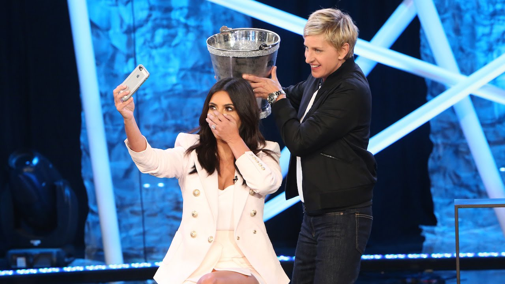

```{r setup, include=FALSE}
knitr::opts_chunk$set(warning = FALSE, message = FALSE, 
                      fig.retina = 3, fig.align = "center")
```

```{r packages-data, include=FALSE}
library(countdown)
```

```{r xaringanExtra, echo=FALSE}
xaringanExtra::use_xaringan_extra(c("tile_view"))
```

class: center middle main-title section-title-2

# Fundraising

.class-info[

**October 6, 2022**

.light[PMAP 3210: Introduction to Nonprofits<br>
Andrew Young School of Policy Studies
]

]

---

name: outline
class: title title-inv-5

# Plan for today

--

.box-8.medium.sp-after[Why do people give money away?]

--

.box-1.medium.sp-after[Where does nonprofit money come from?]

--

.box-4.medium[How should nonprofits<br>get money from people?]

---

layout: false
name: altruism
class: center middle section-title section-title-8 animated fadeIn

# Why do people<br>give money away?

---

layout: true
class: title title-8

---

# Public goods

--

.box-inv-8.medium[Non-excludable]

.box-8.small.sp-after[Not possible to stop others<br>from using the good or service]

--

.box-inv-8.medium[Non-rivalrous]

.box-8.small[One person using the good or service<br>doesn't prevent anyone else from using it]

---

# How are public goods paid for?

--

.box-inv-8.less-medium[Taxes]

.box-8.small.sp-after[Forced payments]

--

.box-inv-8.less-medium[Pooling]

.box-8.small.sp-after[Voluntary taxation]

--

.box-inv-8.less-medium[Altruism]

.box-8.small[Ask for donations]

???

Pooling examples: a group of people build a clubhouse for a neighborhood; a group of people pay for a fireworks display

---

# Altruism

--

.box-inv-8.medium[Evolutionary concept]

.box-8.sp-after[One sacrifices for another to promote the species]

--

.box-inv-8.medium[Hard to understand though!]

.box-8[Not all people value promotion of the species]

--

.box-8[Humans are self-interested]

---

# Adam Smith

--

.pull-left[
<figure>
  
</figure>
]

--

.pull-right[
<figure>
  
</figure>
]

---

# Types of altruism

--

.box-inv-8[Pure altruism]

.box-8.small.sp-after[Giving without any personal benefit]

--

.box-inv-8[Impure altruism]

.box-8.small.sp-after[Giving with a "warm glow" benefit]

--

.box-inv-8[Enlightened self-interest]

.box-8.small[Giving with the expectation of future gain]

???

- Pure altruism - giving without any personal benefit (not even to get warm fuzzies) - when someone dives in front of a car to save someone - it's an instinctual reaction - no time to think about it - once you think, you start thinking about reasons
- Impure altruism - giving with a warm glow benefit
- Enlightened self-interest - giving with the expectation for future gain - making contributions to a church to secure spiritual blessings, for instance

---

# Altruism and free-riding

--

.box-inv-8[Society loves public goods]

.box-inv-8[Paying for them is hard!]

--

.box-inv-8.sp-after.small[Public goods always create a potential for people to become free riders]

--

.box-8[Even altruistic people<br>think about their self-interest!]

--

.box-8.small[There are few pure altruists; most are impure altruists]

---

layout: false

.box-8[Which fundraising campaign would you donate to?]

.pull-left[
```{r fundraising-1, echo=FALSE, fig.width=6.5, fig.height=7}
library(dplyr)
library(forcats)
library(ggplot2)

df <- tribble(
  ~type, ~pct,
  "Needed", 40000,
  "Raised", 10000
) %>% 
  mutate(type = fct_inorder(type))

ggplot(df, aes(x = type, y = pct, fill = type)) +
  geom_col() +
  scale_y_continuous(labels = scales::dollar_format()) +
  scale_fill_manual(values = c("#e76254", "#1e466e")) +
  labs(x = NULL, y = NULL) +
  guides(fill = "none") +
  coord_cartesian(ylim = c(0, 40000)) +
  theme_bw(base_size = 30, base_family = "Jost") +
  theme(panel.grid.major.x = element_blank(),
        panel.grid.minor = element_blank())
```
]

.pull-right[
```{r fundraising-2, echo=FALSE, fig.width=6.5, fig.height=7}
df <- tribble(
  ~type, ~pct,
  "Needed", 30000,
  "Raised", 0
) %>% 
  mutate(type = fct_inorder(type))

ggplot(df, aes(x = type, y = pct, fill = type)) +
  geom_col() +
  scale_y_continuous(labels = scales::dollar_format()) +
  scale_fill_manual(values = c("#e76254", "#1e466e")) +
  labs(x = NULL, y = NULL) +
  guides(fill = "none") +
  coord_cartesian(ylim = c(0, 40000)) +
  theme_bw(base_size = 30, base_family = "Jost") +
  theme(panel.grid.major.x = element_blank(),
        panel.grid.minor = element_blank())
```
]

---

layout: true
class: title title-8

---

# Make contributions feel important

--

.pull-left[
.box-inv-8[Bandwagon effect]

.box-8.smaller[People start donating because<br>they feel they can be useful]

.box-8.smaller[Get a seed donation for a campaign<br>to signal that it's legitimate]
]

--

.pull-right.sp-after[
.box-inv-8[Matching]

.box-8.smaller[We're strongly influenced<br>by what we think others do]

.box-8.smaller[Telling people their donation will be<br>matched signals that other people<br>approve of the cause]
]

--

.box-inv-8[Make people feel needed to prevent free-riding]


???

Like Nancy and charity:water - nobody donated until Marie made the first big move - people hold their position until they think they can improve it - people jump on the bandwagon because they think they can be useful

Fundraising - before you start a campaign, get a seed donation first to signal that it's a real thing, upset the Nash equilibrium, get more people on board.

We're strongly influenced by matches - magnitude doesn't matter, just the presence of the match (NPR telling people to hurry so they don't lose a match - people step in)

---

layout: false
name: nonprofit-revenue
class: center middle section-title section-title-1 animated fadeIn

# Where does nonprofit money come from?

---

layout: true
class: section-title-inv-1

---

.medium.center[

Which of these is the largest<br>source of revenue for nonprofits?

- Private contributions and donations
- Earned income
- Government grants

]

---

.medium.center[

Which of these is the largest<br>source of revenue for nonprofits?

- Private contributions and donations
- .color-6[**Earned income**]
- Government grants

]

--

.box-1.small[72% from earned income!]

???

Fees from government sources (primarily Medicare and Medicaid) alone account for 24.5% of nonprofit revenue.

Private giving only accounts for 13% of nonprofit revenue.

---

layout: true
class: title title-1

---

# Revenue sources

--

.pull-left[
.box-1[Sources]

.box-inv-1[Private fundraising]

.box-inv-1[Government sources]

.box-inv-1[Commercial activities]
]

--

.pull-right[
.box-6[Concerns]

.box-inv-6[Volatility]

.box-inv-6[Goal displacement]

.box-inv-6[Process & structure effects]
]

---

# Private fundraising

.box-inv-1[Asking rich people and foundations for money]

--

.pull-left-3[
.box-6.small[Volatility]

.box-inv-6.small[Highly volatile;<br>depends on<br>individuals]
]

--

.pull-middle-3[
.box-6.small[Goal displacement]

.box-inv-6.small[Strong;<br>large donors can<br>drive the goal]
]

--

.pull-right-3[
.box-6.small[Structure effects]

.box-inv-6.small[Push for<br>formalization:<br>donors might<br>require that the<br>nonprofit evolves]
]

---

# Government sources

.box-inv-1[Grants from government agencies]

--

.pull-left-3[
.box-6.small[Volatility]

.box-inv-6.small[More stable,<br>but can switch<br>because of politics]
]

--

.pull-middle-3[
.box-6.small[Goal displacement]

.box-inv-6.small[Only really happens<br>at the beginning]
]

--

.pull-right-3[
.box-6.small[Structure effects]

.box-inv-6.small[Tons of bureaucracy<br>involved]
]

---

# Commercial activities

.box-inv-1[Money brought in from goods and services]

--

.pull-left-3[
.box-6.small[Volatility]

.box-inv-6.small[Generally less<br>volatile; markets<br>more stable]
]

--

.pull-middle-3[
.box-6.small[Goal displacement]

.box-inv-6.small[Not much]
]

--

.pull-right-3[
.box-6.small[Structure effects]

.box-inv-6.small[Requires more<br>business-like<br>methods]
]

---

layout: false
class: middle

.center[
<table>
  <tr>
    <th></th>
    <th class="color-6">Volatility</th>
    <th class="color-6">Goal displacement</th>
    <th class="color-6">Structure effects</th>
  </tr>
  <tr>
    <td class="color-1"><b>Private fundraising</b></td>
    <td>High</td>
    <td>Strong</td>
    <td>Formalization</td>
  </tr>
  <tr>
    <td class="color-1"><b>Government sources</b></td>
    <td>Low then high</td>
    <td>Initial</td>
    <td>Bureaucratization</td>
  </tr>
  <tr>
    <td class="color-1"><b>Commercial activities</b></td>
    <td>Moderate to low</td>
    <td>Weak</td>
    <td>Business-ization</td>
  </tr>
</table>
]

---

class: title title-1

# Competition and nonprofit revenue

--

.box-inv-1.less-medium.sp-after[How do you convince someone to give to<br>your nonprofit over another nonprofit?]

--

.box-inv-1.less-medium[Should you convince someone to give to<br>your nonprofit over another nonprofit?]

---

layout: false
name: best-practices
class: center middle section-title section-title-4 animated fadeIn

# How should nonprofits<br>get money from people?

---

class: middle

.box-4.huge[Ask!]

---

layout: true
class: title title-4

---

# Fundraising considerations

--

.box-inv-4.medium[How much should you ask for?]

--

.box-inv-4.medium[Who should you ask?]

---

# How much should you ask for?

--

.box-inv-4[Depends on your needs, plans, and budget]

--

.pull-left-3[
.box-4.SMALL[Low-end budget]

.box-inv-4.small[Minimum amount to get nonprofit started]
]

--

.pull-middle-3[
.box-4.SMALL[Middle-end budget]

.box-inv-4.small[Funds needed for a year of operation]
]

--

.pull-right-3[
.box-4.SMALL[High-end budget]

.box-inv-4.small[Amount needed to pay for anything the nonprofit wants to do]
]

---

# Who should you ask?

--

.box-inv-4[.medium[Private fundraising]<br>.small[Individuals / foundations / corporations]]

--

.box-inv-4.medium[Government sources]

--

.box-inv-4.medium[Commercial activities]

---

# Individual giving

.box-inv-4[Direct mail / phone solicitation]

--

.pull-left[
.box-6.small[Pros]

.box-inv-6.small[Ready donor base]

.box-inv-6.small[Easily obtainable mailing lists]

.box-inv-6.small[Nonprofit mission makes<br>it easy to appeal to donors]
]

--

.pull-right[
.box-1.small[Cons]

.box-inv-1.small[Donor apathy]

.box-inv-1.small[Easily ignored]

.box-inv-1.small[NOBODY ANSWERS<br>THEIR PHONE]
]

---

# Individual giving

.box-inv-4.SMALL[Online giving]

--

.pull-left[
.box-6.small[Pros]

.box-inv-6.smaller[Cheap, ready-made infrastructure<br>.smaller[GoFundMe, Donorbox, etc.]]

.box-inv-6.smaller[Faster response]

.box-inv-6.smaller[Tap into online networks]

.box-inv-6.smaller[Target specific<br>markets and demographics]
]

--

.pull-right[
.box-1.small[Cons]

.box-inv-1.small[List maintenance]

.box-inv-1.small[Spam filters]

.box-inv-1.small[Needs exciting cause<br>to go viral]
]

---

# 2014 ALS Ice Bucket Challenge

.center[
<figure>
  
</figure>
]

???

<https://commons.wikimedia.org/wiki/File:Mission_Accomplished_-_ALS_Ice_Bucket_Challenge_(14848289439).jpg>

---

# 2014 ALS Ice Bucket Challenge

.center[
<figure>
  
</figure>
]

???

<https://www.youtube.com/watch?v=zuFytc9YLDs>

---

# Individual giving

.box-inv-4[Events and galas]

--

.pull-left[
.box-6.small[Pros]

.box-inv-6.small[Tradition]

.box-inv-6.small[Visibility and involvement]

.box-inv-6.small[Can provide<br>first contact with donor]
]

--

.pull-right[
.box-1.small[Cons]

.box-inv-1.small[Formal, stodgy, out of fashion]

.box-inv-1.small[Not usually cost effective]

.box-inv-1.small[Event has no connection<br>with the cause]
]

---

layout: false

.pull-left.center[
<figure>
  
  <figcaption>Melissa Sevy</figcaption>
</figure>
]

.pull-right.center[
&nbsp;

<audio controls>
  <source src="img/07/MelissaSevyFundraiser-557.mp3">
</audio>

&nbsp;

<figure>
  
</figure>
]

???

- <https://www.how-to-help.com/home/resilience-melissa-sevy/>
- <https://twitter.com/melissa_sevy/status/567681366397947904/photo/1>
- <https://universe.byu.edu/2014/09/17/byu-graduate-empowers-women-in-uganda/>

---

layout: true
class: title title-4

---

# Individual giving

.box-inv-4[Nonprofit board]

--

.pull-left[
.box-6.small[Pros]

.box-inv-6.small[Have a stake in the organization]

.box-inv-6.small[Expect to be asked for donations]

.box-inv-6.small[Have wealthy connections]
]

--

.pull-right[
.box-1.small[Cons]

.box-inv-1.small[Nonprofit can become<br>dependent on board donations<br>and overuse them]
]

---

# Donor relations

.box-inv-4[If people give you money,<br>you're legally required to acknowledge it]

--

.box-4.small[Nonprofits must acknowledge contributions of $250+]

--

.box-4.small[Donor cannot take a charitable tax deduction without it]

--

.box-4.small.sp-after[Many nonprofits send this notice with a thank you note]

--

.box-inv-4.smaller[Many other requirements if you send donors things in exchange for their donation<br>(see IRS Substantiation Rules on pp. 158–159)]

---

# Planned giving

.box-inv-4[Outright gifts, bequests, expectancies, deferred gifts]

--

.pull-left[
.box-6.small[Pros]

.box-inv-6.small[Large gifts]

.box-inv-6.small[Increasingly common with<br>a wealthier, older population]
]

--

.pull-right[
.box-1.small[Cons]

.box-inv-1.small[Legally complicated;<br>policies change often]

.box-inv-1.small[You have to wait for people to die]
]

---

# Umbrella fundraising groups

.box-inv-4[United Way, Catholic Charities, etc.]

--

.pull-left[
.box-6.small[Pros]

.box-inv-6.small[Stable funding]

.box-inv-6.small[Visibility]

.box-inv-6.small[Community endorsement]
]

--

.pull-right[
.box-1.small[Cons]

.box-inv-1.small[Must meet accountability,<br>program, and fundraising<br>requirements]
]

---

# Foundation giving

--

.pull-left[
.box-6.small[Pros]

.box-inv-6.small[Sizable grants]

.box-inv-6.small[Increased credibility]

.box-inv-6.small[Catalyst for other grants]

.box-inv-6.small[Legally required to<br>give away 5% annually]
]

--

.pull-right[
.box-1.small[Cons]

.box-inv-1.small[Applications take a long time]

.box-inv-1.small[Money moves slowly]

.box-inv-1.small[Misalignment of priorities]
]

---

# Government grants and contracts

--

.pull-left[
.box-6.small[Pros]

.box-inv-6.small[Sizable amounts]

.box-inv-6.small[Credibility]
]

--

.pull-right[
.box-1.small[Cons]

.box-inv-1.small[Paperwork and bureaucracy]

.box-inv-1.small[Slow]
]

---

# Corporate giving

.box-inv-4[Everyone loves corporate social responsibility]

--

.pull-left[
.box-6.small[Pros]

.box-inv-6.small[Easy to find related businesses]

.box-inv-6.small[Easy to involve<br>business leaders on board]

.box-inv-6.small[Can get free in-kind<br>products and services]
]

--

.pull-right[
.box-1.small[Cons]

.box-inv-1.small[Business won't always provide<br>what is really needed]

.box-inv-1.small[Business often do it<br>to market themselves<br>.small[(Reputation laundering)]]
]

---

# Best practices

--

.box-inv-4[Seek out grants and engage in<br>fundraising strategies that support your mission]

--

.box-inv-4[Get buy-in from the board and staff]

--

.box-inv-4[Don't beg]

--

.box-inv-4[Don't apply for grants just for the money]

--

.box-inv-4[Don't let a grant change the focus of your mission]
