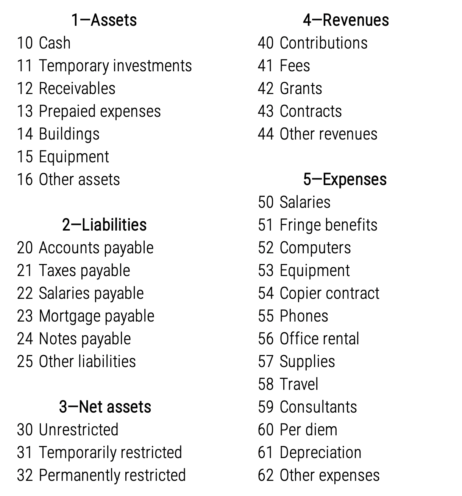
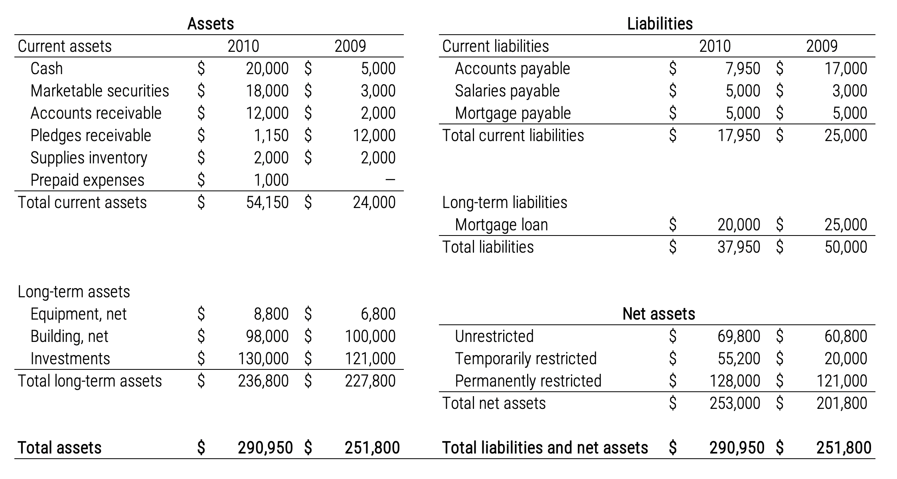
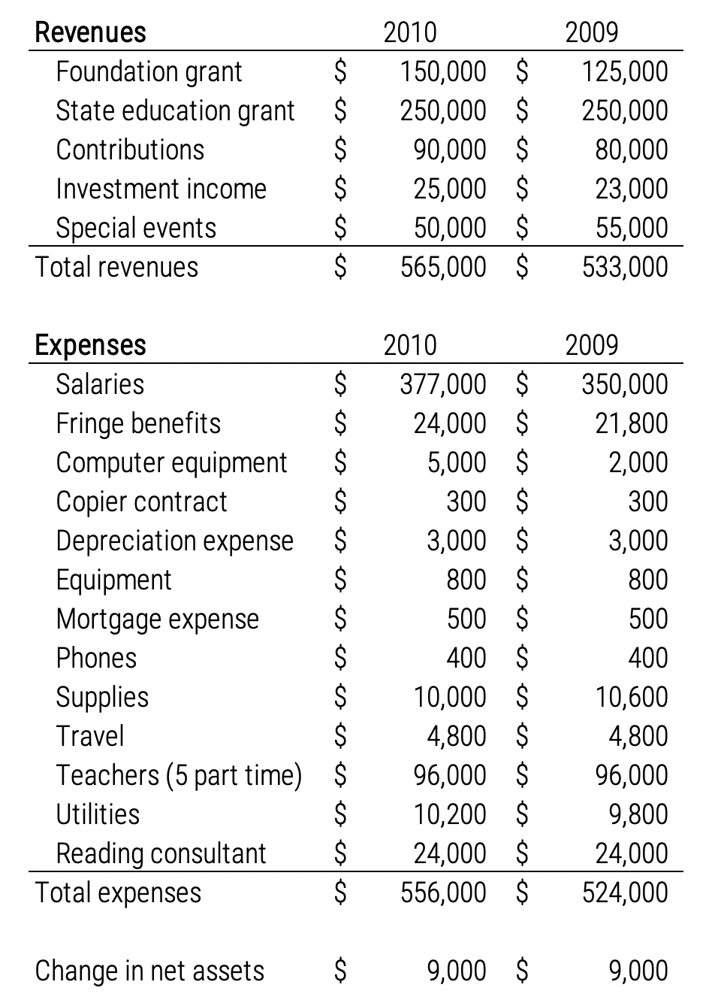
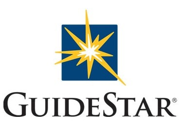
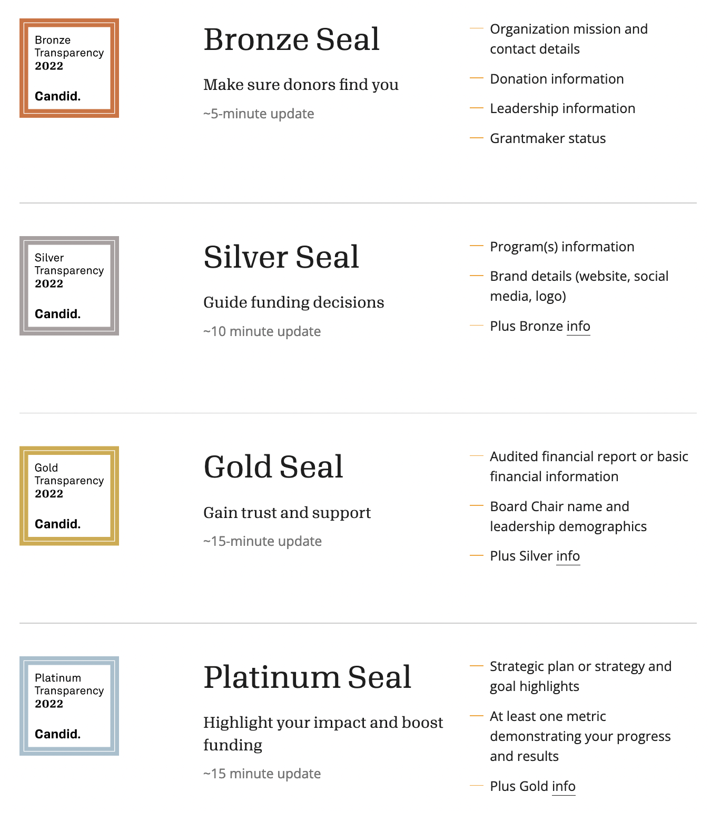
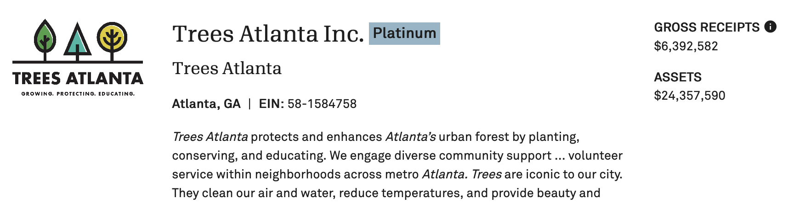
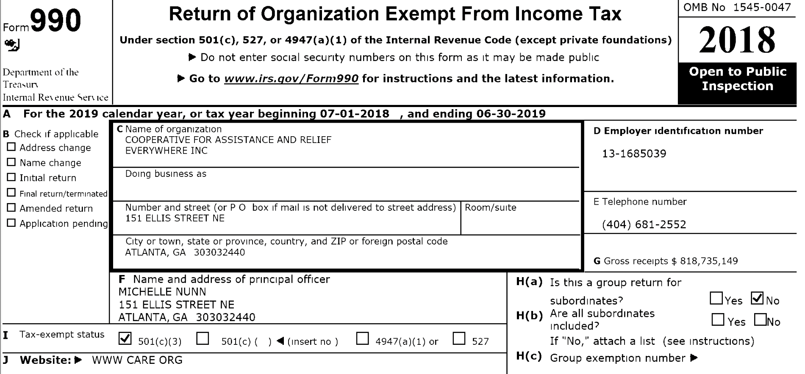
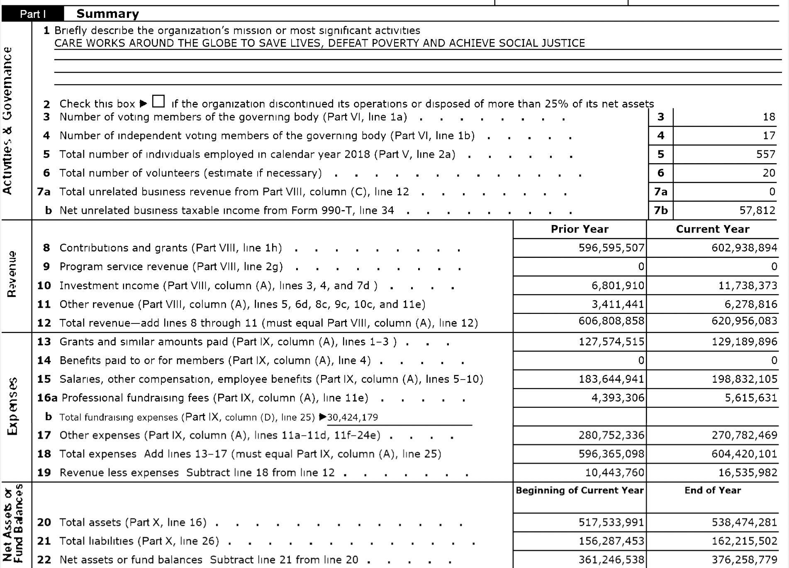
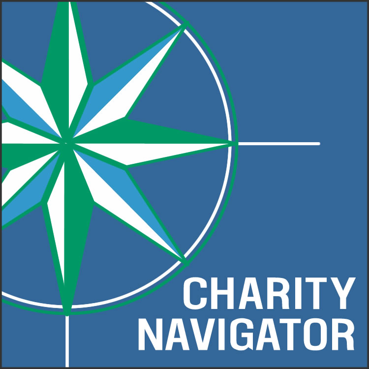
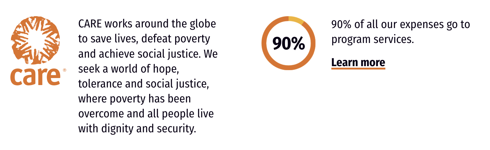

```{r setup, include=FALSE}
knitr::opts_chunk$set(warning = FALSE, message = FALSE, 
                      fig.retina = 3, fig.align = "center")
```

```{r packages-data, include=FALSE}
library(countdown)
```

```{r xaringanExtra, echo=FALSE}
xaringanExtra::use_xaringan_extra(c("tile_view"))
```

class: center middle main-title section-title-2

# Budgeting<br>and financial<br>management

.class-info[

**October 13, 2022**

.light[PMAP 3210: Introduction to Nonprofits<br>
Andrew Young School of Policy Studies
]

]

---

name: outline
class: title title-inv-5

# Plan for today

--

&nbsp;

.box-1.medium.sp-after[Anatomy of a budget]

--

.box-6.medium[Financial analysis]

---

layout: false
name: anatomy
class: center middle section-title section-title-1 animated fadeIn

# Anatomy of<br>a budget

---

class: middle

.box-1.huge[This week just barely<br>scratches the surface<br>of nonprofit finance!]

.box-inv-1[You can get a whole master's degree in this stuff!]

---

layout: true
class: title title-1

---

# Components of nonprofit finance

.center[
<figure>
  
</figure>
]

---

# Tracking finances

.pull-left[
.box-inv-1[Balance sheet]

.box-1.smaller[Where you are]

.center[
<figure>
  
</figure>
]
]

--

.pull-right[
.box-inv-1[Budget]

.box-1.smaller[Where you're going]

.center[
<figure>
  
</figure>
]
]

---

# Tracking finances

.pull-left[
.box-inv-1[Balance sheet]

.box-1.smaller[Where you are]

&nbsp;

.box-inv-1[Assets and liabilities]
]

.pull-right[
.box-inv-1[Budget]

.box-1.smaller[Where you're going]

&nbsp;

.box-inv-1[Revenues and expenses]
]

---

# Balance sheet stuff

.center[
<figure>
  
</figure>
]

---

# Assets

--

&nbsp;

.box-inv-1.medium[Things of value that you can measure]

.box-1[Money in bank, investments held, property owned, etc.]

---

# Assets

--

.pull-left[
.box-inv-1.medium[Liquid / current]

.box-1[Cash or things that can<br>quickly turn into cash]

.box-1.smaller[Cash, securities, inventory,<br>accounts/pledges receivable]
]

--

.pull-right[

.box-inv-1.medium[Long-term]

.box-1[Things that can't<br>quickly turn into cash]

.box-1.smaller[Property, equipment, investments]

]

---

# Liabilities

--

&nbsp;

.box-inv-1.medium[Things you owe]

.box-1[Debts, bills, mortgage, etc.]

---

# Net assets

--

&nbsp;

.box-inv-1.medium[Assets − liabilities]

--

.box-1[A measure of how financially healthy your organization<br>is and how well it can weather a financial emergency]

---

# Budget stuff

.center[
<figure>
  
</figure>
]

---

# Revenues

--

.box-inv-1.medium[Ways the organization brings in money]

--

.box-1[Private fundraising<br>.small[(individual donations and foundation grants)]]

.box-1[Government sources]

.box-1[Commercial activities]

---

# Expenses

--

.box-inv-1.medium[Ways the organization spends money]

--

.center[
.float-left[.box-1[Salaries]&ensp;.box-1[Benefits]]

.float-left[.box-1[Rent]&ensp;.box-1[Travel]]

.box-1[Computers, equipment, supplies]

.box-1[Lots of other things!]
]

---

# Funds

--

.box-inv-1.medium[Types of money the organization can use]

--

.box-1[Endowment funds]

--

.box-1[Unrestricted funds]

--

.box-1[Restricted funds]

???

Endowment Funds

- A financial principal that remains unspent
- Interest earned on the principal is spent

Unrestricted Funds

- Fees for service
- Gifts from donors not targeted for specific purposes
- Income from a nonprofit commercial venture

Restricted Funds 

- Gifts from donors that are targeted for specific purposes

---

# Budgets

&nbsp;

--

.box-inv-1.medium.sp-after[A budget is a moral document]

--

.box-inv-1.medium[Budgets reflect your strategy]

---

# Budget best practices

--

.box-inv-1[Involve everyone]

--

.box-inv-1[Budget monthly]

--

.box-inv-1[Save a reserve]

--

.box-inv-1[Track performance relative to past budgets,<br>especially deviations]

--

.box-inv-1[Rebudget when unexpected changes happen]

---

layout: false
class: middle

.box-1.huge[Budget example]

---

layout: false
name: analysis
class: center middle section-title section-title-6 animated fadeIn

# Financial analysis

---

layout: true
class: title title-6

---

# Why analyze finances?

--

.box-inv-6[Nonprofits have special stewardship over donor money!]

--

.box-inv-6[Increased accountability!]

--

.box-inv-6[Required to make tons of financial information public,<br>including assets, revenues, expenses, and salaries]

--

.box-6[Gauge a nonprofit's financial health]

---

# GuideStar Seals

.pull-left-narrow[
.center[
<figure>
  
</figure>
]
]

.pull-right-wide[
.center[
<figure>
  
</figure>
]
]

---

# GuideStar and transparency

<br>

.center[
<figure>
  
</figure>
]

???

https://www2.guidestar.org/profile/58-1584758

---

# IRS Form 990

.center[
<figure>
  
</figure>
]

---

# IRS Form 990

.center[
<figure>
  
</figure>
]

---

# Things to look for in 990s

--

.box-inv-6[Salaries and staff details]

--

.box-inv-6[Revenue source mix]

--

.box-inv-6[Spending ratios]

--

.box-6.small[Program ratio]

--

.box-6.small[Administrative ratio (overhead)]

--

.box-6.small[Fundraising ratio]

???

<https://warrenaverett.com/insights/nonprofit-ratios/>

---

# Charity Navigator

.pull-left[
.center[
<figure>
  
</figure>
]
]

--

.pull-right[
.box-inv-6[Highest ratings]

.box-6.small[Program expense ratio<br>.smaller[85%+]]

.box-6.small[Administrative expense ratio<br>.smaller[<15%]]

.box-6.small[Fundraising efficiency ratio<br>.smaller[Spend less than $0.10 per $1 raised]]
]

???

- <https://www.charitynavigator.org/index.cfm?bay=content.view&cpid=35>
- <https://www.charitynavigator.org/index.cfm?bay=content.view&cpid=48>

Charity Navigator rating system

---

# Ratios vs. impact

.center[
<figure>
  
</figure>
]

---

# Ratios vs. impact

--

.box-inv-6[Program ratios should be a management tool,<br>not a donor tool]

--

.box-inv-6[All budget decisions should prioritize impact]

--

.box-inv-6[Nonprofits that show robust impact<br>**have better stories** to tell donors]

---

layout: false
class: middle

.box-6.huge[990 example]
