```{r setup, include=FALSE}
knitr::opts_chunk$set(warning = FALSE, message = FALSE, 
                      fig.retina = 3, fig.align = "center")
```

```{r packages-data, include=FALSE}
library(countdown)
```

```{r xaringanExtra, echo=FALSE}
xaringanExtra::use_xaringan_extra(c("tile_view"))
```

class: center middle main-title section-title-2

# Marketing

.class-info[

**October 20, 2022**

.light[PMAP 3210: Introduction to Nonprofits<br>
Andrew Young School of Policy Studies
]

]

---

name: outline
class: title title-inv-5

# Plan for today

--

.box-7.medium.sp-after-half[Marketing theories]

--

.box-3.medium.sp-after-half[Marketing tools]

--

.box-1.medium.sp-after-half[Dignity and poverty porn]

--

.box-2.medium[Stories]

---

layout: false
name: theories
class: center middle section-title section-title-7 animated fadeIn

# Marketing theories

---

class: middle

.box-7.large[What even is marketing?]

---

class: middle

.box-7.large[Why do organizations<br>engage in marketing?]

---

layout: true
class: title title-7

---

# Purpose of marketing

--

&nbsp;

.box-inv-7.large[Research, persuade,<br>and change behavior]

---

# Theories of marketing

--

.box-inv-7[Marketing is all about changing people's behavior…]

--

.box-inv-7.small[…so what do people want?]

--

.box-inv-7.small[…and why do people behave they way they do?]

--

.box-inv-7.sp-after.small[…and why do people change?]

--

.box-7.less-medium[Psychology!]

---

# Theories of marketing

.box-inv-7.less-medium[Change theory]

.box-inv-7.less-medium[Social cognitive theory]

.box-inv-7.less-medium[Exchange theory]

.box-inv-7.less-medium[Stakeholder theory]

---

# Change theory

--

.box-inv-7.sp-after[People act based on their current level/stage of change]

--

.box-7.small[**Pre-contemplation**&emsp;.smaller[(Aware of new behavior but not interested in changing)]]

--

.box-7.small[**Contemplation**&emsp;.smaller[(Consciously evaluate personal relevance of new behavior)]]

--

.box-7.small[**Preparation**&emsp;.smaller[(Decided to act and are trying new behavior)]]

--

.box-7.small[**Action**&emsp;.smaller[(Doing the new behavior)]]

--

.box-7.small[**Confirmation**&emsp;.smaller[(Committed to new behavior; no intention to regress)]]

---

# Change theory

.box-inv-7.less-medium.sp-after[How to use the theory]

--

.box-7[Cultivate relationships with donors]

--

.box-7[Help people move along these levels]

--

.box-7[Tailor messages and campaigns<br>to people at different stages]

---

# Social cognitive theory

--

.box-inv-7.less-medium.sp-after[Our behavior is based on our<br>views of the social context we live in]

--

.box-inv-7.less-medium[The social behavior of people<br>around us influences our behavior]

---

# Social cognitive theory

.box-inv-7.less-medium.sp-after[How to use the theory]

--

.box-7[Create marketing strategies that show good behavior]

--

.box-7["Most people do X"]

--

.box-7["It is important/good/socially acceptable to do X"]

---

# Exchange theory

--

.box-inv-7.less-medium.sp-after[People want to make<br>mutually beneficial exchanges with others]

--

.float-left.center[.box-7[Getting a good deal]&emsp;.box-7[Feeling connected to others]]

---

# Exchange theory

.box-inv-7.less-medium.sp-after[How to use the theory]

--

.box-7[Create marketing strategies that<br>show the benefits of the behavior]

--

.box-7[Emphasize mutual relationships and connections<br>between donor and organization and recipients]

---

# Stakeholder theory

--

.box-inv-7.sp-after[Lots of people and groups are key to the success of<br>a nonprofit and have different needs and preferences]

--

.pull-left[
.box-7[Internal]

.float-left.center[.box-inv-7.small[Staff]&ensp;.box-inv-7.small[Board]]
]

--

.pull-right[
.box-7[External]

.float-left.center[.box-inv-7.small[Donors]&ensp;.box-inv-7.small[Regulators]]

.box-inv-7.small[General public]
]

---

# Stakeholder theory

.box-inv-7.less-medium.sp-after[How to use the theory]

--

.box-7[Create marketing strategies that<br>cater to each group's needs]

---

layout: false
name: tools
class: center middle section-title section-title-3 animated fadeIn

# Marketing tools

---

layout: true
class: title title-3

---

# General tools

.box-inv-3.less-medium[Strategic marketing plan]

.box-inv-3.less-medium[Marketing mix]

.box-inv-3.less-medium[SWOT analysis]

.box-inv-3.less-medium[Personas]

.box-inv-3.less-medium[Communications and public relations]

---

# Strategic marketing plan

--

.box-inv-3[General plan for overall marketing strategy]

--

.center[
<figure>
  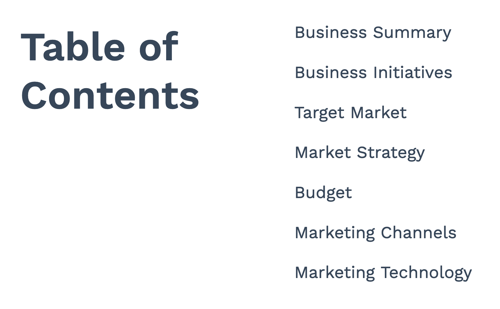
</figure>
]

???

<https://blog.hubspot.com/marketing/marketing-plan-template-generator>

---

# Marketing mix

--

.box-inv-3.sp-after[Characteristics of the products/services you offer (5Ps)]

--

.box-3.small[**Product or service**&emsp;.smaller[(Thing you want people to consume or do)]]

--

.box-3.small[**Price**&emsp;.smaller[(Amount people "pay" for thing)]]

--

.box-3.small[**Place**&emsp;.smaller[(Where the thing will be consumed—in-person, online, etc.)]]

--

.box-3.small[**Promotion**&emsp;.smaller[(How you'll publicize the benefits of the thing)]]

--

.box-3.small[**Policy**&emsp;.smaller[(What regulations or institutional changes are needed to allow people to use the thing)]]

---

# Environmental analysis (SWOT)

--

.box-inv-3[Understand how the organization<br>fits in and interacts with its external environment]

--

.center[
<figure>
  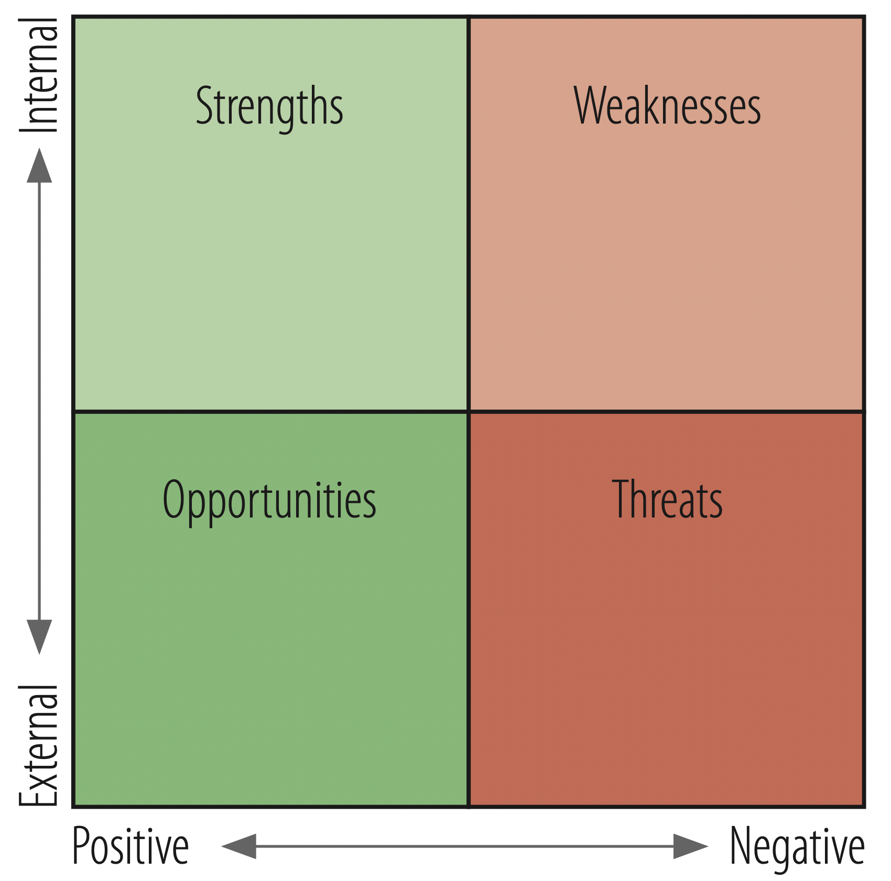
</figure>
]

---

layout: false

.center[
<figure>
  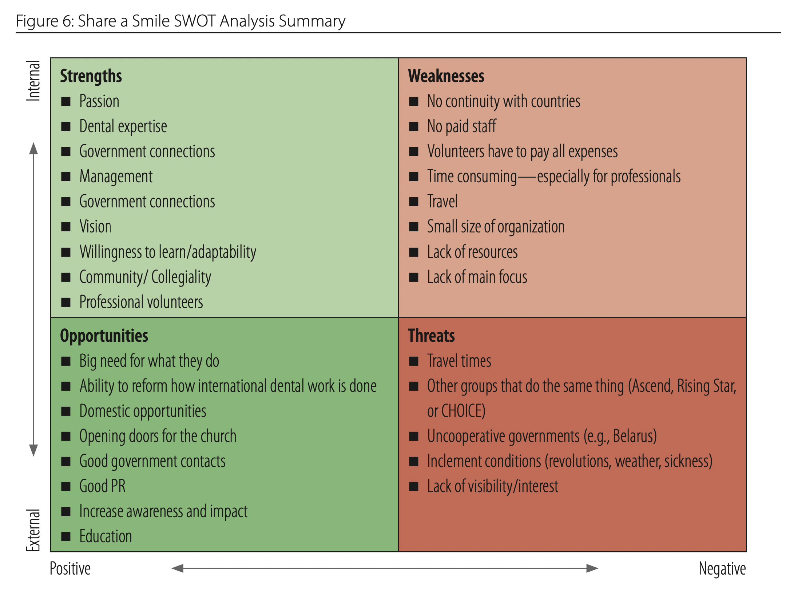
</figure>
]

---

layout: true
class: title title-3

---

# Personas

.box-inv-3[Profiles of fictional (but typical)<br>donors / customers / recipients]

.box-inv-3.small.sp-after[Each persona represents a segment of the market]

.box-inv-3[Tailor your messaging to their needs]

---

# Persona characteristics

--

.pull-left-3[
.box-inv-3[Demographics]

.center[
.float-left[.box-3.smaller[Age]&ensp;.box-3.smaller[Gender]]
.float-left[.box-3.smaller[Education]&ensp;.box-3.smaller[Income]]
.float-left[.box-3.smaller[Location]&ensp;.box-3.smaller[Employment]]
.float-left[.box-3.smaller[Marital status]&ensp;.box-3.smaller[etc.]]
]
]

--

.pull-middle-3[
.box-inv-3[Pscyhographics]

.center[
.float-left[.box-3.smaller[Attitudes]&ensp;.box-3.smaller[Motivations]]
.float-left[.box-3.smaller[Opinions]&ensp;.box-3.smaller[Values]]
.float-left[.box-3.smaller[Personality]&ensp;.box-3.smaller[Lifestyle]]
.float-left[.box-3.smaller[etc.]]
]
]

--

.pull-right-3[
.box-inv-3[Behaviors]

.center[
.box-3.smaller[Communication<br>preferences]

.box-3.smaller[Relationship to nonprofit]

.box-3.smaller[Donation history]

.box-3.smaller[etc.]
]
]

---

layout: false
class: middle

.center[
<figure>
  
</figure>
]

???

<https://themodernnonprofit.com/donor-personas/>

---

layout: true
class: title title-3

---

# Not just for marketing!

--

.small[
- James is a 30-year-old police officer who has been working for 4 years. He’s interested in public service in general and is working on his master’s degree in public policy (MPP) so that he can improve policing in Atlanta.
- He’s familiar with Excel and has taken two MPP classes on statistics with Stata, but wants to be able to use statistical tools in his job after he finishes the MPP program, so he’s interested in R. He also really likes data visualization
- James needs help with programming, since all his training so far has been with GUIs like Excel and Stata. He isn’t especially familiar with any programming language and is scared of things like the terminal console, but he’s willing and excited to learn
]


---

# Communications & public relations

--

.box-inv-3.medium[How the organization<br>communicates with the public]

--

.box-3[More on this next week!]

---

# Communication methods

--

.box-inv-3[Media.small[<br>(commercials, op-eds, letters to editor)]]

--

.box-inv-3[Direct mailers]

--

.box-inv-3[Social media]

--

.box-inv-3[Sponsorships and event marketing]

--

.box-inv-3[Websites]

---

# Branding

--

.box-inv-3.less-medium.sp-after[The organization's total image]

--

.center[.float-left[.box-3[Logo]&ensp;.box-3[Fonts]&ensp;.box-3[Colors]]]

--

.center[.float-left[.box-3[Style]&ensp;.box-3[Taglines]]]

--

.box-3[**Reputation**]

---

layout: false
name: dignity
class: center middle section-title section-title-1 animated fadeIn

# Dignity and<br>poverty porn

---

layout: true
class: title title-1

---

# Marketing and emotions

--

.box-inv-1[The goal of marketing is to persuade behavior]

--

.box-inv-1.sp-after[Strong emotions → faster, more forceful,<br>more lasting behavioral change]

--

.box-inv-1[Evocative images and photographs create strong emotions]

--

.box-1.less-medium[That's not necessarily bad!]

---

layout: false
class: middle

--

.pull-left[
<figure>
  
  <figcaption>Earthrise (1968)</figcaption>
</figure>
]

--

.pull-right[
<figure>
  
  <figcaption>The Blue Marble (1972)</figcaption>
</figure>
]

???

<https://en.wikipedia.org/wiki/Earthrise#/media/File:NASA-Apollo8-Dec24-Earthrise.jpg>

<https://en.wikipedia.org/wiki/File:The_Earth_seen_from_Apollo_17.jpg>

<https://texasclimatenews.org/2018/12/24/50-years-ago-an-image-of-a-blue-planet-inspired-environmental-awareness/>

---

layout: true
class: title title-1

---

# The allure of suffering

--

.box-inv-1[Nonprofits often deal with human suffering]

--

.box-inv-1.sp-after[Suffering naturally creates curiosity]

--

.box-1.medium.sp-after["If it bleeds, it leads"]

--

.box-inv-1["Poverty porn" can raise more money]

---

layout: false
class: middle

.center[
<figure>
  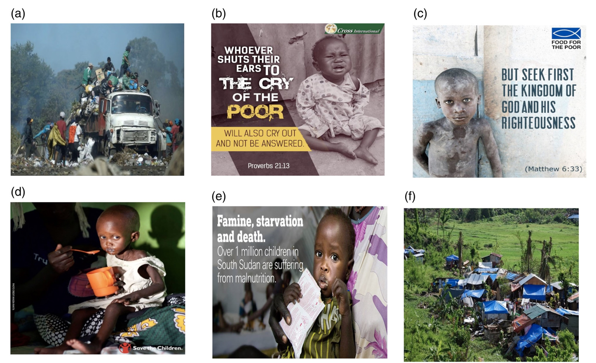
</figure>
]

???

<https://doi.org/10.1002/nvsm.1722>

---

class: middle

.center[
<iframe width="1126" height="600" src="https://www.youtube.com/embed/xbqA6o8_WC0" frameborder="0" allow="accelerometer; autoplay; encrypted-media; gyroscope; picture-in-picture" allowfullscreen></iframe>
]

---

layout: true
class: title title-1

---

# Beware of the allure of suffering

--

.box-inv-1[Nonprofits often fail to emphasize the dignity<br>of the people they serve when they fundraise]

--

.box-inv-1[Children are especially taken advantage of]

--

.box-inv-1.sp-after[Every person depicted in a<br>fundraising campaign is a real person]

--

.box-1.medium[Don't sacrifice dignity for impact]

---

layout: true
class: middle

---

.center[
<figure>
  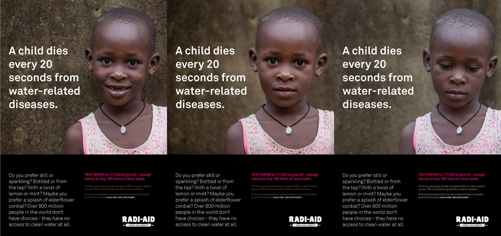
</figure>
]

???

<https://www.radiaid.com/which-image-do-you-prefer>

---

.center[
<figure>
  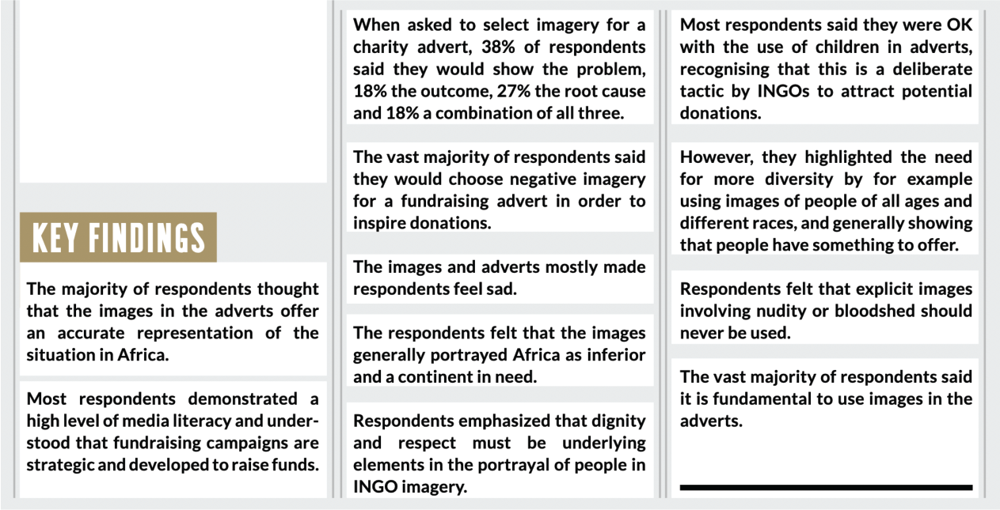
</figure>
]

???

<https://www.radiaid.com/which-image-do-you-prefer>

---

.box-1.medium[Do not treat those you serve as<br>helpless, incapable, opinion-less objects]

---

.box-1.large[Treat people with dignity]

---

.center[
<figure>
  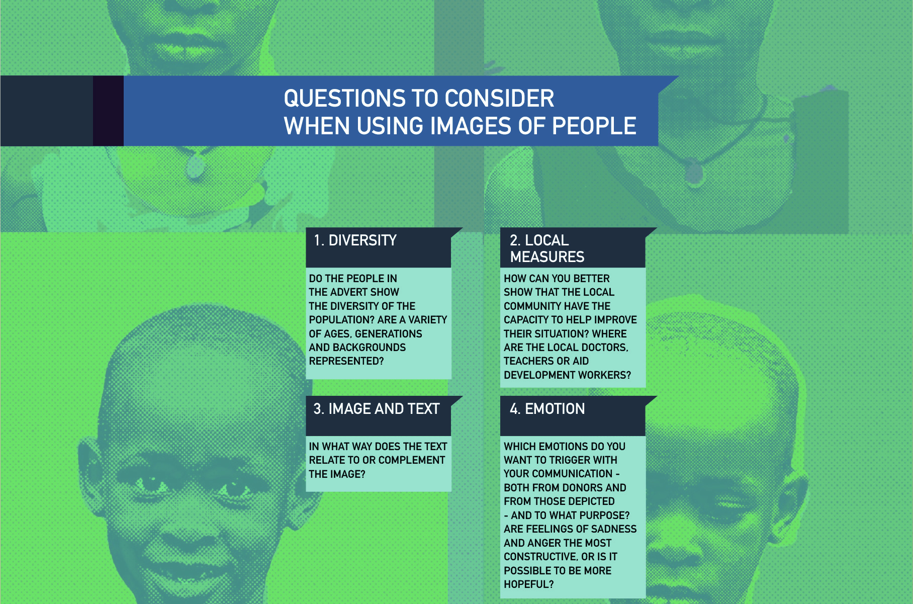
</figure>
]

---

.center[
<figure>
  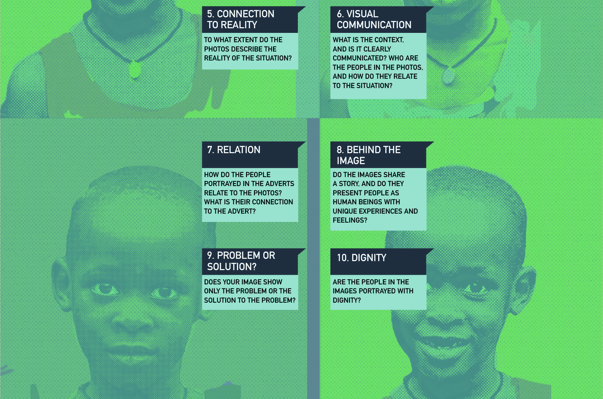
</figure>
]

---

.center[
<figure>
  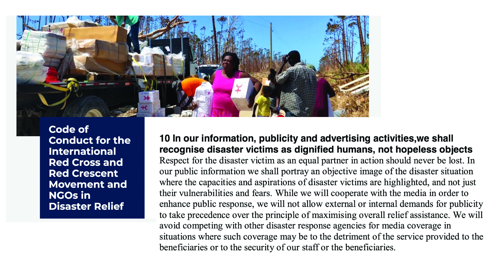
</figure>
]

???

<https://www.ifrc.org/code-conduct-international-red-cross-and-red-crescent-movement-and-ngos-disaster-relief>

---

class: middle

.center[
<iframe width="1126" height="600" src="https://www.youtube.com/embed/OXnxFjT-4mg" frameborder="0" allow="accelerometer; autoplay; encrypted-media; gyroscope; picture-in-picture" allowfullscreen></iframe>
]

---

class: title title-1

# Dignified Storytelling

.center[dignifiedstorytelling.com]

.center[
<figure>
  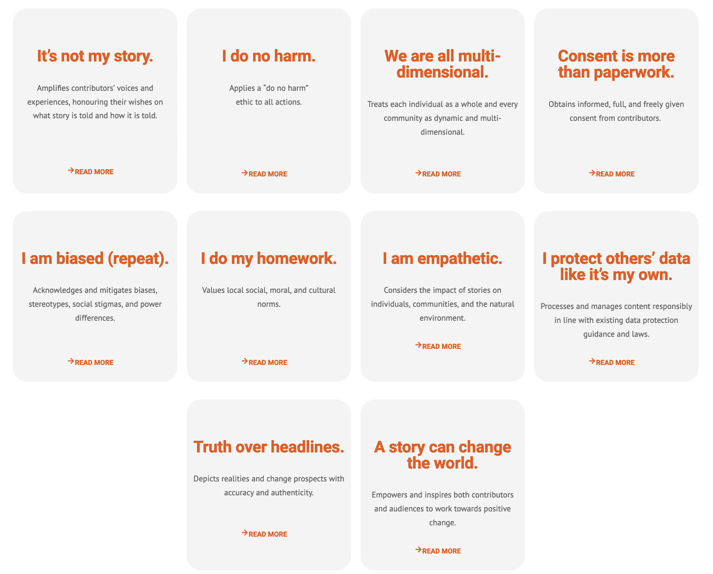
</figure>
]

---

layout: false
name: stories
class: center middle section-title section-title-2 animated fadeIn

# Stories

---

layout: true
class: middle

---

.box-2.large[What are your favorite stories?]

.box-2.large[Why are they so great?]

---

.box-2.large[Why do people like stories?]

---

.center[
<figure>
  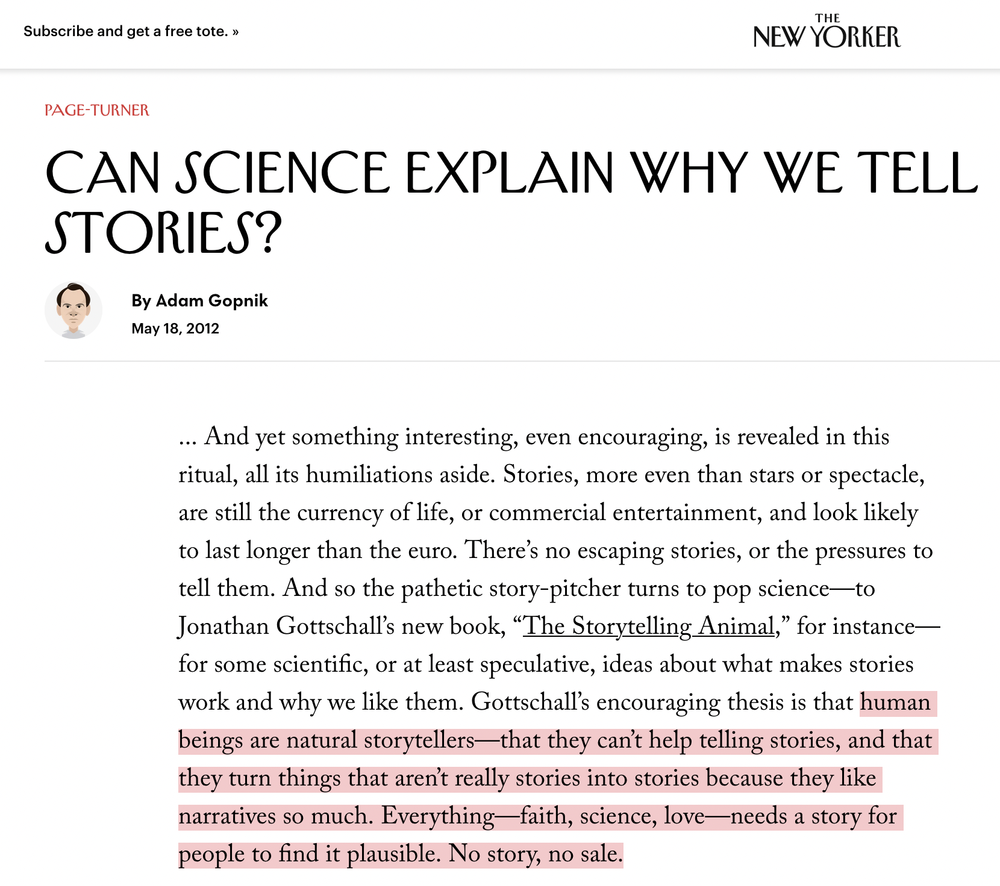
</figure>
]

???

<https://www.newyorker.com/books/page-turner/can-science-explain-why-we-tell-stories>

---

layout: true
class: title title-2

---

# Stories

.box-inv-2.large[**Stories** are how we translate core, essential **content**<br>to different **forms**<br>for specific **audiences**.]

---

# Purpose of stories

--

.box-inv-2.less-medium[We understand the world through causal stories]

--

.box-inv-2.less-medium[Stories are how we construct our sense of self]

--

.box-inv-2.less-medium[Stories are crucial for making ideas memorable]

--

.box-inv-2.less-medium[Stories imbue our experience with meaning]

???

(Gelman and Basbøll, 2014) - "meaning" point from Mayer

---

# Script-following

.box-inv-2[Stories motivate our actions]

> When we act we are often to a great extent *enacting*, we are acting out the story as the script demands, acting in ways that are meaningful in the context of some story and that are true to our character's identity.
> 
> <small>Frederick Mayer, *Narrative and Collective Action: The Power of Public Stories*, p. 7</small>

---

layout: false
class: middle

.box-2.large[Stories lead an<br>audience on a journey]

---

layout: true
class: title title-2

---

# Story shapes

.center[
<iframe width="800" height="450" src="https://www.youtube.com/embed/oP3c1h8v2ZQ" frameborder="0" allow="accelerometer; autoplay; encrypted-media; gyroscope; picture-in-picture" allowfullscreen></iframe>
]

???

Kurt Vonnegut, https://www.youtube.com/watch?v=oP3c1h8v2ZQ

---

# Every story is the same

.center[
<iframe width="800" height="450" src="https://www.youtube.com/embed/LuD2Aa0zFiA" frameborder="0" allow="accelerometer; autoplay; encrypted-media; gyroscope; picture-in-picture" allowfullscreen></iframe>
]

???

Will Schoder, "Every Story is the Same", https://www.youtube.com/watch?v=LuD2Aa0zFiA

---

# Heroes and structure

.pull-left.center[
<figure>
  
</figure>
]

.pull-right.center[
<figure>
  
</figure>
]

???

https://commons.wikimedia.org/wiki/File:Heroesjourney.svg

5:35 from Will Schoder, "Every Story is the Same", https://www.youtube.com/watch?v=LuD2Aa0zFiA

---

layout: false
class: middle

.box-2.large[When marketing something,<br>who is the hero?]

---

layout: true
class: title title-2

---

# You are not the hero

&nbsp;

.center[
<figure>
  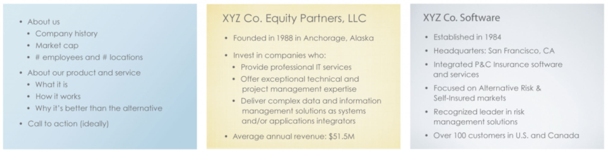
  <figcaption>From Cole Nussbaumer Knaflic, <i>Storytelling with Data: A Data Visualization Guide for Business Professionals</i></figcaption>
</figure>
]

---

layout: false
class: middle

.box-2.large[The audience is the hero]

.box-inv-2.small[This is why we care about personas so much!]

---

class: middle

.center[
<figure>
  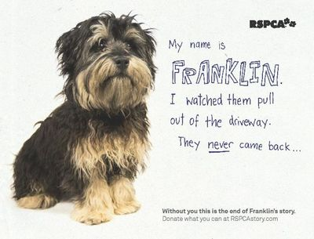
</figure>
]

---

layout: true
class: middle

---

.box-2.medium[Do not treat those you serve as<br>helpless, incapable, opinion-less objects]

.box-inv-2.small[If the audience is the hero, those you serve are characters.<br>Don't mistreat them]

---

.box-2.large[Treat people<br>(and their stories)<br>with dignity]

