```{r setup, include=FALSE}
knitr::opts_chunk$set(warning = FALSE, message = FALSE, 
                      fig.retina = 3, fig.align = "center")
```

```{r packages-data, include=FALSE}
library(countdown)
```

```{r xaringanExtra, echo=FALSE}
xaringanExtra::use_xaringan_extra(c("tile_view"))
```

class: center middle main-title section-title-2

# PR, communications, and the internet

.class-info[

**October 27, 2022**

.light[PMAP 3210: Introduction to Nonprofits<br>
Andrew Young School of Policy Studies
]

]

---

name: outline
class: title title-inv-5

# Plan for today

--

.box-6.medium.sp-after[Public relations]

--

.box-1.medium.sp-after[Nonprofits and the internet]

--

.box-3.medium[Evaluating nonprofit PR]

---

layout: false
name: pr
class: center middle section-title section-title-6 animated fadeIn

# Public relations

---

layout: true
class: title title-6

---

# Public relations

--

> "Public relations (PR) is the practice of managing the flow of information between an individual or an organization and the public."

--

.box-inv-6.medium[What your organization is<br>communicating in all its interactions]

???

Grunig et al., 1984

---

# Every organization does it

--

.pull-left[

.box-inv-6[Consciously]

<figure>
  
  <figcaption>Jen Psaki, White House press secretary</figcaption>
</figure>
]

--

.pull-right[

.box-inv-6[Unconsciously]

<figure>
  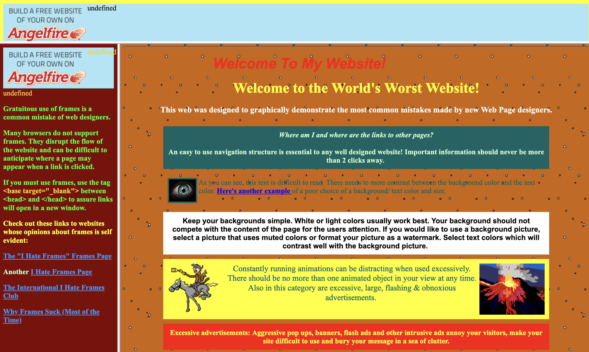
</figure>
]

???

<https://www.angelfire.com/super/badwebs/>


---

# Why do PR as a nonprofit?

--

.box-inv-6[Promote the nonprofit's mission and purposes]

--

.box-inv-6[Create and promote a public image to develop<br>and maintain a donor base and public support]

--

.box-inv-6[Generate awareness of the organization's successes]

--

.box-inv-6[Distinguish the nonprofit from others when competing for<br>donor dollars, media attention, employees, and volunteers]

---

# Audience matters

--

.box-inv-6[All PR should be aimed at specific audiences]

--

.pull-left.center[
<figure>
  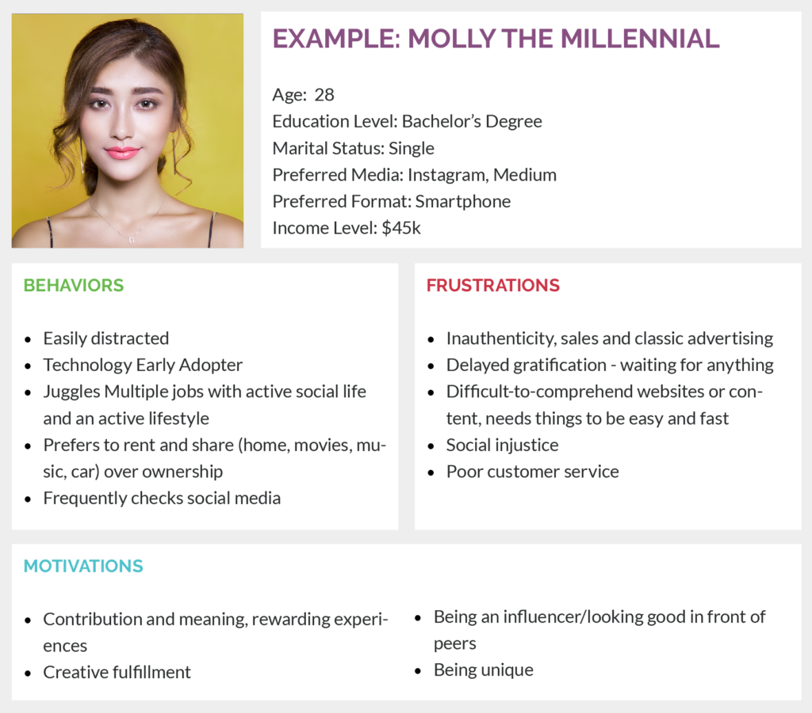
</figure>
]

--

.pull-right[
<figure>
  
</figure>
]

---

# Who is your nonprofit PR audience?

--

.center.sp-after[
.float-left[.box-inv-6[The public]&ensp;.box-inv-6[Donors]&ensp;.box-inv-6[Partners]]

.float-left[.box-inv-6[Board members]&ensp;.box-inv-6[Employees]&ensp;.box-inv-6[Volunteers]]

.float-left[.box-inv-6[Stakeholders]&ensp;.box-inv-6[Constituents]&ensp;.box-inv-6[Membership]]

.float-left[.box-inv-6[Politicians]&ensp;.box-inv-6[Government agencies]]
]

--

.box-6.medium[Everyone!]

---

# Types of public relations

--

.box-inv-6.medium[Front door]

--

.box-inv-6.medium[Maintenance]

--

.box-inv-6.medium[Outreach]

--

.box-inv-6.medium[Collaborative]


---

# Front door PR

--

.box-inv-6.medium[First impressions matter]

--

.box-inv-6[Day-to-day encounters that leave a cumulative effect]

--

.box-inv-6.smaller[Easiest and cheapest PR strategy, even if the nonprofit has few resources]

--

.pull-left[
.box-6.small[Cheerful, helpful person<br>answering the phone]

.box-6.small[Office with attractive<br>and welcoming reception area]
]

--

.pull-right[
.box-6.small[Website is user friendly<br>and informative]

.box-6.small[Calls, e-mails, and social media<br>requests are answered promptly]
]

---

# Maintenance PR

--

.box-inv-6.medium[Information and promotion directed<br>at **those you already work with**]

--

.pull-left[
.box-6.small[Thank you messages]

.box-6.small[Recognizing and<br>celebrating contributions]
]

--

.pull-right[
.box-6.small[Annual reports]

.box-6.small[Donor surveys]

.box-6.small[Collecting input]
]

---

# Outreach PR

--

.box-inv-6.medium[Information and promotion<br>directed at **new people**]

--

.pull-left[
.box-6.small[Press conferences<br>and news releases]

.box-6.small[Brochures, posters, mailers]

.box-6.small[Website and social media]
]

--

.pull-right[
.box-6.small[Newsletters and annual reports]

.box-6.small[Conferences,<br>information fairs, workshops]

.box-6.small[Op-ed articles]
]

---

# Collaborative PR

--

.box-inv-6.medium[Partnering with other organizations<br>to further mutual goals]

--

.box-6.small[Conferences, symposiums, other special events]

.box-6.small[Awareness campaigns]

.box-6.small[Educational materials]

---

# Examples

--

.box-inv-6[Newsletters]

.box-inv-6[Press releases]

.box-inv-6[Annual reports]

.box-inv-6[Podcasts]

.box-inv-6[Social media]

---

# Newsletters

.pull-left.center[
<figure>
  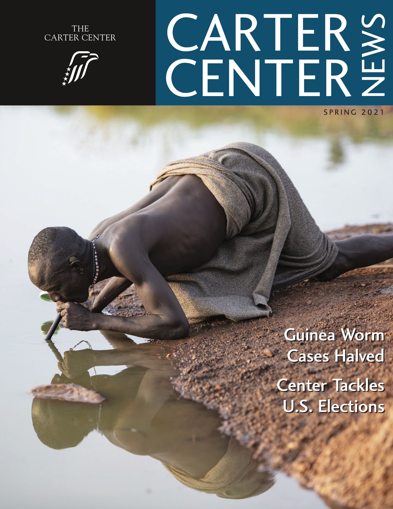
  <figcaption>The Carter Center</figcaption>
</figure>
]

--

.pull-right.center[
<figure>
  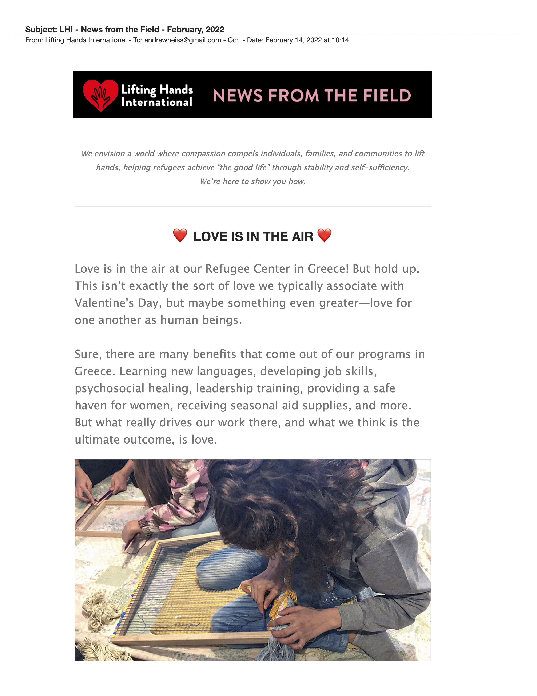
  <figcaption>Lifting Hands International</figcaption>
</figure>
]

???

- <https://www.cartercenter.org/news/publications/newsletters/index.html>

---

# Press releases

.center[
<figure>
  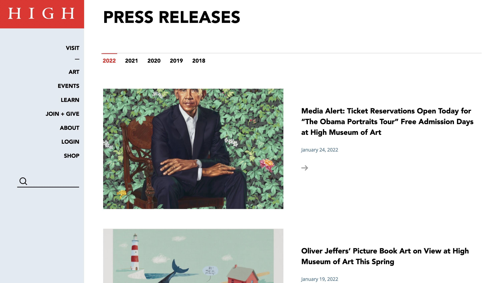
  <figcaption>High Museum</figcaption>
</figure>
]

???

<https://high.org/press-releases/>

---

# Annual reports

.pull-left.center[
<figure>
  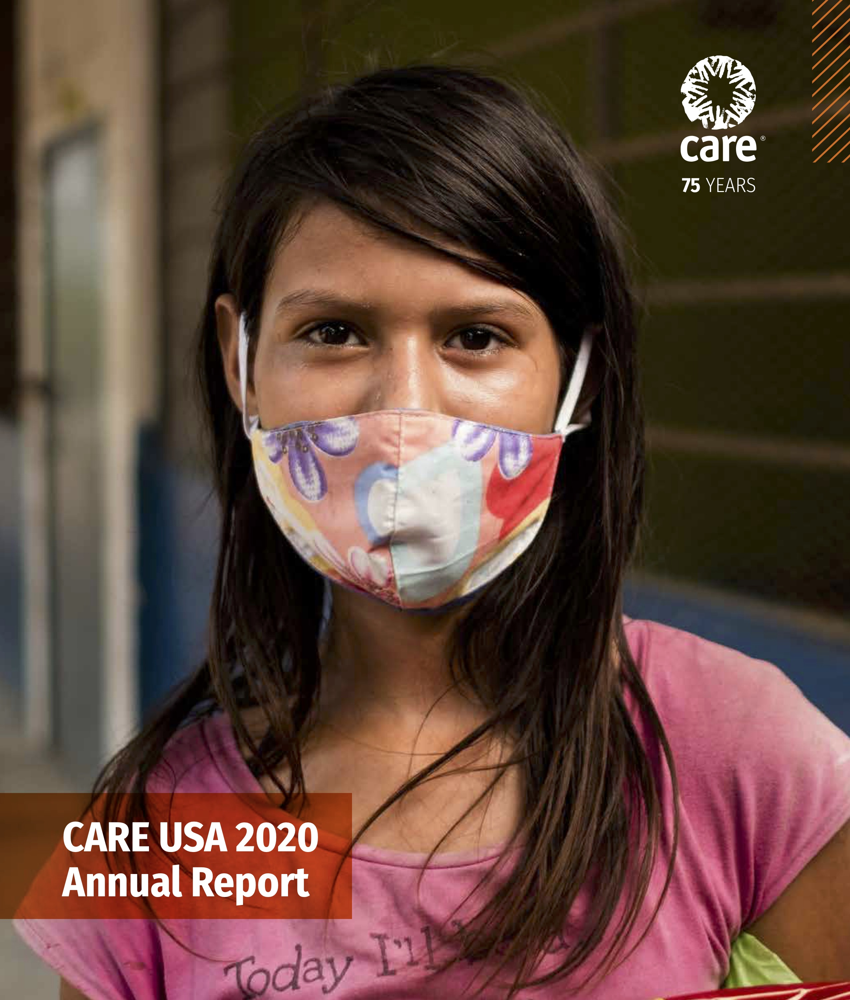
  <figcaption>CARE</figcaption>
</figure>
]

--

.pull-right.center[
<figure>
  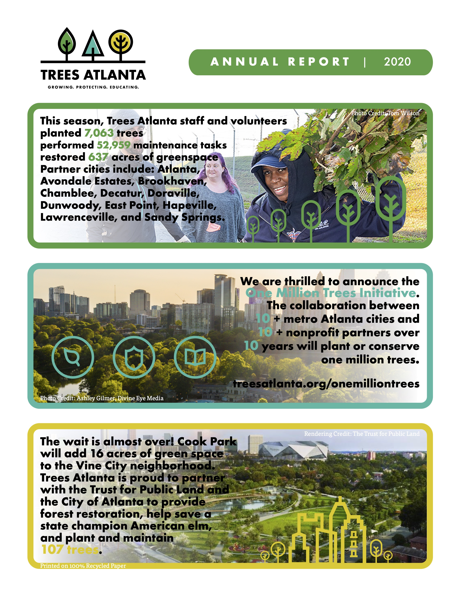
  <figcaption>Trees Atlanta</figcaption>
</figure>
]

???

- <https://www.care.org/news-and-stories/resources/care-usa-2020-annual-report/>
- <https://www.treesatlanta.org/annual-reports/>

---

# Podcasts

.center[
<figure>
  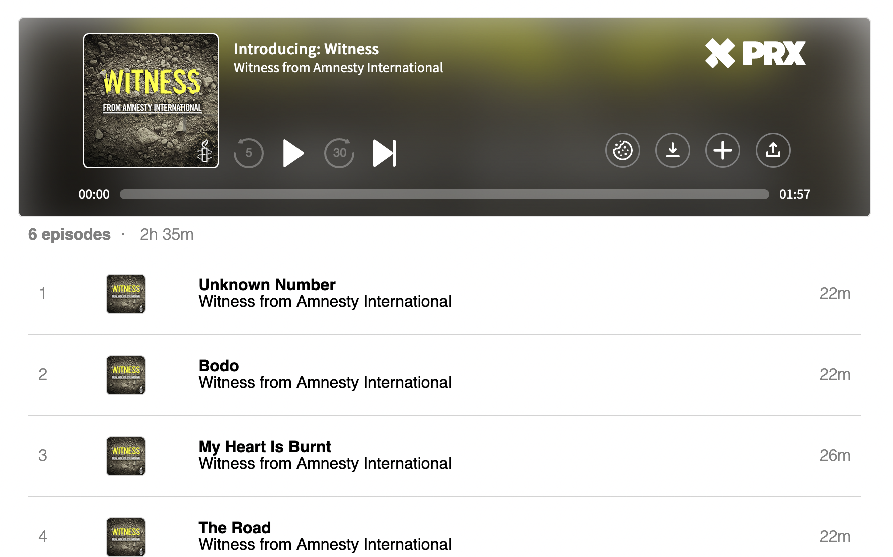
  <figcaption>Amnesty International</figcaption>
</figure>
]

???

<https://www.amnesty.org/en/witness/>

---

# Social media

&nbsp;

--

.pull-left-3.center[
<figure>
  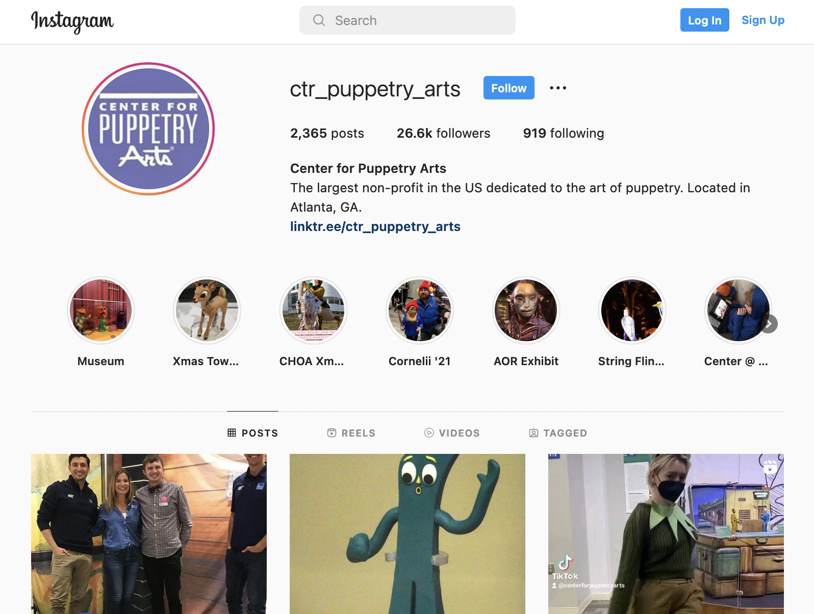
  <figcaption>Instagram</figcaption>
</figure>
]

--

.pull-middle-3.center[
<figure>
  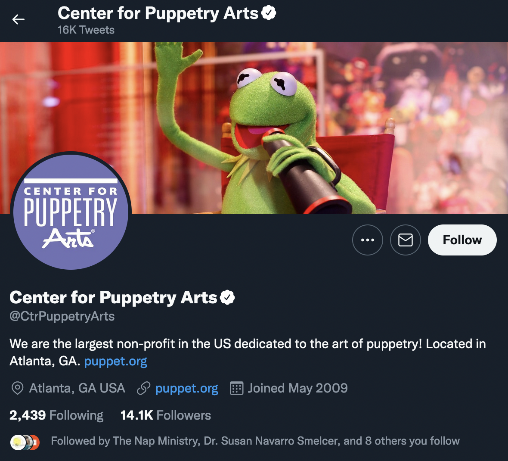
  <figcaption>Twitter</figcaption>
</figure>
]

--

.pull-right-3.center[
<figure>
  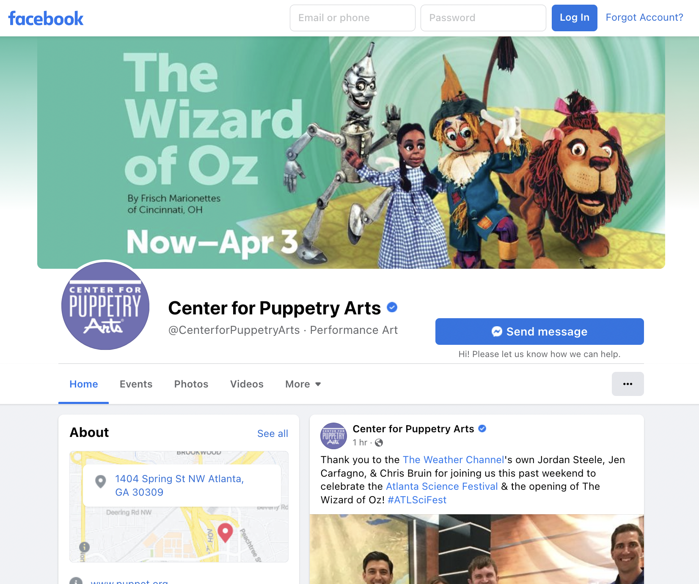
  <figcaption>Facebook</figcaption>
</figure>
]

???

- <https://twitter.com/CtrPuppetryArts>
- <https://www.instagram.com/ctr_puppetry_arts/>
- <https://www.facebook.com/CenterforPuppetryArts/>

---

layout: false
name: internet
class: center middle section-title section-title-1 animated fadeIn

# Nonprofits<br>and the internet

---

class: middle

.box-1.medium[You've never really known<br>a world without the internet]

---

layout: true
class: title title-1

---

# Internet-y things you should do

.pull-left[
.box-inv-1[Have a website]

.box-inv-1[Have a domain name]

.box-inv-1[Have e-mail addresses<br>using that domain name]

.box-inv-1[Have social media accounts]
]

.pull-right[
.box-inv-1[Collect donations<br>and/or sell stuff]

.box-inv-1[Manage donors]

.box-inv-1[Run ads]

.box-inv-1[Use internal services]
]

---

# Websites

.box-inv-1.medium[A website is .smaller[(typically)] a set of<br>HTML files that lives on a<br>computer somewhere in the world]

--

.box-1[Use someone else's server or your own]

---

# Site creation + hosting

.pull-left[
.box-inv-1[.medium[Hire a designer]<br>.light.small[(paid; unlimited design choices)]]

.box-inv-1[.medium[Squarespace]<br>.light.small[(free/paid; ad-supported)]]

.box-inv-1[.medium[Wix]<br>.light.small[(free/paid; ad-supported)]]]

.pull-right[
.box-inv-1[.medium[Google Sites]<br>.light.small[(free; limited design choices)]]

.box-inv-1[.medium[WordPress]<br>.light.small[(free/paid; more design options)]]

.box-inv-1[.medium[Weebly]<br>.light.small[(free/paid; ad-supported)]]
]

---

# Domain name

.box-inv-1.medium[A domain name is an address<br>that points at a server]

.box-1.sp-after[sites.google.com/yournonprofit vs. yournonprofit.org]

--

.box-inv-1.sp-before[You can point a domain name at<br>pretty much any hosting option]

.box-1[iwantmyname.com]

---

# Top Level Domains (TLDs)

--

.box-inv-1.large[**.org**]

--

.box-inv-1.medium[.com, .net]

--

.box-inv-1.medium[.charity, .site, .pizza, etc.]

---

# E-mail

--

.box-inv-1[Have domain-specific e-mail addresses for staff & board]

--

.box-inv-1.small[jimmy_loves_pizza2012@hotmail.com vs. james_smith@nonprofit.org]

--

.pull-left.center[
<figure>
  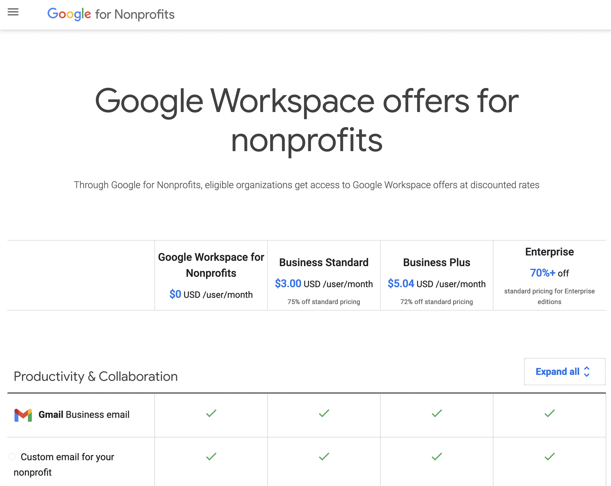
  <figcaption>Google Workspace</figcaption>
</figure>
]

--

.pull-right.center[
<figure>
  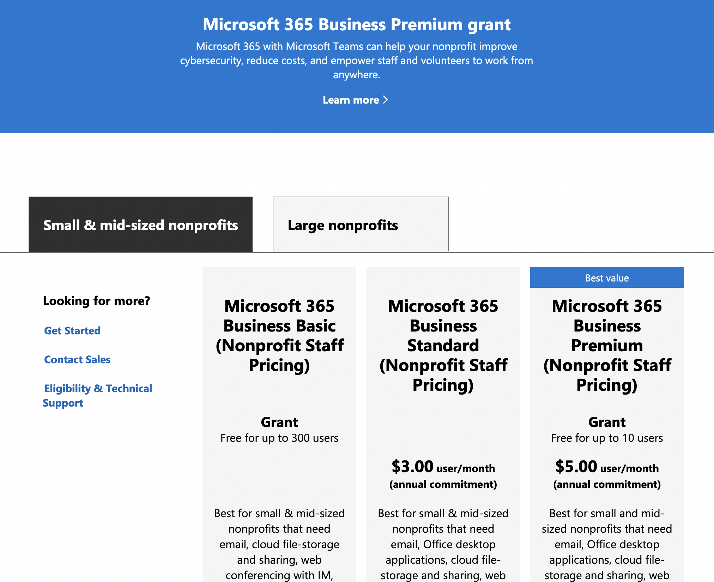
  <figcaption>Microsoft 365</figcaption>
</figure>
]

---

# Social media

--

.box-inv-1[Use whatever your audience uses]

.center.huge[.large[
`r icons::icon_style(icons::fontawesome("facebook"), fill = "#4267B2")`
`r icons::icon_style(icons::fontawesome("instagram"), fill = "#DD2A7B")`
`r icons::icon_style(icons::fontawesome("twitter"), fill = "#1DA1F2")`
<br>
`r icons::icon_style(icons::fontawesome("youtube"), fill = "#FF0000")`
`r icons::icon_style(icons::fontawesome("linkedin"), fill = "#0e76a8")`
`r icons::icon_style(icons::fontawesome("tiktok"), fill = "#ee1d52")`
]]

---

# Collect donations / sell stuff

.box-inv-1[Donorbox<br>.smaller[https://donorbox.org/]]

.box-inv-1[Give Lively<br>.smaller[https://www.givelively.org/]]

.box-inv-1[Shopify<br>.smaller[https://www.shopify.com/]]

---

# Manage donors

.box-1[Customer relationship management (CRM)]

--

.box-inv-1[Kindful<br>.smaller[https://kindful.com/]]

.box-inv-1[Donorbox<br>.smaller[https://donorbox.org/]]

.box-inv-1[Give Lively<br>.smaller[https://www.givelively.org/]]

---

# Run ads

--

.pull-left.center[
<figure>
  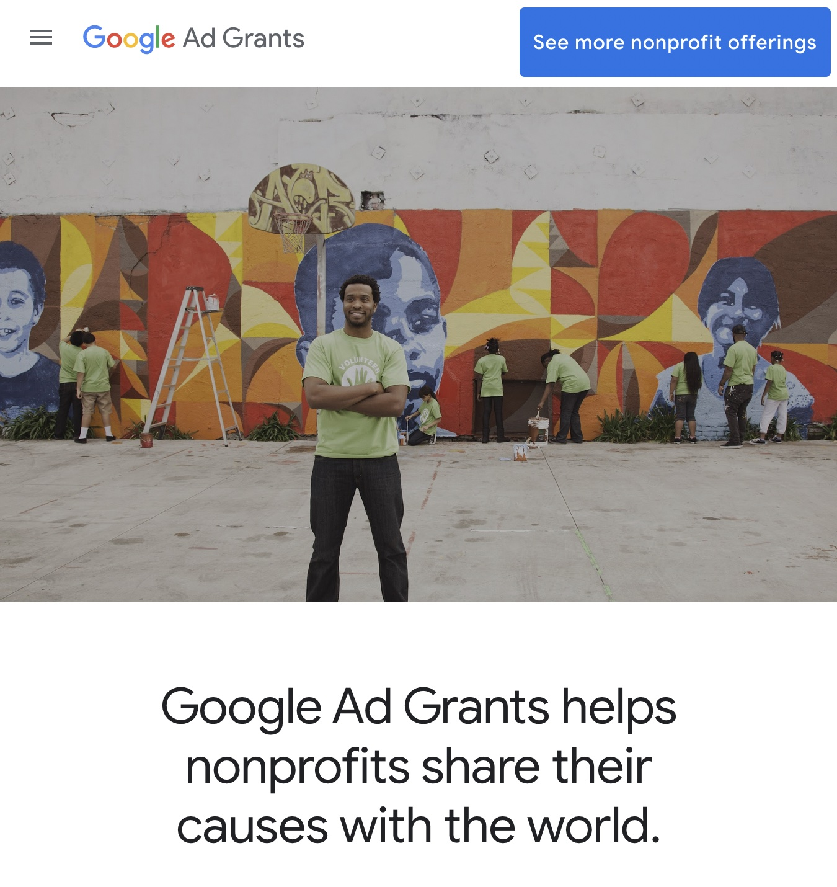
  <figcaption>Google Ads</figcaption>
</figure>
]

--

.pull-right.center[
<figure>
  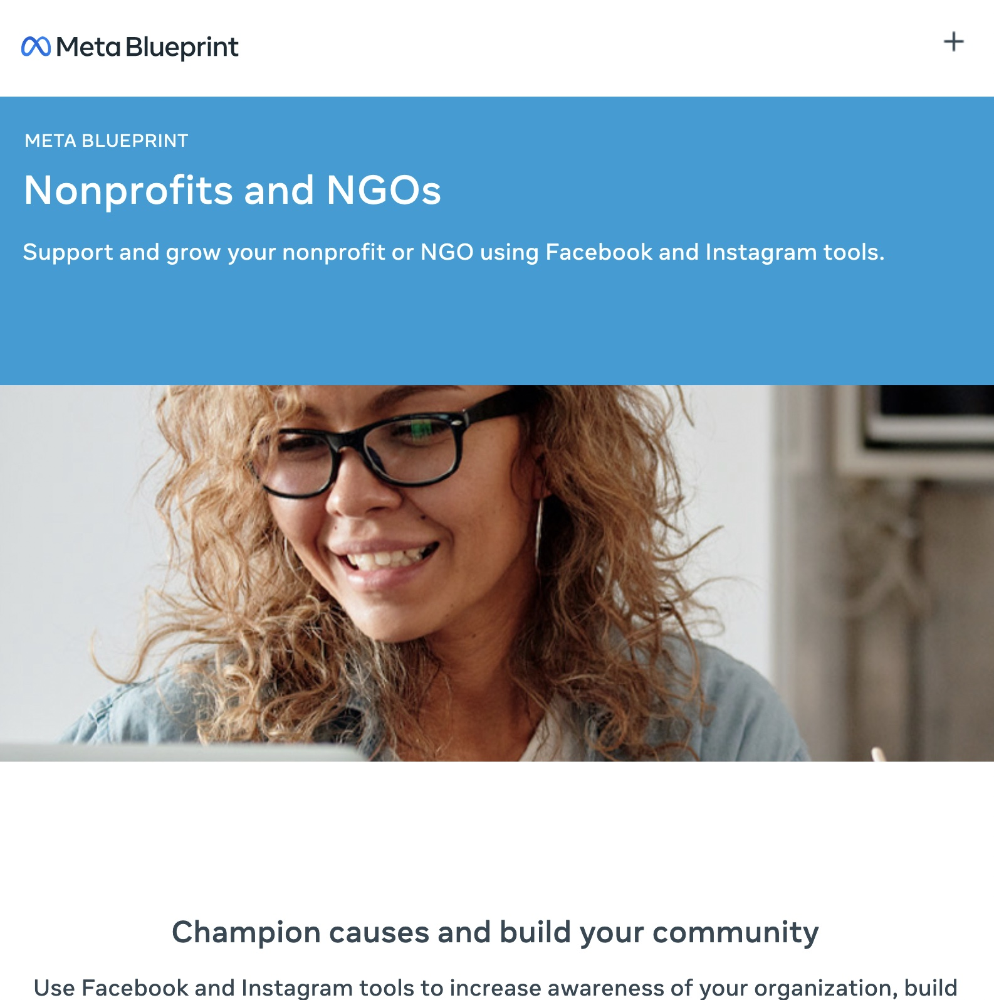
  <figcaption>Meta (Facebook and Instagram) Ads</figcaption>
</figure>
]


---

# Internal services

.pull-left[
.box-inv-1[**Slack**<br>Team communication/chat<br>.small[(Free for nonprofits)]]

.box-inv-1[**Zoom**<br>Video chat<br>.small[(50% off for nonprofits)]]
]

.pull-right[
.box-inv-1[**Asana**<br>Project management<br>.small[(50% off for nonprofits)]]

.box-inv-1[**Most other services**<br>Google<br>"`service` nonprofits"]
]

---

layout: false
name: evaluating
class: center middle section-title section-title-3 animated fadeIn

# Evaluating<br>nonprofit PR
