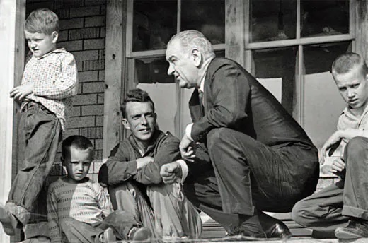

```{r setup, include=FALSE}
knitr::opts_chunk$set(warning = FALSE, message = FALSE, 
                      fig.retina = 3, fig.align = "center")
```

```{r packages-data, include=FALSE}
library(countdown)
```

```{r xaringanExtra, echo=FALSE}
xaringanExtra::use_xaringan_extra(c("tile_view"))
```

class: center middle main-title section-title-2

# Diversity in the<br>nonprofit sector

.class-info[

**November 3, 2022**

.light[PMAP 3210: Introduction to Nonprofits<br>
Andrew Young School of Policy Studies
]

]

---

name: outline
class: title title-inv-5

# Plan for today

--

.box-1.medium.sp-after[Institutions and individual action]

--

.box-5.medium.sp-after[Nonprofits and institutions]

--

.box-8.medium[Diversity in nonprofits]

---

layout: false
name: institutions
class: center middle section-title section-title-1 animated fadeIn

# Institutions and<br>individual action

---

layout: true
class: title title-1

---

# What are institutions?

<br>

--

.box-inv-1.medium[Rules and structures that<br>govern social interactions]

--

.pull-left[
.box-1.medium[Formal]
]

--

.pull-right[
.box-1.medium[Informal]
]

---

# Assets vs. income

--

.pull-left[
.box-inv-1.medium[Income]

.box-1[Money that you earn]
]

--

.pull-right[
.box-inv-1.medium[Assets]

.box-1[Money that you<br>build up over time]
]

---

# Assets vs. income

.center[
<figure>
  
</figure>
]

---

layout: false
class: middle

.box-1.large[Why are assets<br>important for wealth?]

???

- Money begets more money
- Money provides a safety net

---

class: middle

.less-medium[
> “It’s all right to tell a man to lift himself by his own bootstraps, but it is a cruel jest to say to a bootless man that he ought to lift himself by his own bootstraps.”
> 
> —Martin Luther King, Jr.<br>May 8, 1967 NBC interview
]

---

class: middle

.pull-left-narrow[
.box-1["40 acres<br>and a mule"]

.box-1[The Freedman's<br>Bureau]

.box-1[Designed to<br>promote assets]
]

.pull-left-wide[
<figure>
  
</figure>
]

???

- William Tecumsah Sherman, Special Field Order 15
- Strip of land along the coast of Georgia and SC, government provisions for 18,000 former slaves
- Freedman’s Bureau
- Cancelled by Andrew Johnson later that year

This policy was designed to bestow assets on the newly freed slaves

What happened after the abolition of slavery?

https://commons.wikimedia.org/wiki/File:Freedman_bureau_harpers_cartoon.jpg

---

class: middle

.pull-left-3[
.center[
<figure>
  
</figure>
]
]

.pull-middle-3[
.box-1[Homesteading Act of 1862]

.box-inv-1.small[160 acres in the west]

.box-inv-1.small[Distributed<br>80 million acres<br>by 1900,<br>mostly to<br>white settlers]

.box-inv-1.small[(Promoted assets)]
]

--

.pull-right-3[
.center[
<figure>
  
</figure>
]
]

???

https://www.loc.gov/rr/program/bib/ourdocs/homestead.html

---

class: middle

.pull-left-wide[
.center[
<figure>
  
</figure>
]
]

.pull-right-narrow[
.box-1[Designed to<br>boost assets]

.box-1[Access to<br>programs was<br>unequal and<br>racialized]
]

???

Great Depression → need to build up middle class. Government intervention!

---

class: middle

.pull-left-narrow[
.box-1[Implementation<br>of FHA was<br>systemically racist]

.box-inv-1.small[andhs.co/atl-redlining]

.box-inv-1.small[andhs.co/atl-airport]
]

.pull-right-wide[
.center[
<figure>
  
</figure>
]
]

???

Not only was access to programs unequal (harder for black veterans to get GI bill benefits in the first place), the implementation of programs was unequal – red lining – FHA loans couldn’t be used in certain neighborhoods, since they were too risky

---

.box-1[Civil rights laws in 1960s banned redlining]

--

.center[
<figure>
  
</figure>
]

???

Fair Housing Act of 1968

<https://www.revealnews.org/article/for-people-of-color-banks-are-shutting-the-door-to-homeownership/>

---

class: middle

.less-medium[
> “It is the unearned birthright of inheritance or other family transfers that has the greatest effect on wealth accumulation, and likewise is the largest factor erecting barriers to wealth accumulation for people of color.”
> 
> Darity, et al., 3
]

---

class: middle

.less-medium[
> “There’s no amount of lattes and avocado toast that you can forego that will take the place of an FHA mortgage to your grandfather.”
>
> Mehrsa Baradaran
]

---

layout: true
class: title title-1

---

# Neoliberalism

.box-inv-1[The idea that all human interaction<br>can be imagined as a competitive market]

--

.pull-left[
.box-1[Poverty]
]

.pull-right[

]

---

layout: false
background-image: url("img/11/black-capitalism-1.jpg")
background-position: center
background-size: contain

---

background-image: url("img/11/black-capitalism-2.jpg")
background-position: center
background-size: contain

---

background-image: url("img/11/black-capitalism-3.jpg")
background-position: center
background-size: contain

---

background-image: url("img/11/black-capitalism-4.jpg")
background-position: center
background-size: contain

---

layout: true
class: title title-1

---

# Neoliberalism

.box-inv-1[The idea that all human interaction<br>can be imagined as a competitive market]

.pull-left[
.box-1[Poverty]

.box-inv-1.small[Free market capitalism]

.box-1[Education]

.box-inv-1.small[Charter schools, No Child Left<br>Behind, Race to the Top]
]

.pull-right[

]

---

# Neoliberalism

.box-inv-1[The idea that all human interaction<br>can be imagined as a competitive market]

.pull-left[
.box-1[Poverty]

.box-inv-1.small[Free market capitalism]

.box-1[Education]

.box-inv-1.small[Charter schools, No Child Left<br>Behind, Race to the Top]
]

.pull-right[
.box-1[Environment]

.box-inv-1.small[Carbon offsets & permits]
]

---

# Neoliberalism

.box-inv-1[The idea that all human interaction<br>can be imagined as a competitive market]

.pull-left[
.box-1[Poverty]

.box-inv-1.small[Free market capitalism]

.box-1[Education]

.box-inv-1.small[Charter schools, No Child Left<br>Behind, Race to the Top]
]

.pull-right[
.box-1[Environment]

.box-inv-1.small[Carbon offsets & permits]

.box-1[Other government services]

.box-inv-1.small[US COVID response,<br>demand that USPS be profitable]
]

---

# Consequences of neoliberalism

.box-inv-1.medium[Individual actions and<br>personal responsibility are<br>preferred over <br>institutional and structural change]

.center.grey.small[(Income over assets)]

---

layout: false
name: nonprofits-institutions
class: center middle section-title section-title-5 animated fadeIn

# Nonprofits<br>and institutions

---

layout: true
class: title title-5

---

# Quick historical review

--

.box-inv-5.SMALL[**1600s–1700s**<br>Church-based charities]

--

.box-inv-5.SMALL[**1787+**<br>Formal constitutional right of association]

--

.box-inv-5.SMALL[**1900–1960**<br>Tax exemption and more formal institutional structures]

--

.box-inv-5.SMALL[**1960s–today**<br>Corporatization and professionalization]

---

# 1960s–today

.pull-left[
.box-inv-5[War on Poverty]

<figure>
  
</figure>

.box-5.smaller[Increased federal funding]
]

--

.pull-right[
.box-inv-5[Neoliberal privatization]

<figure>
  
</figure>

.box-5.smaller[Corporatization & professionalization]
]

---

# Non-Profit Industrial Complex .smaller[(NPIC)]

--

.box-inv-5[Professionalization and standardization]

--

.box-5.small[Every organization has to fill out the same forms]

--

.box-5.small[Most nonprofits have the same organizational structure]

--

.box-5.small[Staff get the same kinds of degrees]

--

.pull-left[
.box-inv-5.smaller[Master of Public Administration (MPA)<br>in nonprofit management]
]

.pull-right[
.box-inv-5.smaller[Undergraduate courses and<br>programs in nonprofit management]
]

--

.box-5[WHAT YOU'RE DOING RIGHT NOW]

---

# Non-Profit Industrial Complex .smaller[(NPIC)]

--

.box-inv-5.less-medium[Organizations all look the same]

--

.box-inv-5.less-medium[Foundations require similarity]

--

.box-inv-5.less-medium[Individual donors want consistency]

.box-5.small[GuideStar and Charity Navigator]

---

# Non-Profit Industrial Complex .smaller[(NPIC)]

> "The NPIC is a system of relationships between the State, the owning classes, foundations, and nonprofit and social justice organizations that results in the surveillance, control, derailment, and everyday management of political movements."
>
> —[Neesha Powell](https://everydayfeminism.com/2018/05/decolonizing-nonprofits/)

---

# Non-Profit Industrial Complex .smaller[(NPIC)]

<br>

.box-5.medium[Nonprofit organizational standardization fundamentally limits nonprofits' ability to undertake institutional change]

---

layout: false
class: middle

.SMALL[
> Nearly 30 years later, I look around and see many shelters and services for survivors of domestic violence, but no large-scale movement to end male violence. I see many batterer intervention programs, but few men involved in challenging sexism. The loss of vision that narrowed the focus of men's work reflects a change that occurred in other parts of the movement to end violence, as activists who set out to change the institutions perpetrating violence settled into service jobs helping people cope.
>
> Paul Kivel, "Social Service or Social Change?", *The Revolution Will Not Be Funded*, p. 129
]

---

layout: true
class: title title-5

---

# Social services vs. social change

--

.pull-left[
.box-5.less-medium[Social services]

.center.smaller.grey[(Analogous to income)]

.box-inv-5.small[Helping individuals suffering from systems of exploitation and violence]

.box-inv-5[Nonprofits are<br>designed for this]
]

--

.pull-right[
.box-5.less-medium[Social change]

.center.smaller.grey[(Analogous to assets)]

.box-inv-5.small[Challenging the root institutional causes of systemic exploitation and violence]

.box-inv-5[Nonprofits<br>struggle with this]
]

---

# Institutional limits

--

.box-inv-5[Existing institutional structures limit nonprofits<br>from pursuing institutional changes]

--

.pull-left[
.box-5[Legal limits]

.box-inv-5.small[501(c)(3)s can't<br>engage in substantial lobbying]
]

--

.pull-right[
.box-5[Organizational conformity]

.box-inv-5.small[Funders like "standard" nonprofits]

.box-inv-5.small[Pressure to tame programming in order to get easily measurable results to make funders happier]
]

---

layout: false
name: diversity
class: center middle section-title section-title-8 animated fadeIn

# Diversity<br>in nonprofits

---

layout: true
class: title title-8

---

# Foundational institutional issue

--

.box-inv-8.less-medium[Existing nonprofit regulatory environment<br>was largely designed for white- and male-led<br>organizations providing paternalistic<br>social services, often as a<br>replacement of the government]

--

.box-inv-8[POC-led nonprofits face an institutional<br>environment built for white organizations]

---

# Diversity in the nonprofit sector

.box-inv-8[Demographic trends reflect this institutional history]

--

.box-8.smaller[90% of nonprofit board chairs are white]

--

.box-8.smaller[90% of nonprofit executive directors are white]

--

.box-8.smaller[≈20% of nonprofit staff are people of color]

--

.box-8.smaller[73% of nonprofit staff are women]

--

.box-8.smaller[45% of nonprofit executive directors are women]

--

.box-8.smaller[Women executive directors make 66% of men's salaries]

--

.box-8.smaller[Underrepresentation of LGBTQ populations]

---

# How to fix this?

--

.box-inv-8.medium[Deeper institutional<br>restructuring… somehow…]

--

.box-inv-8.medium[Organization- and sector-level<br>increase in diversity]

---

# Diversity

--

.box-inv-8.less-medium[Diversity is a characteristic of groups,<br>not of individuals]

--

.box-inv-8.less-medium[You can talk about a *member* of a<br>diverse community but not about<br>a diverse individual]

???

<https://serc.carleton.edu/advancegeo/resources/what_diversity.html>

---

# Primary dimensions

.center[
<figure>
  
</figure>
]

---

# Secondary dimensions

.center[
<figure>
  
</figure>
]

---

# Intersectionality

.center[
<figure>
  
</figure>
]

---

# Business benefits of diversity

--

.box-inv-8.less-medium[Better, more creative decision-making]

--

.box-inv-8.less-medium[Better performance]

--

.box-inv-8.less-medium[Better community engagement and involvement]

--

.box-inv-8.less-medium[More money from donors and foundations]

---

# Representative bureaucracy

--

.box-inv-8.medium[A nonprofit should represent<br>the community which it serves]

.box-8.small[(This is a general idea, not a one-to-one checklist)]

---

# Lip service vs. real diversity

--

.box-inv-8.less-medium[You can’t just hire a bunch of different people]

--

.box-inv-8.less-medium[You must actually take in<br>the perspectives of different people]

--

.box-8.medium[This requires structural<br>changes within the organization!]

---

# Institutionalizing diversity

.box-inv-8[Set up organizational structures that actually<br>allow for and encourage multiple perspectives]

--

.pull-left[
.box-8.small[Board recruitment]

.box-8.small[Staff hiring practices]

.box-8.small[Volunteer management]
]

--

.pull-right[
.box-8.small[Better pay]

.box-8.small[Client advisory boards]

.box-8.small[Clear channels of communication]
]
