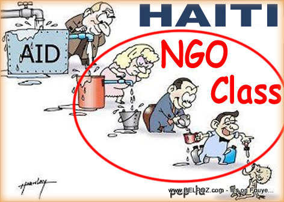
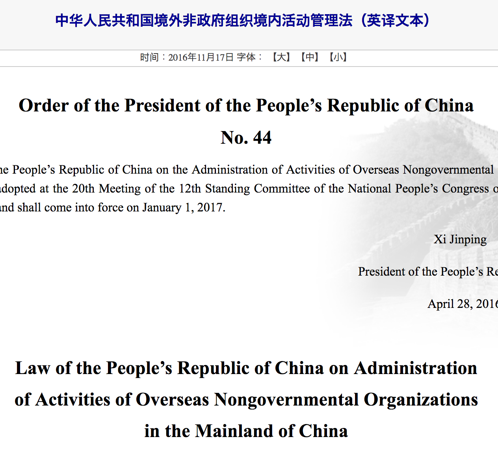

```{r setup, include=FALSE}
knitr::opts_chunk$set(warning = FALSE, message = FALSE, 
                      fig.retina = 3, fig.align = "center")
```

```{r packages-data, include=FALSE}
library(countdown)
```

```{r xaringanExtra, echo=FALSE}
xaringanExtra::use_xaringan_extra(c("tile_view"))
```

class: center middle main-title section-title-2

# International<br>nonprofits

.class-info[

**November 17, 2022**

.light[PMAP 3210: Introduction to Nonprofits<br>
Andrew Young School of Policy Studies
]

]

---

name: outline
class: title title-inv-5

# Plan for today

--

.box-6.medium.sp-after[What are INGOs and<br>what do they do?]

--

.box-1.medium.sp-after[INGOs in dictatorships]

--

.box-3.medium[Final projects]

---

layout: false
name: ingos
class: center middle section-title section-title-6 animated fadeIn

# What are INGOs and<br>what do they do?

---

layout: true
class: title title-6

---

# SO MANY ACRONYMS

--

.box-inv-6[NPO = Nonprofit organization]

--

.box-inv-6[NGO = Nongovernmental organization<br>.small[Basically the same as a nonprofit, but has connotation of non-US-based]]

--

.box-inv-6.small[INGO = International NGO]

--

.box-inv-6.small[GONGO = Government-operated NGO]

--

.box-inv-6.small[BONGO = Briefcase-operated NGO / Business NGO]

--

.box-inv-6.small[QUANGO = Quasi NGO]

---

# INGOS

.box-inv-6.medium[NGOs that are based in<br>one country and work in another]

--

.box-6[In the US they're still 501(c)(3)s and everything<br>we've learned in this class applies to them]

???

- Health / medical / emergencies - doctors without borders, red cross, IRC
- Human rights / legal - amnesty, journalists without borders, HRW, 
- Development - BRAC, Heifer Foundation, Oxfam, Care
- Environment - WWF, Environmental Defense Fund

---

# What do INGOs do?

--

.pull-left[
.box-inv-6.less-medium[Freedom from want]

.box-6[Humanitarian assistance]

.box-6[Disaster relief]

.box-6[International development]
]

.pull-right[]

---

layout: false
background-image: url("img/13/freedom-from-want@3x.png")
background-position: center
background-size: contain

---

class: title title-6

# What do INGOs do?

.pull-left[
.box-inv-6.less-medium[Freedom from want]

.box-6[Humanitarian assistance]

.box-6[Disaster relief]

.box-6[International development]
]

--

.pull-right[
.box-inv-6.less-medium[Freedom from fear]

.box-6[Human rights advocacy]

.box-6[Environmental advocacy]
]

---

background-image: url("img/13/freedom-from-fear@3x.png")
background-position: center
background-size: contain

---

layout: true
class: title title-6

---

# INGOs and political power

--

.box-inv-6[Can INGOs influence the politics of other countries?]

--

.box-6[They're not countries]

--

.box-6[They have less power than states]

--

.box-6[They have less access to things like the UN]

--

.box-6[Most INGOs don't even engage in politics]

--

.box-inv-6[AND YET]

---

# Transnational advocacy

.pull-left[
.center[
<figure>
  
</figure>
]
]

--

.pull-right[
.center[
<figure>
  
</figure>
]
]

???

1837 *The Liberator*: <https://www.dhr.history.vt.edu/modules/us/mod04_women/index.html>

---

# Opposing states

.center[
<figure>
  
</figure>
]

---

# Opposing states

.center[
<figure>
  
</figure>
]

---

# Opposing states

.center[
<figure>
  
</figure>
]

---

# Opposing states

.center[
<figure>
  
</figure>
]

---

# Collaborating with states

<br>

--

.pull-left-3[
.center[
<figure>
  
</figure>
]
]

--

.pull-middle-3[
.center[
<figure>
  
</figure>
]
]

--

.pull-right-3[
.center[
<br>
<figure>
  
</figure>
]
]

---

# Replace states

--

.pull-left[
<figure>
  
</figure>
]

--

.pull-right[
<iframe width="610" height="343" src="https://www.youtube.com/embed/aqGQ1IRhdzg" frameborder="0" allow="accelerometer; autoplay; encrypted-media; gyroscope; picture-in-picture" allowfullscreen></iframe>
]

???

<http://www.haitianinternet.com/photos/photo-haiti-ngo-class.html>

---

# Issues with INGOs

--

.box-inv-6.medium[Global moral compass]

--

.box-inv-6.medium[Modular techniques]

--

.box-inv-6.medium[Claim to be above politics]

--

.box-inv-6.medium[Representativeness]

???

**Global moral compass**: INGOs appoint themselves as moral authorities for their issue - that drives their mission - and that's fine. That's what even domestic nonprofits do

Amnesty decided that people shouldn't be imprisoned for their beliefs, so now they're an authentic moral compass for global human rights

**Modular techniques**: practices and programs that an NGO does to address its issues

Letter writing, adopting a child, easily replicable and portable

**Secular sanction**: NGOS have to be above politics—but they also have to get political authority from states to act (ironic!)

**Representative claim**: INGOs claim to speak for or empower the people

NGOs in Egypt can overthrow government or reinforce governmental legitimacy - Muslim Brotherhood provides social services as a rival to the state + human rights NGOs are permitted to operate to make it look like the government is more open to human rights; they can be tracked by intelligence services better; government can manage the political impact of activists; foreign funding to NGOs enters the Egyptian economy

---

layout: false
name: ingos-dictatorships
class: center middle section-title section-title-1 animated fadeIn

# INGOs in dictatorships

---

class: middle

.box-1.large[Why do dictators let (I)NGOs<br>work in their country?]

---

--

.pull-left[
.center[
<figure>
  
</figure>
]
]

--

.pull-right[
.center[
<figure>
  
</figure>
]
]

---

.pull-left[
.center[
<figure>
  
</figure>
]
]

.pull-right[
.center[
<figure>
  
</figure>
]
]

---

class: middle

--

.pull-left[
.center[
<figure>
  
</figure>
]
]

--

.pull-right[
.center[
<figure>
  
</figure>
]
]

---

class: middle

.pull-left[
.center[
<figure>
  
</figure>
]
]

--

.pull-right[
.center[
<figure>
  
</figure>
]
]

---

class: middle

--

.pull-left[
.center[
<figure>
  
</figure>
]
]

--

.pull-right[
.center[
<figure>
  
</figure>
]
]

---

layout: true
class: title title-1

---

# Institutional balancing

.pull-left-narrow[
.box-inv-1[To stay in power, dictators must give some power to rival institutions, but in a controlled and safe way]
]

--

.pull-right-wide[
.center[
<figure>
  
</figure>
]
]

---

# "Donning democratic garb"

.box-inv-1.medium[Dictators use democratic-ish<br>institutions in the service of<br>regime stability]

--

.center.sp-before[
.float-left[.box-1[Elections]&ensp;.box-1[Parliaments]]

.float-left[.box-1[Independent judiciary]&ensp;.box-1[Protests]]
]

---

# NGOs as institutions

.box-inv-1.medium[(I)NGOs are yet another institution<br>that dictators have to deal with<br>when pursuing regime stability]

---

# NGOs in dictatorships

--

.box-inv-1.less-medium[PTAs, networks,<br>and .color-5[**supporting**] state power]

--

.box-inv-1.less-medium["Standing up to city hall"<br>and .color-5[**challenging**] state power]

--

.box-inv-1.less-medium[NGO fiefdoms<br>and .color-5[**replacing**] state power]

---

layout: false
background-image: url("img/13/crackdown-1@2x.png")
background-position: center
background-size: contain

---

background-image: url("img/13/crackdown-2@2x.png")
background-position: center
background-size: contain

---

background-image: url("img/13/crackdown-3@2x.png")
background-position: center
background-size: contain

---

background-image: url("img/13/crackdown-4@2x.png")
background-position: center
background-size: contain

---

layout: true
class: title title-1

---

# Costs and benefits of INGOs

--

.pull-left[
.box-inv-1.medium[Coordinated<br>understanding]

.box-inv-1.medium[Boomerangs<br>and spirals]
]

--

.pull-right[
.box-inv-8.medium[Provide services<br>for regime]

.box-inv-8.medium[Bestow legitimacy<br>to regime]
]

---

# Legal restrictions

--

.box-inv-1.medium[Dictators use laws to avoid costs,<br>reap benefits of NGOs]

--

.pull-left[
.box-1.medium[Gatekeeping]
]

--

.pull-right[
.box-1.medium[Programmatic]
]

---

# Varying enforcement

--

.box-inv-1.less-medium[Just because a law exists<br>doesn't mean it is followed]

--

.center[
<figure>
  
  <figcaption>Civil society regulations in Egypt</figcaption>
</figure>
]

---

layout: false
background-image: url("img/13/meduza-pragmatism@2x-80.jpg")
background-position: center
background-size: contain

---

layout: true
class: title title-1

---

# Adjusting to the legal environment

--

.pull-left-narrow[
.box-inv-1[Change staff]

.box-inv-1[Change programs]

.box-inv-1[Change laws]

.box-inv-1[Leave and stop]

.box-inv-1[Leave and sneak]
]

--

.pull-right-wide[
&nbsp;

<figure>
  
  <figcaption>International Media Support's different strategies</figcaption>
</figure>

]

???

International Media Support

---

layout: false
name: ingos
class: center middle section-title section-title-3 animated fadeIn

# Final projects
